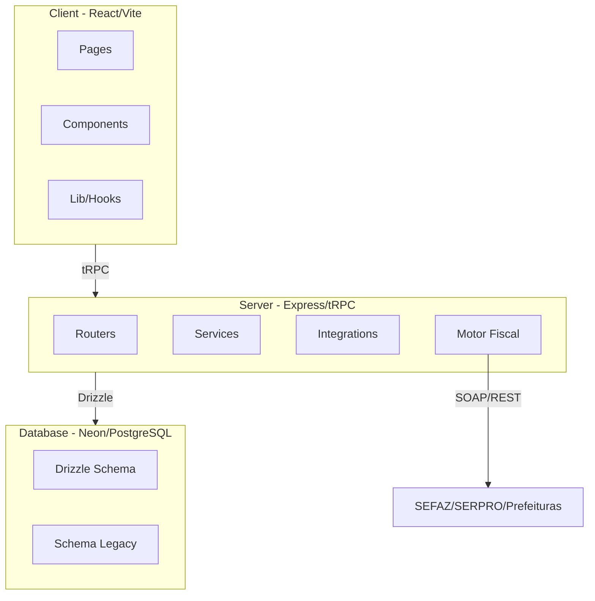

# CentrOS

Sistema ERP multi-tenant para organizações do terceiro setor, com foco inicial em Centros Espíritas. Gerencia pessoas, finanças, contabilidade, patrimônio e obrigações fiscais em uma única plataforma.

## Quick Start

```bash
# Pré-requisitos: Node 20+, PostgreSQL (ou conta Neon)
git clone https://github.com/seu-usuario/centroos.git
cd centroos
npm install
cp .env.example .env  # configurar DATABASE_URL
npm run db:push       # aplicar schema no banco
npm run dev           # inicia client e server
```

Acesse `http://localhost:5173` no navegador.

## Arquitetura



## Módulos do Sistema

| Módulo | Descrição |
|--------|-----------|
| **A - Identidades** | Pessoas, Associados, Documentos, LGPD |
| **B - Dinheiro** | Caixa, Bancos, Extratos, Conciliação |
| **C - Títulos** | Contas a Pagar e Receber, Baixas |
| **D - Contabilidade** | Plano de Contas, Lançamentos, Períodos |
| **E - Projetos** | Centros de Custo, Fundos, Projetos |
| **F - Patrimônio** | Bens, Depreciação, Inventário |
| **G - Governança** | Aprovações, Auditoria, Permissões |
| **Fiscal** | NFS-e SP, NFS-e Nacional, NF-e, SERPRO |

## Estrutura de Pastas

```
centroos/
├── client/                 # Frontend React
│   └── src/
│       ├── components/     # Componentes por domínio
│       │   ├── {domain}/   # Ex: titulos/, pessoas/, patrimonio/
│       │   │   └── wizard/ # Wizards com steps e Provider
│       │   └── ui/         # Componentes genéricos reutilizáveis
│       ├── pages/          # 1 arquivo por rota
│       └── lib/            # Hooks, utils, configurações
├── server/                 # Backend tRPC
│   ├── fiscal/             # Motor fiscal (NFS-e, NF-e)
│   ├── integrations/       # SERPRO, Gov.br, Prefeituras
│   ├── services/           # Lógica de negócio
│   └── routers.ts          # Definição das rotas tRPC
├── drizzle/                # Schema do banco
│   ├── schema.ts           # Schema atual (multi-tenant)
│   └── schema-legacy.ts    # Schema v1 (em migração)
├── scripts/                # Utilitários
│   ├── audit/              # Auditoria de dados
│   ├── seed/               # Seeds e migrações
│   └── pipeline/           # Processamento de dados
├── docs/                   # Documentação técnica
└── e2e/                    # Testes E2E (Playwright)
```

## Convenções de Código

### Imports
Sempre usar path aliases:
```typescript
// Correto
import { cn } from '@/lib/utils';
import { Button } from '@/components/ui/button';

// Incorreto
import { cn } from '../../lib/utils';
```

### Componentes
- PascalCase, um por arquivo
- Colocar em `components/{domain}/` conforme o domínio

### Wizards
Estrutura padrão para formulários multi-step:
```
components/{domain}/
├── {Domain}Wizard.tsx           # Componente principal
└── wizard/
    ├── {Domain}WizardProvider.tsx  # Context com estado e lógica
    ├── {Domain}WizardFooter.tsx
    ├── {Domain}WizardHeader.tsx
    ├── {Domain}WizardStepper.tsx
    ├── RascunhoBanner.tsx          # Banner de rascunho pendente
    ├── RascunhosList.tsx           # Lista de rascunhos
    └── steps/
        ├── StepIdentificacao.tsx
        ├── StepValores.tsx
        └── StepRevisao.tsx
```

### Rascunhos (Drafts)
Cada wizard implementa autosave local:
- Persistência em `localStorage`
- Debounce de 2 segundos
- Máximo 10 rascunhos por domínio
- Expiração de 24h para sugestão de retomada

## Schema: Atual vs Legacy

| Arquivo | Status | Uso |
|---------|--------|-----|
| `drizzle/schema.ts` | **Ativo** | Schema multi-tenant, usar para novas features |
| `drizzle/schema-legacy.ts` | Em migração | Usado por `routers.ts`, `reports.ts`, `classification.ts` |

**Regra**: Não adicionar novas tabelas no schema-legacy. Migração gradual em andamento.

## Scripts Disponíveis

```bash
npm run dev           # Inicia client + server em modo desenvolvimento
npm run build         # Build de produção do client
npm run db:push       # Aplica schema no banco (Drizzle)
npm run db:studio     # Abre Drizzle Studio para visualizar dados
npm test              # Executa testes unitários (Vitest)
npm run test:e2e      # Executa testes E2E (Playwright)
```

## Testes

- **Unitários**: `server/fiscal/__tests__/`, `server/integrations/serpro/__tests__/`
- **E2E**: `e2e/` com Playwright

```bash
npm test              # Unitários
npm run test:watch    # Unitários em watch mode
npm run test:e2e      # E2E headless
npm run test:e2e:ui   # E2E com UI do Playwright
```

## Pendências Técnicas

Veja [TODO.md](./TODO.md) para lista de TODOs priorizados (P0-P3).

## Como Contribuir

Veja [CONTRIBUTING.md](./CONTRIBUTING.md) para guia completo de contribuição.

Resumo:
1. Fork o repositório
2. Crie branch: `git checkout -b feat/minha-feature`
3. Siga as convenções de código
4. Rode os testes: `npm test`
5. Abra PR com descrição clara

## Licença

Proprietário - Uso restrito.
