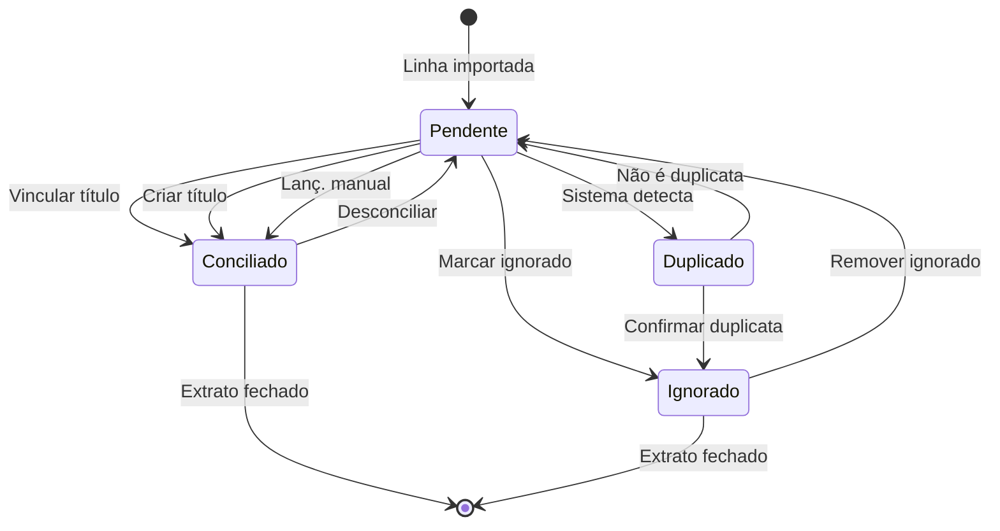

# UX Specification - Módulo B: Caixa, Bancos e Conciliação

> **Versão:** 1.0  
> **Data:** Dezembro 2025  
> **Status:** Aprovado para implementação

---

## 1. Princípios de UX do Módulo

| Princípio | Descrição | Implementação |
|-----------|-----------|---------------|
| **Velocidade sobre perfeição** | O contador concilia centenas de linhas/mês. Cada clique economizado importa. | Filtros persistentes, atalhos de teclado, ações em lote. |
| **Nunca perder trabalho** | Autosave a cada campo alterado. Estados de rascunho visíveis. | Indicador "Salvo como rascunho há Xs", retomada ao reabrir. |
| **Alerta, não bloqueie** | Validações bloqueiam apenas quando há risco de integridade. | Alertas amarelos com ação sugerida + permite continuar. |
| **Contexto visível** | Breadcrumbs completos. Saldo atual sempre visível. | Progresso de conciliação (X de Y) em destaque. |
| **Pendentes primeiro** | Listas ordenam por status: Pendentes no topo. | Seguidos de sugestões de alta confiança, depois conciliados. |
| **Desfazer e explicar** | Toda ação destrutiva tem confirmação + opção de desfazer. | Undo por 10s. Desconciliar requer motivo auditável. |
| **Guia o próximo passo** | Em qualquer estado, o usuário sabe o que fazer. | CTA primário claro, mensagens de estado vazio orientadoras. |

---

## 2. Arquitetura de Informação e Navegação

### 2.1 Sitemap do Módulo

```
Caixa e Bancos/
├── Contas Financeiras
│   ├── Lista de Contas (com saldos consolidados)
│   ├── Nova Conta (formulário com draft/autosave)
│   └── [Conta] Detalhes/Editar
│       ├── Aba: Dados
│       ├── Aba: Histórico de Saldo
│       ├── Aba: Extratos
│       └── Ação: Inativar (modal com pré-validação)
├── Extratos Bancários
│   ├── Lista de Extratos (filtro por conta, com progresso)
│   ├── Importar Extrato (OFX/CSV/TXT)
│   └── [Extrato] Detalhe
│       ├── Linhas do Extrato
│       ├── Conciliação (sidebar contextual)
│       └── Ação: Fechar Extrato (checklist modal)
└── Conciliação Rápida (visão operacional - todas contas)
```

### 2.2 Padrões de Navegação

| Elemento | Comportamento |
|----------|---------------|
| **Breadcrumb** | `Caixa e Bancos > Extratos > BB Conta Movimento > Jan/2025` |
| **Abas internas** | Detalhe da Conta: Dados / Histórico de Saldo / Extratos |
| **Filtros persistentes** | Status, período, conta - salvos em sessão, restaurados ao voltar |
| **Voltar ao ponto** | Ao sair de edição/conciliação, retorna exatamente à linha/extrato anterior |
| **Sidebar contextual** | Em Conciliação: painel lateral com detalhes do título sugerido / formulário |

---

## 3. Fluxos Principais

### 3.1 Fluxo: Criar Conta Financeira

```
[1] Usuário acessa "Nova Conta"
    ↓
[2] Seleciona Tipo (ex: Conta Corrente)
    ↓ Sistema: exibe seção "Dados Bancários" condicionalmente
[3] Preenche campos obrigatórios (nome, banco, agência, conta, saldo inicial, data)
    ↓ Autosave: "Rascunho salvo há 5s"
[4] Opcionalmente: cadastra Chave PIX, vincula conta contábil
    ↓
[5] Clica "Salvar Conta"
    ↓ Validação: se tipo bancário sem dados bancários → BLOQUEIA
    ↓ Validação: se agência/conta duplicada → BLOQUEIA
    ↓ Validação: código FEBRABAN inválido → BLOQUEIA
    ↓ Validação: conta contábil não vinculada → ALERTA (permite salvar)
[6] Conta criada, redireciona para Lista com toast "Conta criada com sucesso"
```

**Variante - Editar:**
- Campos bloqueados após movimento: tipo, banco, agência, conta
- Ajuste de saldo: seção especial com justificativa obrigatória

**Variante - Inativar:**
- Pré-validação: saldo = 0 e sem extratos pendentes
- Se falhar: modal explica o que falta + link para resolver

### 3.2 Fluxo: Importar Extrato OFX

```
[1] Usuário acessa "Importar Extrato"
    ↓
[2] Seleciona Conta (dropdown com saldo atual visível)
    ↓
[3] Seleciona Formato: OFX (pré-selecionado como recomendado)
    ↓
[4] Arrasta ou seleciona arquivo .ofx
    ↓ Sistema: valida formato, lê período, conta linhas
[5] Preview: "Jan/2025 - 47 movimentos - Saldo inicial R$ 5.000,00"
    ↓ Alerta (se houver): "Período sobrepõe extrato existente. Deseja continuar?"
[6] Clica "Importar"
    ↓ Validação: arquivo inválido → BLOQUEIA + msg "Arquivo não é OFX válido"
    ↓ Validação: extrato idêntico já importado → BLOQUEIA + msg com link
[7] Sucesso: redireciona para Detalhe do Extrato com linhas prontas
```

### 3.3 Fluxo: Importar CSV/TXT (com configuração)

```
[1-4] Mesmo fluxo até selecionar arquivo
    ↓
[5] Sistema detecta formato e exibe seção "Configurar Leitura"
    ↓ Preview das 3 primeiras linhas do arquivo
    ↓
[6] Usuário configura: separador, colunas (data/descrição/valor/tipo), linhas ignorar
    ↓ Preview atualiza em tempo real mostrando como ficará
    ↓ Autosave: configuração salva para próximas importações desta conta
[7] Se preview OK, clica "Importar"
    ↓ Validações de formato
[8] Sucesso ou lista de erros por linha
```

### 3.4 Fluxo: Conciliação Mensal (Linha de Produção)

```
[1] Usuário acessa Detalhe do Extrato ou "Conciliação Rápida"
    ↓
[2] Sistema exibe: barra de progresso "23 de 47 conciliados (49%)"
    ↓ Filtro ativo: "Pendentes primeiro" (padrão)
    ↓
[3] Para cada linha pendente:
    
    [3a] SE sistema tem sugestão alta confiança (80-100%):
         → Exibe card expandido com título sugerido
         → Botões: [Aplicar] [Rejeitar] [Ver detalhes]
         → Ação em lote disponível: "Aplicar todas sugestões 80%+"
    
    [3b] SE sistema tem sugestão média (50-80%):
         → Exibe indicador amarelo "Possível match"
         → Usuário clica para revisar → sidebar abre com detalhes
         → Confirma ou busca outro título
    
    [3c] SE sem sugestão:
         → Usuário clica linha → sidebar abre opções:
           - Buscar título existente (filtro por valor/pessoa/período)
           - Criar novo título (form inline simplificado)
           - Lanç. manual (tarifa/rendimento - contas sugeridas)
           - Ignorar (com motivo)
    ↓
[4] Após conciliar: linha muda cor (verde), próxima pendente recebe foco
    ↓
[5] Ao atingir 100%: banner de celebração + CTA "Fechar Extrato"
```

### 3.5 Fluxo: Fechar Extrato (Checklist)

```
[1] Usuário clica "Fechar Extrato"
    ↓
[2] Sistema exibe checklist de fechamento:
    
    [ ] 100% das linhas conciliadas ou ignoradas
    [ ] Saldo final do extrato = Saldo calculado do sistema
    [ ] Nenhuma linha marcada como "duplicada" sem resolução
    
    ↓
[3] Se todos OK: botão "Confirmar Fechamento" habilitado
    ↓ Se algum pendente: checklist mostra item em vermelho + link para resolver
    ↓
[4] Após fechar: extrato fica somente leitura, badge "Fechado"
```

---

## 4. Telas e Componentes

### 4.1 Lista de Contas Financeiras

**Objetivo:** Visão consolidada de todas as contas com saldos atuais.

**Componentes:**
- Header com PageHeader, botão "Nova Conta"
- Filtros: Tipo, Status, Busca
- Cards de resumo: Saldo Total, Bancos + Aplicações, Caixa Físico
- Grid de ContaCards com ações hover
- Seção colapsável "Contas Inativas"

**Estados:**
| Estado | Comportamento |
|--------|---------------|
| Vazio | "Nenhuma conta cadastrada. Crie sua primeira conta para começar a controlar o caixa." + CTA |
| Carregando | Skeleton da tabela com shimmer |
| Erro | "Não foi possível carregar as contas. [Tentar novamente]" |
| Sucesso | Grid de cards com dados |

**Ações:**
- Menu [⋮]: Editar, Ver extratos, Inativar
- Clique na linha: abre Detalhe da Conta

---

### 4.2 Formulário de Conta (Criar/Editar)

**Objetivo:** Cadastrar ou editar conta financeira com autosave.

**Seções do Acordeão:**
1. **Identificação** (sempre aberta)
   - Tipo de Conta (grid de botões com ícones)
   - Nome da Conta (com datalist de sugestões)

2. **Dados Bancários** (visível se tipo ≠ caixa)
   - Banco (BancoSelect com autocomplete)
   - Agência + Conta + Dígito

3. **Chave PIX** (opcional)
   - Tipo da Chave + Valor com máscara

4. **Saldo Inicial** (obrigatório)
   - Valor + Data de referência
   - Alerta informativo sobre importância

5. **Vínculo Contábil** (opcional/avançado)
   - Select de contas contábeis

**Estados do Formulário:**
| Estado | Indicador Visual |
|--------|------------------|
| Rascunho | "Salvo como rascunho há 12s" no rodapé |
| Validação Bloqueadora | Campo vermelho + mensagem + botão desabilitado |
| Validação Alerta | Campo amarelo + sugestão + botão habilitado |
| Enviando | Botão com spinner "Salvando..." |
| Sucesso | Toast + redirect para lista |

---

### 4.3 Modal Inativar Conta

**Objetivo:** Confirmar inativação com pré-validações visuais.

**Layout Bloqueado:**
```
┌────────────────────────────────────────────┐
│ Inativar Conta: BB Conta Movimento         │
├────────────────────────────────────────────┤
│ ⚠ Não é possível inativar esta conta:     │
│                                            │
│ ✗ Saldo atual: R$ 15.320,00                │
│   → O saldo precisa ser zerado             │
│   [Fazer ajuste de saldo]                  │
│                                            │
│ ✗ 2 extratos pendentes de conciliação      │
│   → Conclua a conciliação primeiro         │
│   [Ver extratos pendentes]                 │
│                                            │
│                              [Fechar]      │
└────────────────────────────────────────────┘
```

**Layout Permitido:**
```
┌────────────────────────────────────────────┐
│ Inativar Conta: Caixa Eventos              │
├────────────────────────────────────────────┤
│ ✓ Saldo zerado                             │
│ ✓ Sem extratos pendentes                   │
│                                            │
│ Conta inativa não aceita novos movimentos  │
│ mas permanece no histórico.                │
│                                            │
│              [Cancelar] [Inativar Conta]   │
└────────────────────────────────────────────┘
```

---

### 4.4 Lista de Extratos

**Objetivo:** Visualizar extratos importados por conta, com progresso de conciliação.

**Componentes:**
- Filtros: Conta, Período (range), Status
- Cards de extrato com barra de progresso
- Badge de status (Pendente/Processado/Fechado/Erro)

**Card do Extrato:**
- Período (mês/ano)
- Barra de progresso visual
- Contagem: X pendentes
- Saldo final
- Ações hover: Abrir, Excluir

**Estados:**
- Vazio: "Nenhum extrato importado. [Importar primeiro extrato]"
- Com pendências: Badge amarelo + contagem
- Fechado: Badge verde + somente leitura

---

### 4.5 Importar Extrato

**Objetivo:** Wizard de 4 passos para importação com feedback claro.

**Passos:**
1. **Conta** - Seleção de conta com saldo visível
2. **Arquivo** - Dropzone + seleção de formato (OFX recomendado)
3. **Preview** - Estatísticas + tabela com primeiras linhas
4. **Confirmar** - Resumo + alertas + botão final

**Configuração CSV/TXT (condicional):**
- Separador, Coluna Data, Coluna Descrição, Coluna Valor
- Linhas de cabeçalho a ignorar
- Preview em tempo real

---

### 4.6 Detalhe do Extrato + Conciliação

**Objetivo:** Tela principal de trabalho do contador.

**Layout:**
- Header: nome da conta, período, saldo inicial → final
- Barra de progresso: X/Y conciliados (Z%)
- Ações em lote: "Aplicar sugestões 80%+"
- Filtros rápidos: [Pendentes] [Sugestões] [Conciliados] [Ignorados]
- Tabela de linhas (lado esquerdo)
- Sidebar de conciliação (lado direito, contextual)

**Card de Sugestão Automática:**
```
┌─────────────────────────────────────────┐
│ ★ Sugestão (98% confiança)              │
├─────────────────────────────────────────┤
│ Linha: PIX RECEBIDO JOAO S. +R$ 500,00  │
│ ↓                                       │
│ Título #234: Doação João Silva          │
│ Valor: R$ 500,00 • Vcto: 02/01          │
│                                         │
│ [Aplicar] [Rejeitar] [Ver detalhes]     │
└─────────────────────────────────────────┘
```

**Sidebar de Conciliação Manual:**
- Opções: Vincular título, Criar novo, Lanç. manual, Ignorar
- Form contextual conforme opção selecionada
- Tipos rápidos para lançamento (Tarifa, Rendimento, etc.)

---

### 4.7 Conciliação Rápida (Visão Operacional)

**Objetivo:** Conciliar múltiplas contas de uma vez - modo "linha de produção".

**Componentes:**
- Resumo geral: X contas com pendências, Y linhas total
- Progresso por conta (barras visuais)
- Ações em lote globais
- Lista unificada ordenada por data

---

## 5. Validações e Alertas

### 5.1 Matriz de Validação: Bloqueio vs Alerta

| Validação | Tipo | Mensagem | Ação |
|-----------|------|----------|------|
| Tipo bancário sem dados bancários | **BLOQUEIA** | "Informe os dados bancários para contas de banco" | Campo obrigatório |
| Código FEBRABAN inválido | **BLOQUEIA** | "Código de banco inválido. Use 3 dígitos (ex: 001)" | Corrigir campo |
| Agência/conta duplicada | **BLOQUEIA** | "Esta conta já está cadastrada: [nome]" | Link para conta |
| Inativar com saldo ≠ 0 | **BLOQUEIA** | "Conta tem saldo de R$ X. Zere o saldo para inativar" | Link para ajuste |
| Inativar com extratos pendentes | **BLOQUEIA** | "Existem X extratos pendentes de conciliação" | Link para extratos |
| Arquivo OFX inválido | **BLOQUEIA** | "Arquivo não é um OFX válido. Baixe novamente do banco" | Orientação |
| Extrato idêntico já importado | **BLOQUEIA** | "Este extrato já foi importado em [data]" | Link para extrato |
| Linha já conciliada | **BLOQUEIA** | "Linha já está conciliada. [Desconciliar primeiro?]" | Link para ação |
| Conta contábil não vinculada | **ALERTA** | "Recomendamos vincular conta contábil para lançamentos automáticos" | Permite salvar |
| Período sobrepõe extrato | **ALERTA** | "Período sobrepõe extrato de [mês]. Linhas duplicadas serão marcadas" | Permite importar |
| Valor da linha difere do título | **ALERTA** | "Valor do extrato (R$ X) difere do título (R$ Y). Confirma?" | Permite conciliar |
| Chave PIX inválida | **ALERTA** | "Formato de chave PIX parece incorreto" | Permite salvar |
| Ajuste de saldo grande | **ALERTA** | "Ajuste de R$ X é significativo. Confirme a justificativa" | Exige justificativa |

---

## 6. Microcopy (pt-BR)

### 6.1 Tooltips (conforme especificação)

| Campo | Tooltip |
|-------|---------|
| Tipo de Conta | "Selecione o tipo da conta financeira" |
| Código do Banco | "Código FEBRABAN de 3 dígitos. Ex: 001 = Banco do Brasil" |
| Agência | "Número da agência com dígito verificador, se houver. Ex: 1234-5" |
| Conta | "Número da conta sem o dígito verificador" |
| Saldo Inicial | "Saldo da conta na data de início do controle no sistema" |
| Data do Saldo | "Data de referência do saldo inicial" |
| Chave PIX | "Cadastrar facilita identificação automática de depósitos" |
| Conta Contábil | "Conta do ativo circulante para lançamentos automáticos" |
| Confiança Mínima | "Só sugerir matches com score acima deste valor" |

### 6.2 Estados Vazios

| Contexto | Mensagem |
|----------|----------|
| Lista de contas | "Nenhuma conta cadastrada ainda. Crie sua primeira conta para começar a controlar o caixa e os bancos." |
| Lista de extratos | "Nenhum extrato importado para esta conta. Baixe o OFX do seu banco e importe aqui." |
| Linhas pendentes zeradas | "Parabéns! Todas as linhas deste extrato estão conciliadas." |
| Sugestões vazias | "Nenhuma sugestão automática encontrada. Concilie manualmente as linhas pendentes." |
| Títulos pendentes zerados | "Todos os títulos estão quitados." |

### 6.3 Confirmações

| Ação | Mensagem |
|------|----------|
| Aplicar sugestões em lote | "Aplicar X sugestões automáticas? Você poderá revisar depois." |
| Desconciliar | "Desfazer conciliação? O título voltará ao status anterior." |
| Excluir extrato com conciliações | "Este extrato tem X linhas conciliadas. Todas as conciliações serão desfeitas." |
| Fechar extrato | "Fechar extrato de [mês/ano]? Ele ficará somente leitura." |
| Inativar conta | "Conta inativa não aceita novos movimentos mas permanece no histórico." |

### 6.4 Mensagens de Sucesso

| Ação | Mensagem |
|------|----------|
| Criar conta | "Conta criada com sucesso" |
| Atualizar conta | "Conta atualizada com sucesso" |
| Inativar conta | "Conta inativada com sucesso" |
| Importar extrato | "Extrato importado: X linhas prontas para conciliação" |
| Conciliar linha | "Linha conciliada. Próxima pendente em foco." |
| Conciliar em lote | "X sugestões aplicadas. Y linhas restantes." |
| Ignorar linha | "Linha marcada como ignorada" |
| Fechar extrato | "Extrato fechado com sucesso" |

### 6.5 Mensagens de Erro

| Contexto | Mensagem |
|----------|----------|
| Arquivo inválido | "Não foi possível importar. Arquivo inválido ou corrompido." |
| Erro de rede | "Erro ao salvar. Verifique sua conexão e tente novamente." |
| Saldo insuficiente | "Conta tem saldo de R$ X. Zere o saldo para inativar." |
| Duplicidade | "Esta conta já está cadastrada: [nome da conta existente]" |

---

## 7. Draft/Autosave/Retomada

### 7.1 Comportamento de Autosave

| Tela | Gatilho | Indicador Visual | Retomada |
|------|---------|------------------|----------|
| Form Conta | A cada blur de campo | "Salvo como rascunho há Xs" (rodapé) | Banner: "Retomar rascunho de [nome]?" |
| Importar CSV config | A cada mudança | "Configuração salva" | Próxima importação usa config anterior |
| Conciliação | Imediato (cada ação) | Não precisa - atômico | Lista mostra onde parou |

### 7.2 Retomada de Trabalho

**Cenário 1 - Formulário abandonado:**
- Usuário fecha aba ou navega para fora
- Próximo acesso: banner "Você tem um rascunho não salvo. [Retomar] [Descartar]"
- Retomar: abre form com dados preenchidos
- Descartar: limpa rascunho

**Cenário 2 - Conciliação em andamento:**
- Cada ação é salva imediatamente
- Ao voltar: lista mostra exatamente onde parou (filtro por pendentes)

**Cenário 3 - Importação CSV configurada:**
- Configuração salva por conta
- Próxima importação: "Usar configuração anterior? [Sim] [Reconfigurar]"

---

## 8. Checklist de Fechamento Mensal (UX)

### Modal de Fechamento

**Layout - Todos OK:**
```
┌──────────────────────────────────────────────────────────┐
│ Fechar Extrato: BB C/C - Jan/2025                        │
├──────────────────────────────────────────────────────────┤
│ Checklist de Fechamento:                                 │
│                                                          │
│ ✓ Todas as linhas tratadas (47/47)                       │
│   40 conciliadas, 5 ignoradas, 2 duplicadas resolvidas   │
│                                                          │
│ ✓ Saldos conferem                                        │
│   Sistema: R$ 15.320,00 = Extrato: R$ 15.320,00          │
│                                                          │
│ ✓ Nenhuma inconsistência detectada                       │
│ ──────────────────────────────────────────────────────── │
│ Após fechar:                                             │
│ • Extrato fica somente leitura                           │
│ • Conciliações não podem ser desfeitas                   │
│ • Relatórios consideram dados como definitivos           │
│                     [Cancelar] [Confirmar Fechamento]    │
└──────────────────────────────────────────────────────────┘
```

**Layout - Com Pendências:**
```
│ ✗ 3 linhas pendentes                                     │
│   [Ver linhas pendentes]                                 │
│                                                          │
│ ⚠ Saldos com diferença de R$ 50,00                      │
│   Sistema: R$ 15.320,00 ≠ Extrato: R$ 15.370,00          │
│   [Investigar diferença]                                 │
│                                                          │
│ Não é possível fechar enquanto houver pendências.        │
│                                            [Fechar]      │
```

---

## 9. Atalhos de Teclado (Melhoria Opcional)

| Atalho | Ação | Contexto |
|--------|------|----------|
| `Enter` | Aplicar sugestão / Abrir detalhes | Linha selecionada |
| `I` | Marcar como Ignorado | Linha pendente |
| `N` | Novo título | Conciliação |
| `↑` `↓` | Navegar entre linhas | Lista de linhas |
| `Esc` | Fechar sidebar | Sidebar aberta |
| `Ctrl+S` | Salvar formulário | Formulários |

---

## 10. Backlog de Melhorias Opcionais

> **NOTA:** Itens abaixo são sugestões de UX para evolução futura. NÃO são requisitos obrigatórios.

| Melhoria | Descrição | Impacto |
|----------|-----------|---------|
| Atalhos de teclado | Enter/I/N/setas para navegação rápida | Alto |
| Ação em lote: ignorar | Selecionar múltiplas linhas + "Marcar como ignorado" | Médio |
| Ação em lote: transferências | Detectar pares TED entrada/saída entre contas próprias | Médio |
| Tema escuro | Reduz fadiga visual em uso prolongado | Baixo |
| Exportar relatório | PDF com resumo do extrato fechado | Médio |
| Notificações de prazo | Lembrete "Extrato de [mês] ainda não importado" | Baixo |
| Regras de categorização | Criar regras "se descrição contém X, sugerir natureza Y" | Alto |
| Histórico de sugestões | Ver por que sistema sugeriu determinado match | Baixo |

---

## 11. Critérios de Aceite

| Critério | Validação |
|----------|-----------|
| **Importação sem fricção** | Usuário importa OFX e vê linhas em menos de 3 cliques |
| **Conciliação produtiva** | Usuário concilia 10 linhas com sugestões em menos de 2 minutos |
| **Nunca perde trabalho** | Formulários longos têm autosave; ao fechar/voltar, dados são recuperáveis |
| **Validações justas** | Bloqueio apenas em: formato inválido, duplicidade, regra explícita |
| **Próximo passo claro** | Em qualquer tela, usuário entende o que fazer (CTA visível) |
| **Pendentes em destaque** | Listas ordenam por status: pendentes primeiro, com contagem |
| **Filtros persistentes** | Ao navegar e voltar, filtros de status/período permanecem |
| **Fechamento com confiança** | Checklist visual garante que nada foi esquecido |
| **Operação repetitiva veloz** | Navegação por Tab/Enter funciona; sidebar abre sem recarregar |
| **Microcopy profissional** | Mensagens em pt-BR, tom direto, sem jargão desnecessário |

---

## 12. Estados de UI

### 12.1 Status da Linha de Extrato



### 12.2 Cores por Status

| Status | Badge Color | Background |
|--------|-------------|------------|
| Pendente | `text-amber-600 bg-amber-500/10` | Linha normal |
| Conciliado | `text-emerald-600 bg-emerald-500/10` | Linha com fundo verde sutil |
| Ignorado | `text-muted-foreground bg-muted` | Linha esmaecida |
| Duplicado | `text-rose-600 bg-rose-500/10` | Linha com destaque vermelho |
| Sugestão | `text-primary bg-primary/10` + ícone estrela | Card destacado |

---

## Histórico de Revisões

| Versão | Data | Alterações |
|--------|------|------------|
| 1.0 | Dez 2025 | Versão inicial completa |


