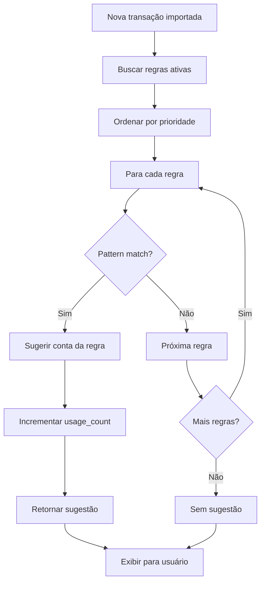

# Regras de Negócio e Fluxos de Trabalho - Sistema de Gestão Financeira

## 1. REGRAS FUNDAMENTAIS DO SISTEMA

### 1.1 Regime Contábil

**Regime de Competência Mensal (NBC T-10.19.2)**

O sistema opera exclusivamente em **regime de competência**, conforme exigido pela norma contábil ITG 2002 (R1) para entidades sem fins lucrativos. Isso significa que todas as receitas e despesas devem ser reconhecidas no período em que ocorrem, independentemente do recebimento ou pagamento.

**Implicações Práticas:**
- Lançamentos são registrados pela **data da transação**, não pela data de pagamento
- Cada lançamento deve estar associado a um **período contábil específico** (mês/ano)
- Períodos são **mensais** e devem ser gerenciados sequencialmente
- Não é permitido criar lançamentos em períodos futuros
- Lançamentos em períodos fechados requerem reabertura formal

**Validação no Sistema:**
```typescript
// Regra: Data de transação não pode ser futura
if (transactionDate > new Date()) {
  throw new Error("Não é permitido criar lançamentos com data futura");
}

// Regra: Período deve estar aberto
const period = await getPeriodByDate(transactionDate);
if (period.status !== "open") {
  throw new Error("O período está fechado. Reabra o período para criar lançamentos");
}
```

### 1.2 Hierarquia de Contas

**Estrutura Obrigatória:**

O plano de contas segue uma estrutura hierárquica de **5 níveis**, baseada na nomenclatura contábil padrão para entidades sem fins lucrativos:

| Nível | Descrição | Exemplo | Código |
|-------|-----------|---------|--------|
| 1 | **Grupo** | Ativo, Passivo, Receita, Despesa, Imobilizado | 1, 2, 6, 7, 8 |
| 2 | **Subgrupo** | Ativo Circulante, Receitas de Doações | 1.1, 6.1 |
| 3 | **Categoria** | Disponibilidades, Doações de Associados | 1.1.1, 6.1.1 |
| 4 | **Subcategoria** | Bancos Conta Movimento | 1.1.1.001 |
| 5 | **Conta Analítica** | Banco do Brasil Conta 12345 | 1.1.1.001.001 |

**Regras de Codificação:**
- Códigos devem ser **únicos** no sistema
- Formato: `N.N.N.NNN` ou `N.N.N.NNN.NNN`
- Contas **sintéticas** (com filhos) não podem receber lançamentos diretos
- Apenas contas **analíticas** (sem filhos) podem ter lançamentos
- Código da conta filha deve começar com o código da conta pai

**Validação:**
```typescript
// Regra: Conta sintética não pode receber lançamento
const account = await getAccountById(accountId);
const hasChildren = await accountHasChildren(accountId);
if (hasChildren) {
  throw new Error("Não é permitido lançar em conta sintética. Selecione uma conta analítica");
}

// Regra: Validar hierarquia ao criar conta
if (parentId) {
  const parent = await getAccountById(parentId);
  if (!code.startsWith(parent.code)) {
    throw new Error("Código da conta deve começar com o código da conta pai");
  }
}
```

### 1.3 Tipos de Conta e Natureza

**Classificação Contábil:**

| Tipo | Natureza | Saldo Normal | Uso |
|------|----------|--------------|-----|
| **asset** (Ativo) | Devedora | Débito | Bens e direitos |
| **liability** (Passivo) | Credora | Crédito | Obrigações |
| **revenue** (Receita) | Credora | Crédito | Entradas de recursos |
| **expense** (Despesa) | Devedora | Débito | Saídas de recursos |
| **fixed_asset** (Imobilizado) | Devedora | Débito | Investimentos permanentes |

**Regras de Lançamento:**
- **Receitas**: Sempre **crédito** (aumenta receita)
- **Despesas**: Sempre **débito** (aumenta despesa)
- **Ativos**: **Débito** aumenta, **crédito** diminui
- **Passivos**: **Crédito** aumenta, **débito** diminui

**Validação Automática:**
```typescript
// Regra: Sugerir tipo de lançamento baseado no tipo de conta
function suggestEntryType(accountType: AccountType): "debit" | "credit" {
  switch (accountType) {
    case "revenue":
      return "credit"; // Receita sempre crédito
    case "expense":
      return "debit"; // Despesa sempre débito
    case "asset":
    case "fixed_asset":
      return "debit"; // Ativo normalmente débito
    case "liability":
      return "credit"; // Passivo normalmente crédito
  }
}
```

### 1.4 Períodos Contábeis

**Ciclo de Vida do Período:**

```
[Criado] → [Aberto] → [Em Revisão] → [Fechado]
                ↑___________|
                (Reabertura com justificativa)
```

**Estados:**

| Status | Descrição | Ações Permitidas |
|--------|-----------|------------------|
| **open** | Período aberto para lançamentos | Criar, editar, excluir lançamentos |
| **under_review** | Período em processo de fechamento | Apenas visualização e ajustes finais |
| **closed** | Período fechado | Apenas visualização (reabertura requer admin) |

**Regras de Fechamento:**

1. **Validações Obrigatórias:**
   - Todos os lançamentos devem estar classificados
   - Saldo de fechamento deve ser informado
   - Reconciliação bancária deve estar completa (opcional, mas recomendado)

2. **Cálculos Automáticos:**
   - Totalização de receitas do período
   - Totalização de despesas do período
   - Cálculo do superávit/déficit
   - Atualização do saldo de abertura do próximo período

3. **Auditoria:**
   - Registrar usuário que fechou
   - Registrar data/hora do fechamento
   - Registrar notas explicativas (opcional)

**Validação:**
```typescript
async function closePeriod(periodId: number, userId: number, closingBalance: number, notes?: string) {
  const period = await getPeriodById(periodId);
  
  // Validação: Período já fechado
  if (period.status === "closed") {
    throw new Error("Período já está fechado");
  }
  
  // Validação: Verificar lançamentos não classificados
  const unclassified = await getUnclassifiedEntries(periodId);
  if (unclassified.length > 0) {
    throw new Error(`Existem ${unclassified.length} lançamentos não classificados`);
  }
  
  // Calcular totais
  const revenues = await sumEntries(periodId, "revenue");
  const expenses = await sumEntries(periodId, "expense");
  const balance = revenues - expenses;
  
  // Atualizar período
  await updatePeriod(periodId, {
    status: "closed",
    closingBalance,
    closedBy: userId,
    closedAt: new Date(),
    notes,
  });
  
  // Criar próximo período com saldo de abertura
  const nextMonth = period.month === 12 ? 1 : period.month + 1;
  const nextYear = period.month === 12 ? period.year + 1 : period.year;
  
  await createPeriod({
    month: nextMonth,
    year: nextYear,
    openingBalance: closingBalance,
    status: "open",
  });
  
  // Auditoria
  await createAuditLog({
    userId,
    entityType: "period",
    entityId: periodId,
    action: "close",
    newValues: { status: "closed", closingBalance, notes },
  });
}
```

**Reabertura de Período:**

Apenas usuários com role **admin** podem reabrir períodos fechados. A reabertura requer:
- Justificativa obrigatória
- Registro em auditoria
- Notificação aos usuários relevantes

```typescript
async function reopenPeriod(periodId: number, userId: number, reason: string) {
  const user = await getUserById(userId);
  
  // Validação: Apenas admin pode reabrir
  if (user.role !== "admin") {
    throw new Error("Apenas administradores podem reabrir períodos");
  }
  
  // Validação: Justificativa obrigatória
  if (!reason || reason.length < 10) {
    throw new Error("Justificativa obrigatória (mínimo 10 caracteres)");
  }
  
  const period = await getPeriodById(periodId);
  
  // Atualizar período
  await updatePeriod(periodId, {
    status: "open",
    notes: `REABERTO: ${reason}\n\n${period.notes || ""}`,
  });
  
  // Auditoria
  await createAuditLog({
    userId,
    entityType: "period",
    entityId: periodId,
    action: "reopen",
    oldValues: { status: "closed" },
    newValues: { status: "open", reason },
  });
}
```

---

## 2. REGRAS ESPECÍFICAS - NOTA FISCAL CIDADÃ

### 2.1 Identificação de Recursos NFC

**Marcação Obrigatória:**

Todos os lançamentos provenientes do programa Nota Fiscal Cidadã devem ser **marcados explicitamente** no sistema com a flag `isNfc = true`. Isso permite rastreamento e validação da aplicação dos recursos conforme a legislação.

**Campos Relacionados:**
```typescript
{
  isNfc: boolean,              // true se for recurso NFC
  nfcCategory: "project_70" | "operating_30" | null,  // Categoria de aplicação
}
```

**Regras de Classificação:**

1. **Receitas NFC:**
   - Conta específica: `6.2.1 Nota Fiscal Cidadã`
   - Sempre marcada como `isNfc = true`
   - Categoria não se aplica (receita não tem categoria de aplicação)

2. **Despesas com Recursos NFC:**
   - Devem ser marcadas como `isNfc = true`
   - **70% Projeto** (`project_70`): Investimentos conforme projeto cadastrado na SEFAZ
     - Obras e reformas
     - Aquisição de veículos
     - Equipamentos permanentes
     - Mobiliário
   - **30% Custeio** (`operating_30`): Despesas operacionais
     - Contas de consumo (luz, água, telefone)
     - Materiais de limpeza e escritório
     - Salários e encargos
     - Manutenção e reparos

**Validação:**
```typescript
// Regra: Despesa NFC deve ter categoria
if (entry.isNfc && entry.type === "debit" && !entry.nfcCategory) {
  throw new Error("Despesas com recursos NFC devem ter categoria (70% Projeto ou 30% Custeio)");
}

// Regra: Receita NFC não deve ter categoria
if (entry.isNfc && entry.type === "credit" && entry.nfcCategory) {
  throw new Error("Receitas NFC não devem ter categoria de aplicação");
}
```

### 2.2 Validação de Proporção 70/30

**Cálculo Automático:**

O sistema deve calcular automaticamente a proporção de aplicação dos recursos NFC e alertar se houver desvio da regra 70/30.

```typescript
async function validateNfcProportion(periodId: number): Promise<{
  valid: boolean;
  project70Percent: number;
  operating30Percent: number;
  totalNfcExpenses: number;
  message: string;
}> {
  // Buscar todas as despesas NFC do período
  const nfcExpenses = await getEntries({
    periodId,
    isNfc: true,
    type: "debit",
  });
  
  const project70 = nfcExpenses
    .filter(e => e.nfcCategory === "project_70")
    .reduce((sum, e) => sum + e.amountCents, 0);
  
  const operating30 = nfcExpenses
    .filter(e => e.nfcCategory === "operating_30")
    .reduce((sum, e) => sum + e.amountCents, 0);
  
  const total = project70 + operating30;
  
  if (total === 0) {
    return {
      valid: true,
      project70Percent: 0,
      operating30Percent: 0,
      totalNfcExpenses: 0,
      message: "Nenhuma despesa NFC registrada neste período",
    };
  }
  
  const project70Percent = (project70 / total) * 100;
  const operating30Percent = (operating30 / total) * 100;
  
  // Tolerância de 5% para variação
  const valid = project70Percent >= 65 && project70Percent <= 75;
  
  return {
    valid,
    project70Percent,
    operating30Percent,
    totalNfcExpenses: total,
    message: valid
      ? "Proporção NFC dentro do esperado (70% projeto / 30% custeio)"
      : `⚠️ ATENÇÃO: Proporção fora do esperado. Projeto: ${project70Percent.toFixed(1)}%, Custeio: ${operating30Percent.toFixed(1)}%`,
  };
}
```

**Alertas no Sistema:**

- **Dashboard**: Card específico mostrando proporção atual
- **Fechamento de Período**: Validação obrigatória com alerta se fora da proporção
- **Relatório NFC**: Detalhamento completo da aplicação dos recursos

### 2.3 Relatório de Prestação de Contas NFC

**Conteúdo Obrigatório:**

1. **Sumário Executivo:**
   - Total de recursos NFC recebidos no período
   - Total de recursos NFC aplicados
   - Saldo de recursos NFC não aplicados

2. **Demonstrativo de Aplicação:**
   - Detalhamento das despesas 70% (projeto)
   - Detalhamento das despesas 30% (custeio)
   - Proporção calculada

3. **Comprovação:**
   - Listagem de todos os lançamentos NFC
   - Documentos suporte (anexos)
   - Notas explicativas

**Geração Automática:**
```typescript
async function generateNfcComplianceReport(periodId: number): Promise<Buffer> {
  const period = await getPeriodById(periodId);
  
  // Buscar receitas NFC
  const nfcRevenues = await getEntries({
    periodId,
    isNfc: true,
    type: "credit",
  });
  
  // Buscar despesas NFC
  const nfcExpenses = await getEntries({
    periodId,
    isNfc: true,
    type: "debit",
  });
  
  const project70Expenses = nfcExpenses.filter(e => e.nfcCategory === "project_70");
  const operating30Expenses = nfcExpenses.filter(e => e.nfcCategory === "operating_30");
  
  const totalRevenue = nfcRevenues.reduce((sum, e) => sum + e.amountCents, 0);
  const totalProject = project70Expenses.reduce((sum, e) => sum + e.amountCents, 0);
  const totalOperating = operating30Expenses.reduce((sum, e) => sum + e.amountCents, 0);
  const totalExpenses = totalProject + totalOperating;
  
  // Gerar PDF
  const pdf = await generatePDF({
    title: `Relatório Nota Fiscal Cidadã - ${formatPeriod(period.month, period.year)}`,
    sections: [
      {
        title: "Sumário Executivo",
        content: {
          totalRevenue,
          totalExpenses,
          balance: totalRevenue - totalExpenses,
        },
      },
      {
        title: "Aplicação de Recursos",
        content: {
          project70: {
            amount: totalProject,
            percent: (totalProject / totalExpenses) * 100,
            entries: project70Expenses,
          },
          operating30: {
            amount: totalOperating,
            percent: (totalOperating / totalExpenses) * 100,
            entries: operating30Expenses,
          },
        },
      },
      {
        title: "Comprovação",
        content: {
          allEntries: [...nfcRevenues, ...nfcExpenses],
        },
      },
    ],
  });
  
  return pdf;
}
```

---

## 3. FLUXOS DE TRABALHO PRINCIPAIS

### 3.1 Fluxo: Criar Lançamento Manual

```mermaid
graph TD
    A[Usuário clica "Novo Lançamento"] --> B[Sistema verifica período atual]
    B --> C{Período aberto?}
    C -->|Não| D[Erro: Período fechado]
    C -->|Sim| E[Exibir formulário]
    E --> F[Usuário preenche dados]
    F --> G[Seleciona conta]
    G --> H{Conta analítica?}
    H -->|Não| I[Erro: Selecione conta analítica]
    H -->|Sim| J[Usuário informa valor]
    J --> K[Seleciona tipo débito/crédito]
    K --> L{Recurso NFC?}
    L -->|Sim| M[Marcar isNfc e selecionar categoria]
    L -->|Não| N[Continuar]
    M --> N
    N --> O[Usuário adiciona descrição]
    O --> P[Validação client-side]
    P --> Q{Válido?}
    Q -->|Não| R[Mostrar erros]
    Q -->|Sim| S[Enviar para backend]
    S --> T[Validação server-side]
    T --> U{Válido?}
    U -->|Não| V[Retornar erro]
    U -->|Sim| W[Criar lançamento no DB]
    W --> X[Registrar auditoria]
    X --> Y[Retornar sucesso]
    Y --> Z[Atualizar lista de lançamentos]
    Z --> AA[Toast: Lançamento criado]
```

**Validações:**

1. **Client-side (React Hook Form + Zod):**
   - Campos obrigatórios preenchidos
   - Valor maior que zero
   - Data não futura
   - Descrição mínima de 3 caracteres

2. **Server-side (tRPC + Zod):**
   - Período existe e está aberto
   - Conta existe e é analítica
   - Usuário tem permissão
   - Valor em centavos (inteiro)
   - Categoria NFC se isNfc = true

**Código de Exemplo:**
```typescript
// client/src/pages/Entries.tsx
const createEntry = trpc.entries.create.useMutation({
  onSuccess: () => {
    toast.success("Lançamento criado com sucesso!");
    utils.entries.list.invalidate();
    setIsDialogOpen(false);
  },
  onError: (error) => {
    toast.error("Erro ao criar lançamento", {
      description: error.message,
    });
  },
});

const onSubmit = (data: EntryFormData) => {
  createEntry.mutate({
    ...data,
    amountCents: Math.round(data.amount * 100),
  });
};
```

### 3.2 Fluxo: Importar Extrato Bancário

```mermaid
graph TD
    A[Usuário clica "Importar Extrato"] --> B[Wizard Etapa 1: Upload]
    B --> C[Usuário seleciona arquivo]
    C --> D[Validar tipo e tamanho]
    D --> E{Válido?}
    E -->|Não| F[Erro: Arquivo inválido]
    E -->|Sim| G[Upload para S3]
    G --> H[Criar registro BankImport]
    H --> I[Wizard Etapa 2: Processamento]
    I --> J[Parser extrai transações]
    J --> K[Detectar duplicatas]
    K --> L[Aplicar regras de classificação]
    L --> M[Exibir preview das transações]
    M --> N[Usuário revisa]
    N --> O{Confirma?}
    O -->|Não| P[Voltar ou cancelar]
    O -->|Sim| Q[Wizard Etapa 3: Classificação]
    Q --> R{Todas classificadas?}
    R -->|Sim| S[Criar lançamentos em lote]
    R -->|Não| T[Usuário classifica manualmente]
    T --> U{Concluído?}
    U -->|Não| T
    U -->|Sim| S
    S --> V[Atualizar BankImport status]
    V --> W[Registrar auditoria]
    W --> X[Toast: Importação concluída]
    X --> Y[Redirecionar para lançamentos]
```

**Etapas Detalhadas:**

**Etapa 1: Upload e Validação**
```typescript
async function handleFileUpload(file: File, bank: string) {
  // Validações
  if (file.size > 10 * 1024 * 1024) {
    throw new Error("Arquivo muito grande (máximo 10MB)");
  }
  
  const allowedTypes = [".pdf", ".csv", ".ofx"];
  const extension = file.name.split(".").pop()?.toLowerCase();
  if (!extension || !allowedTypes.includes(`.${extension}`)) {
    throw new Error("Tipo de arquivo não suportado");
  }
  
  // Upload para S3
  const fileKey = `bank-imports/${Date.now()}-${file.name}`;
  const { url } = await storagePut(fileKey, await file.arrayBuffer(), file.type);
  
  // Criar registro
  const bankImport = await trpc.bankImports.create.mutate({
    filename: file.name,
    bank,
    fileType: extension as "pdf" | "csv" | "ofx",
    fileUrl: url,
    status: "pending",
  });
  
  return bankImport;
}
```

**Etapa 2: Parsing e Detecção de Duplicatas**
```typescript
async function processImport(importId: number) {
  const bankImport = await getBankImportById(importId);
  
  // Atualizar status
  await updateBankImport(importId, { status: "processing" });
  
  try {
    // Selecionar parser baseado no banco
    const parser = getParser(bankImport.bank, bankImport.fileType);
    
    // Baixar arquivo do S3
    const fileBuffer = await downloadFromS3(bankImport.fileUrl);
    
    // Extrair transações
    const transactions = await parser.parse(fileBuffer);
    
    // Detectar duplicatas
    const existingEntries = await getEntriesByDateRange(
      transactions[0].date,
      transactions[transactions.length - 1].date
    );
    
    const duplicates = transactions.filter(tx =>
      existingEntries.some(entry =>
        entry.transactionDate === tx.date &&
        entry.amountCents === tx.amountCents &&
        entry.description === tx.description
      )
    );
    
    // Aplicar regras de classificação
    const classified = await applyClassificationRules(transactions);
    
    // Atualizar registro
    await updateBankImport(importId, {
      totalTransactions: transactions.length,
      classifiedCount: classified.filter(t => t.suggestedAccountId).length,
      startDate: transactions[0].date,
      endDate: transactions[transactions.length - 1].date,
      status: "completed",
    });
    
    return {
      transactions: classified,
      duplicates,
    };
  } catch (error) {
    await updateBankImport(importId, {
      status: "failed",
      errorMessage: error.message,
    });
    throw error;
  }
}
```

**Etapa 3: Classificação Manual e Criação de Lançamentos**
```typescript
async function finalizeImport(importId: number, classifications: Array<{
  transactionIndex: number;
  accountId: number;
  isNfc?: boolean;
  nfcCategory?: "project_70" | "operating_30";
}>) {
  const bankImport = await getBankImportById(importId);
  const transactions = await getImportTransactions(importId);
  
  // Criar lançamentos em lote
  const entries = transactions.map((tx, index) => {
    const classification = classifications.find(c => c.transactionIndex === index);
    
    return {
      periodId: getPeriodByDate(tx.date).id,
      accountId: classification.accountId,
      type: tx.amount > 0 ? "credit" : "debit",
      amountCents: Math.abs(tx.amount),
      transactionDate: tx.date,
      description: tx.description,
      origin: "bank_import",
      bankImportId: importId,
      isNfc: classification.isNfc || false,
      nfcCategory: classification.nfcCategory,
      createdBy: getCurrentUserId(),
    };
  });
  
  await createEntriesBatch(entries);
  
  // Auditoria
  await createAuditLog({
    userId: getCurrentUserId(),
    entityType: "import",
    entityId: importId,
    action: "create",
    newValues: { entriesCreated: entries.length },
  });
}
```

### 3.3 Fluxo: Classificação Automática



**Algoritmo de Classificação:**
```typescript
async function classifyTransaction(description: string): Promise<{
  suggestedAccountId: number | null;
  confidence: number;
  ruleId: number | null;
}> {
  // Buscar regras ativas ordenadas por prioridade
  const rules = await getClassificationRules({
    active: true,
    orderBy: "priority",
    order: "desc",
  });
  
  // Normalizar descrição
  const normalizedDesc = description.toLowerCase().trim();
  
  // Tentar match com cada regra
  for (const rule of rules) {
    const pattern = rule.pattern.toLowerCase();
    
    // Match exato
    if (normalizedDesc.includes(pattern)) {
      // Incrementar contador de uso
      await incrementRuleUsage(rule.id);
      
      return {
        suggestedAccountId: rule.accountId,
        confidence: 0.9, // Alta confiança
        ruleId: rule.id,
      };
    }
    
    // Match fuzzy (similaridade > 80%)
    const similarity = calculateSimilarity(normalizedDesc, pattern);
    if (similarity > 0.8) {
      await incrementRuleUsage(rule.id);
      
      return {
        suggestedAccountId: rule.accountId,
        confidence: similarity,
        ruleId: rule.id,
      };
    }
  }
  
  // Sem match
  return {
    suggestedAccountId: null,
    confidence: 0,
    ruleId: null,
  };
}

// Algoritmo de similaridade (Levenshtein distance)
function calculateSimilarity(str1: string, str2: string): number {
  const longer = str1.length > str2.length ? str1 : str2;
  const shorter = str1.length > str2.length ? str2 : str1;
  
  if (longer.length === 0) return 1.0;
  
  const editDistance = levenshteinDistance(longer, shorter);
  return (longer.length - editDistance) / longer.length;
}
```

**Aprendizado Automático (Futuro):**

O sistema pode aprender com as classificações manuais do usuário e criar regras automaticamente:

```typescript
async function learnFromManualClassification(entry: Entry) {
  // Verificar se já existe regra similar
  const existingRule = await findSimilarRule(entry.description, entry.accountId);
  
  if (existingRule) {
    // Incrementar prioridade da regra existente
    await updateRule(existingRule.id, {
      priority: existingRule.priority + 1,
    });
  } else {
    // Criar nova regra
    const pattern = extractKeywords(entry.description);
    
    await createClassificationRule({
      pattern,
      accountId: entry.accountId,
      priority: 1,
      active: true,
      createdBy: entry.createdBy,
    });
  }
}
```

### 3.4 Fluxo: Fechar Período

```mermaid
graph TD
    A[Usuário clica "Fechar Período"] --> B[Validar permissões]
    B --> C{É admin/accountant?}
    C -->|Não| D[Erro: Sem permissão]
    C -->|Sim| E[Buscar dados do período]
    E --> F[Calcular totais]
    F --> G[Validar lançamentos]
    G --> H{Todos classificados?}
    H -->|Não| I[Alerta: Lançamentos não classificados]
    H -->|Sim| J[Validar proporção NFC]
    J --> K{NFC OK?}
    K -->|Não| L[Alerta: Proporção fora do esperado]
    K -->|Sim| M[Exibir dialog de confirmação]
    I --> M
    L --> M
    M --> N[Usuário confirma]
    N --> O[Atualizar status para closed]
    O --> P[Registrar saldo de fechamento]
    P --> Q[Criar próximo período]
    Q --> R[Registrar auditoria]
    R --> S[Toast: Período fechado]
    S --> T[Atualizar dashboard]
```

**Implementação Completa:**
```typescript
async function closePeriod(
  periodId: number,
  userId: number,
  closingBalance: number,
  notes?: string
): Promise<void> {
  // 1. Validar permissões
  const user = await getUserById(userId);
  if (!["admin", "accountant"].includes(user.role)) {
    throw new TRPCError({
      code: "FORBIDDEN",
      message: "Apenas administradores e contadores podem fechar períodos",
    });
  }
  
  // 2. Buscar período
  const period = await getPeriodById(periodId);
  if (period.status === "closed") {
    throw new TRPCError({
      code: "BAD_REQUEST",
      message: "Período já está fechado",
    });
  }
  
  // 3. Validar lançamentos
  const unclassifiedEntries = await getEntries({
    periodId,
    accountId: null, // Sem conta = não classificado
  });
  
  if (unclassifiedEntries.length > 0) {
    throw new TRPCError({
      code: "BAD_REQUEST",
      message: `Existem ${unclassifiedEntries.length} lançamentos não classificados. Classifique-os antes de fechar o período.`,
    });
  }
  
  // 4. Calcular totais
  const revenues = await sumEntries(periodId, "revenue");
  const expenses = await sumEntries(periodId, "expense");
  const balance = revenues - expenses;
  
  // 5. Validar proporção NFC (se houver despesas NFC)
  const nfcValidation = await validateNfcProportion(periodId);
  if (!nfcValidation.valid && nfcValidation.totalNfcExpenses > 0) {
    console.warn(`[Period Close] NFC proportion warning: ${nfcValidation.message}`);
    // Não bloqueia fechamento, apenas alerta
  }
  
  // 6. Atualizar período
  await updatePeriod(periodId, {
    status: "closed",
    closingBalance,
    closedBy: userId,
    closedAt: new Date(),
    notes: notes || "",
  });
  
  // 7. Criar próximo período
  const nextMonth = period.month === 12 ? 1 : period.month + 1;
  const nextYear = period.month === 12 ? period.year + 1 : period.year;
  
  const nextPeriod = await createPeriod({
    month: nextMonth,
    year: nextYear,
    openingBalance: closingBalance,
    status: "open",
  });
  
  // 8. Auditoria
  await createAuditLog({
    userId,
    entityType: "period",
    entityId: periodId,
    action: "close",
    oldValues: { status: period.status },
    newValues: {
      status: "closed",
      closingBalance,
      revenues,
      expenses,
      balance,
      nfcValidation,
    },
  });
  
  // 9. Notificar usuários (futuro)
  // await notifyUsers({
  //   title: `Período ${formatPeriod(period.month, period.year)} fechado`,
  //   message: `Saldo de fechamento: ${formatCurrency(closingBalance)}`,
  // });
}
```

### 3.5 Fluxo: Gerar Relatório

```mermaid
graph TD
    A[Usuário seleciona tipo de relatório] --> B[Exibir dialog de configuração]
    B --> C[Usuário seleciona período/ano]
    C --> D[Usuário seleciona opções]
    D --> E[Usuário clica "Gerar"]
    E --> F[Validar seleções]
    F --> G{Válido?}
    G -->|Não| H[Mostrar erros]
    G -->|Sim| I[Buscar dados do período]
    I --> J[Calcular totais e saldos]
    J --> K[Gerar gráficos se necessário]
    K --> L[Montar estrutura do relatório]
    L --> M[Gerar PDF]
    M --> N[Upload para S3]
    N --> O[Retornar URL do PDF]
    O --> P[Abrir PDF em nova aba]
    P --> Q[Registrar auditoria]
```

**Tipos de Relatório:**

1. **Relatório Financeiro Mensal:**
   - Sumário executivo
   - Demonstrativo de receitas
   - Demonstrativo de despesas
   - Balanço patrimonial
   - Saldos bancários
   - Notas explicativas

2. **Relatório Nota Fiscal Cidadã:**
   - Total de recursos recebidos
   - Aplicação 70% projeto
   - Aplicação 30% custeio
   - Proporção calculada
   - Comprovação

3. **Balancete Mensal:**
   - Saldos de todas as contas
   - Movimentação do período
   - Saldo anterior vs saldo atual

**Geração de PDF:**
```typescript
import { jsPDF } from "jspdf";
import "jspdf-autotable";

async function generateFinancialReport(periodId: number, options: ReportOptions): Promise<Buffer> {
  const period = await getPeriodById(periodId);
  const organization = await getOrganizationSettings();
  
  // Buscar dados
  const revenues = await getEntries({ periodId, accountType: "revenue" });
  const expenses = await getEntries({ periodId, accountType: "expense" });
  const accounts = await getAccounts();
  
  // Calcular totais
  const totalRevenues = revenues.reduce((sum, e) => sum + e.amountCents, 0);
  const totalExpenses = expenses.reduce((sum, e) => sum + e.amountCents, 0);
  const balance = totalRevenues - totalExpenses;
  
  // Criar PDF
  const doc = new jsPDF();
  
  // Cabeçalho
  doc.setFontSize(18);
  doc.text(organization.name, 105, 20, { align: "center" });
  doc.setFontSize(14);
  doc.text(
    `Relatório Financeiro - ${formatPeriod(period.month, period.year)}`,
    105,
    30,
    { align: "center" }
  );
  
  // Sumário Executivo
  doc.setFontSize(12);
  doc.text("Sumário Executivo", 20, 45);
  doc.setFontSize(10);
  doc.text(`Receitas: ${formatCurrency(totalRevenues)}`, 20, 55);
  doc.text(`Despesas: ${formatCurrency(totalExpenses)}`, 20, 62);
  doc.text(
    `Saldo: ${formatCurrency(balance)} (${balance >= 0 ? "Superávit" : "Déficit"})`,
    20,
    69
  );
  
  // Tabela de Receitas
  doc.addPage();
  doc.setFontSize(12);
  doc.text("Demonstrativo de Receitas", 20, 20);
  
  const revenueRows = revenues.map(e => [
    formatDate(e.transactionDate),
    e.description,
    e.account.name,
    formatCurrency(e.amountCents),
  ]);
  
  doc.autoTable({
    startY: 25,
    head: [["Data", "Descrição", "Conta", "Valor"]],
    body: revenueRows,
  });
  
  // Tabela de Despesas
  doc.addPage();
  doc.setFontSize(12);
  doc.text("Demonstrativo de Despesas", 20, 20);
  
  const expenseRows = expenses.map(e => [
    formatDate(e.transactionDate),
    e.description,
    e.account.name,
    formatCurrency(e.amountCents),
  ]);
  
  doc.autoTable({
    startY: 25,
    head: [["Data", "Descrição", "Conta", "Valor"]],
    body: expenseRows,
  });
  
  // Converter para buffer
  const pdfBuffer = Buffer.from(doc.output("arraybuffer"));
  
  return pdfBuffer;
}
```

---

## 4. REGRAS DE VALIDAÇÃO

### 4.1 Validações de Entrada

**Lançamentos:**
```typescript
const entrySchema = z.object({
  periodId: z.number().positive("Selecione um período"),
  accountId: z.number().positive("Selecione uma conta"),
  type: z.enum(["debit", "credit"], {
    errorMap: () => ({ message: "Selecione débito ou crédito" }),
  }),
  amountCents: z.number()
    .positive("Valor deve ser maior que zero")
    .int("Valor deve ser em centavos")
    .max(999999999999, "Valor muito grande"),
  transactionDate: z.date()
    .max(new Date(), "Data não pode ser futura"),
  description: z.string()
    .min(3, "Descrição muito curta (mínimo 3 caracteres)")
    .max(500, "Descrição muito longa (máximo 500 caracteres)"),
  isNfc: z.boolean().default(false),
  nfcCategory: z.enum(["project_70", "operating_30"]).optional(),
  notes: z.string().max(1000, "Notas muito longas").optional(),
}).refine(
  (data) => {
    // Se isNfc = true e tipo = débito, categoria é obrigatória
    if (data.isNfc && data.type === "debit" && !data.nfcCategory) {
      return false;
    }
    return true;
  },
  {
    message: "Despesas NFC devem ter categoria (70% Projeto ou 30% Custeio)",
    path: ["nfcCategory"],
  }
);
```

**Contas:**
```typescript
const accountSchema = z.object({
  code: z.string()
    .min(1, "Código obrigatório")
    .max(50, "Código muito longo")
    .regex(/^[0-9.]+$/, "Código deve conter apenas números e pontos"),
  name: z.string()
    .min(3, "Nome muito curto")
    .max(255, "Nome muito longo"),
  type: z.enum(["asset", "liability", "revenue", "expense", "fixed_asset"]),
  parentId: z.number().positive().optional(),
  description: z.string().max(1000).optional(),
});
```

**Períodos:**
```typescript
const periodSchema = z.object({
  month: z.number()
    .min(1, "Mês inválido")
    .max(12, "Mês inválido"),
  year: z.number()
    .min(2000, "Ano inválido")
    .max(2100, "Ano inválido"),
  openingBalance: z.number()
    .int("Saldo deve ser em centavos")
    .default(0),
});
```

### 4.2 Validações de Negócio

**Período Fechado:**
```typescript
async function validatePeriodOpen(periodId: number): Promise<void> {
  const period = await getPeriodById(periodId);
  if (period.status === "closed") {
    throw new TRPCError({
      code: "BAD_REQUEST",
      message: "Não é permitido criar ou editar lançamentos em período fechado",
    });
  }
}
```

**Conta Analítica:**
```typescript
async function validateAccountAnalytic(accountId: number): Promise<void> {
  const hasChildren = await accountHasChildren(accountId);
  if (hasChildren) {
    throw new TRPCError({
      code: "BAD_REQUEST",
      message: "Não é permitido lançar em conta sintética. Selecione uma conta analítica (sem filhos)",
    });
  }
}
```

**Hierarquia de Contas:**
```typescript
async function validateAccountHierarchy(code: string, parentId?: number): Promise<void> {
  if (parentId) {
    const parent = await getAccountById(parentId);
    if (!code.startsWith(parent.code)) {
      throw new TRPCError({
        code: "BAD_REQUEST",
        message: `Código da conta deve começar com o código da conta pai (${parent.code})`,
      });
    }
  }
}
```

**Código Único:**
```typescript
async function validateAccountCodeUnique(code: string, excludeId?: number): Promise<void> {
  const existing = await getAccountByCode(code);
  if (existing && existing.id !== excludeId) {
    throw new TRPCError({
      code: "BAD_REQUEST",
      message: `Já existe uma conta com o código ${code}`,
    });
  }
}
```

---

## 5. REGRAS DE AUDITORIA

### 5.1 Eventos Auditados

**Todas as operações críticas devem ser registradas:**

| Entidade | Ações Auditadas | Informações Registradas |
|----------|-----------------|-------------------------|
| **Entry** | create, update, delete | Valores antigos e novos, usuário, timestamp |
| **Account** | create, update, delete | Código, nome, tipo, hierarquia |
| **Period** | create, close, reopen | Status, saldo, usuário que fechou |
| **BankImport** | create, process, complete | Arquivo, transações, classificações |
| **ClassificationRule** | create, update, delete | Pattern, conta, prioridade |
| **Settings** | update | Configurações alteradas |

### 5.2 Estrutura do Log

```typescript
{
  id: number,
  userId: number,
  entityType: "entry" | "account" | "period" | "import" | "rule" | "setting",
  entityId: number,
  action: "create" | "update" | "delete" | "close" | "reopen",
  oldValues: Record<string, any> | null,
  newValues: Record<string, any>,
  ipAddress: string,
  userAgent: string,
  createdAt: Date,
}
```

### 5.3 Consulta de Auditoria

**Interface de Auditoria:**
```typescript
// Buscar histórico de uma entidade específica
async function getEntityAuditTrail(
  entityType: string,
  entityId: number
): Promise<AuditLog[]> {
  return await db.select()
    .from(auditLog)
    .where(and(
      eq(auditLog.entityType, entityType),
      eq(auditLog.entityId, entityId)
    ))
    .orderBy(auditLog.createdAt, "desc");
}

// Buscar ações de um usuário
async function getUserAuditTrail(
  userId: number,
  startDate?: Date,
  endDate?: Date
): Promise<AuditLog[]> {
  const conditions = [eq(auditLog.userId, userId)];
  
  if (startDate && endDate) {
    conditions.push(between(auditLog.createdAt, startDate, endDate));
  }
  
  return await db.select()
    .from(auditLog)
    .where(and(...conditions))
    .orderBy(auditLog.createdAt, "desc");
}
```

---

## 6. REGRAS DE PERMISSÕES

### 6.1 Matriz de Permissões

| Ação | admin | accountant | manager | viewer |
|------|-------|------------|---------|--------|
| **Visualizar dashboard** | ✅ | ✅ | ✅ | ✅ |
| **Visualizar lançamentos** | ✅ | ✅ | ✅ | ✅ |
| **Criar lançamento** | ✅ | ✅ | ✅ | ❌ |
| **Editar lançamento (período aberto)** | ✅ | ✅ | ❌ | ❌ |
| **Excluir lançamento** | ✅ | ❌ | ❌ | ❌ |
| **Importar extrato** | ✅ | ✅ | ❌ | ❌ |
| **Criar/editar conta** | ✅ | ✅ | ❌ | ❌ |
| **Excluir conta** | ✅ | ❌ | ❌ | ❌ |
| **Fechar período** | ✅ | ✅ | ❌ | ❌ |
| **Reabrir período** | ✅ | ❌ | ❌ | ❌ |
| **Gerar relatório** | ✅ | ✅ | ✅ | ✅ |
| **Gerenciar usuários** | ✅ | ❌ | ❌ | ❌ |
| **Alterar configurações** | ✅ | ❌ | ❌ | ❌ |
| **Ver auditoria** | ✅ | ✅ | ❌ | ❌ |

### 6.2 Implementação de Permissões

```typescript
// Middleware de permissão
export const requireRole = (allowedRoles: string[]) => {
  return protectedProcedure.use(({ ctx, next }) => {
    if (!allowedRoles.includes(ctx.user.role)) {
      throw new TRPCError({
        code: "FORBIDDEN",
        message: "Você não tem permissão para realizar esta ação",
      });
    }
    return next({ ctx });
  });
};

// Uso nos routers
export const appRouter = router({
  entries: router({
    create: requireRole(["admin", "accountant", "manager"])
      .input(entrySchema)
      .mutation(async ({ input, ctx }) => {
        // Criar lançamento
      }),
    
    delete: requireRole(["admin"])
      .input(z.object({ id: z.number() }))
      .mutation(async ({ input, ctx }) => {
        // Excluir lançamento
      }),
  }),
  
  periods: router({
    close: requireRole(["admin", "accountant"])
      .input(closePeriodSchema)
      .mutation(async ({ input, ctx }) => {
        // Fechar período
      }),
    
    reopen: requireRole(["admin"])
      .input(reopenPeriodSchema)
      .mutation(async ({ input, ctx }) => {
        // Reabrir período
      }),
  }),
});
```

---

## 7. REGRAS DE INTEGRIDADE

### 7.1 Integridade Referencial

**Foreign Keys:**
```sql
-- Lançamentos devem ter período válido
ALTER TABLE entries
  ADD CONSTRAINT fk_entries_period
  FOREIGN KEY (periodId) REFERENCES periods(id)
  ON DELETE RESTRICT;

-- Lançamentos devem ter conta válida
ALTER TABLE entries
  ADD CONSTRAINT fk_entries_account
  FOREIGN KEY (accountId) REFERENCES accounts(id)
  ON DELETE RESTRICT;

-- Contas podem ter pai (hierarquia)
ALTER TABLE accounts
  ADD CONSTRAINT fk_accounts_parent
  FOREIGN KEY (parentId) REFERENCES accounts(id)
  ON DELETE RESTRICT;
```

### 7.2 Constraints

```sql
-- Período único por mês/ano
ALTER TABLE periods
  ADD CONSTRAINT uk_periods_month_year
  UNIQUE (month, year);

-- Código de conta único
ALTER TABLE accounts
  ADD CONSTRAINT uk_accounts_code
  UNIQUE (code);

-- Valor de lançamento sempre positivo
ALTER TABLE entries
  ADD CONSTRAINT ck_entries_amount_positive
  CHECK (amountCents > 0);

-- Mês válido (1-12)
ALTER TABLE periods
  ADD CONSTRAINT ck_periods_month_valid
  CHECK (month BETWEEN 1 AND 12);
```

### 7.3 Regras de Exclusão

**Soft Delete vs Hard Delete:**

- **Contas**: Soft delete (marcar como inativa) se houver lançamentos
- **Períodos**: Não permitir exclusão (apenas fechar)
- **Lançamentos**: Hard delete permitido apenas em períodos abertos
- **Importações**: Soft delete (manter histórico)

```typescript
async function deleteAccount(accountId: number): Promise<void> {
  // Verificar se tem lançamentos
  const hasEntries = await accountHasEntries(accountId);
  
  if (hasEntries) {
    // Soft delete
    await updateAccount(accountId, { active: false });
  } else {
    // Hard delete
    await db.delete(accounts).where(eq(accounts.id, accountId));
  }
}

async function deleteEntry(entryId: number, userId: number): Promise<void> {
  const entry = await getEntryById(entryId);
  const period = await getPeriodById(entry.periodId);
  
  // Validar período aberto
  if (period.status !== "open") {
    throw new TRPCError({
      code: "BAD_REQUEST",
      message: "Não é permitido excluir lançamentos de período fechado",
    });
  }
  
  // Validar permissão
  const user = await getUserById(userId);
  if (user.role !== "admin") {
    throw new TRPCError({
      code: "FORBIDDEN",
      message: "Apenas administradores podem excluir lançamentos",
    });
  }
  
  // Auditoria antes de excluir
  await createAuditLog({
    userId,
    entityType: "entry",
    entityId: entryId,
    action: "delete",
    oldValues: entry,
    newValues: null,
  });
  
  // Hard delete
  await db.delete(entries).where(eq(entries.id, entryId));
}
```

---

**Documento elaborado em:** Dezembro 2024  
**Versão:** 1.0  
**Autor:** Manus AI  
**Base Normativa:** ITG 2002 (R1), NBC T-10.19, Legislação NFC
