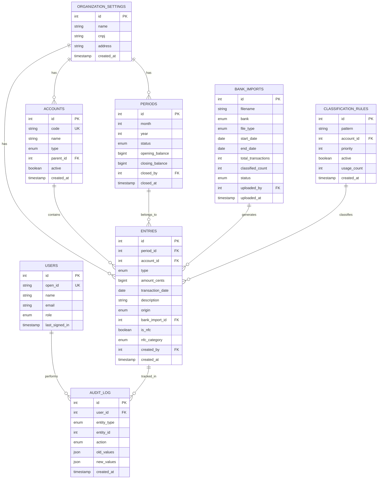

# Arquitetura Técnica do Sistema - Gestão Financeira para Centros Espíritas

## 1. VISÃO GERAL DO SISTEMA

### 1.1 Propósito
Sistema web completo para gestão financeira e contábil de Centros Espíritas e entidades sem fins lucrativos, com foco em:
- Automação de processos contábeis
- Conformidade com ITG 2002 (R1) e normas do terceiro setor
- Controle específico de recursos da Nota Fiscal Cidadã (70%/30%)
- Geração automática de relatórios e demonstrações contábeis
- Importação e classificação inteligente de extratos bancários

### 1.2 Princípios Arquiteturais
1. **Type-Safety End-to-End**: tRPC garante tipagem completa do backend ao frontend
2. **Single Source of Truth**: Banco de dados como única fonte de verdade
3. **Audit Trail**: Rastreamento completo de todas as operações
4. **Separation of Concerns**: Camadas bem definidas (apresentação, lógica, dados)
5. **Progressive Enhancement**: Funcionalidades básicas primeiro, complexidade incremental

---

## 2. STACK TECNOLÓGICA

### 2.1 Frontend
```typescript
{
  "framework": "React 19",
  "routing": "Wouter 3.x",
  "styling": "TailwindCSS 4.x",
  "components": "shadcn/ui (Radix UI)",
  "forms": "React Hook Form + Zod",
  "state": "TanStack Query (React Query)",
  "rpc": "tRPC Client 11.x",
  "charts": "Recharts",
  "pdf": "React-PDF / jsPDF",
  "excel": "SheetJS (xlsx)"
}
```

**Justificativas:**
- **React 19**: Última versão com melhorias de performance e concurrent features
- **Wouter**: Roteamento leve e performático (3KB vs 40KB do React Router)
- **TailwindCSS 4**: Utility-first CSS com performance otimizada
- **shadcn/ui**: Componentes acessíveis, customizáveis e modernos
- **tRPC**: Type-safety completa, sem necessidade de gerar tipos manualmente

### 2.2 Backend
```typescript
{
  "runtime": "Node.js 22.x",
  "framework": "Express 4.x",
  "rpc": "tRPC Server 11.x",
  "validation": "Zod",
  "orm": "Drizzle ORM",
  "database": "MySQL 8.x / TiDB",
  "auth": "Manus OAuth + JWT",
  "storage": "AWS S3 (via Manus)",
  "serialization": "SuperJSON"
}
```

**Justificativas:**
- **Express**: Maduro, estável, grande ecossistema
- **tRPC**: Elimina necessidade de REST/GraphQL, type-safety automática
- **Drizzle ORM**: Type-safe, performático, migrations simples
- **MySQL/TiDB**: Relacional, ACID, adequado para dados financeiros
- **SuperJSON**: Serializa Date, BigInt, Map, Set automaticamente

### 2.3 Infraestrutura
```yaml
Hosting: Manus Platform
Database: TiDB (MySQL-compatible)
Storage: S3 (Manus-managed)
Auth: Manus OAuth
Deployment: Git-based, automatic
SSL: Automatic (Manus-managed)
Domain: Custom domain support
```

---

## 3. ARQUITETURA DE DADOS

### 3.1 Modelo Entidade-Relacionamento



### 3.2 Schema Detalhado (Drizzle ORM)

```typescript
// drizzle/schema.ts

import { int, bigint, mysqlEnum, mysqlTable, text, timestamp, varchar, date, json, boolean, index, uniqueIndex } from "drizzle-orm/mysql-core";

// ==================== USERS ====================
export const users = mysqlTable("users", {
  id: int("id").autoincrement().primaryKey(),
  openId: varchar("openId", { length: 64 }).notNull().unique(),
  name: text("name"),
  email: varchar("email", { length: 320 }),
  loginMethod: varchar("loginMethod", { length: 64 }),
  role: mysqlEnum("role", ["admin", "accountant", "manager", "viewer"]).default("viewer").notNull(),
  createdAt: timestamp("createdAt").defaultNow().notNull(),
  updatedAt: timestamp("updatedAt").defaultNow().onUpdateNow().notNull(),
  lastSignedIn: timestamp("lastSignedIn").defaultNow().notNull(),
});

// ==================== ORGANIZATION ====================
export const organizationSettings = mysqlTable("organization_settings", {
  id: int("id").autoincrement().primaryKey(),
  name: varchar("name", { length: 255 }).notNull(),
  cnpj: varchar("cnpj", { length: 18 }),
  address: text("address"),
  city: varchar("city", { length: 100 }),
  state: varchar("state", { length: 2 }),
  zipCode: varchar("zipCode", { length: 10 }),
  phone: varchar("phone", { length: 20 }),
  email: varchar("email", { length: 320 }),
  createdAt: timestamp("createdAt").defaultNow().notNull(),
  updatedAt: timestamp("updatedAt").defaultNow().onUpdateNow().notNull(),
});

// ==================== ACCOUNTS ====================
export const accounts = mysqlTable("accounts", {
  id: int("id").autoincrement().primaryKey(),
  code: varchar("code", { length: 50 }).notNull().unique(),
  name: varchar("name", { length: 255 }).notNull(),
  type: mysqlEnum("type", ["asset", "liability", "revenue", "expense", "fixed_asset"]).notNull(),
  parentId: int("parentId"),
  level: int("level").default(0).notNull(),
  active: int("active").default(1).notNull(),
  description: text("description"),
  createdAt: timestamp("createdAt").defaultNow().notNull(),
  updatedAt: timestamp("updatedAt").defaultNow().onUpdateNow().notNull(),
}, (table) => ({
  codeIdx: uniqueIndex("code_idx").on(table.code),
  typeIdx: index("type_idx").on(table.type),
  parentIdx: index("parent_idx").on(table.parentId),
}));

// ==================== PERIODS ====================
export const periods = mysqlTable("periods", {
  id: int("id").autoincrement().primaryKey(),
  month: int("month").notNull(),
  year: int("year").notNull(),
  status: mysqlEnum("status", ["open", "under_review", "closed"]).default("open").notNull(),
  openingBalance: bigint("openingBalance", { mode: "number" }).default(0).notNull(),
  closingBalance: bigint("closingBalance", { mode: "number" }).default(0).notNull(),
  closedBy: int("closedBy"),
  closedAt: timestamp("closedAt"),
  notes: text("notes"),
  createdAt: timestamp("createdAt").defaultNow().notNull(),
  updatedAt: timestamp("updatedAt").defaultNow().onUpdateNow().notNull(),
}, (table) => ({
  periodIdx: uniqueIndex("period_idx").on(table.month, table.year),
  statusIdx: index("status_idx").on(table.status),
}));

// ==================== ENTRIES ====================
export const entries = mysqlTable("entries", {
  id: int("id").autoincrement().primaryKey(),
  periodId: int("periodId").notNull(),
  accountId: int("accountId").notNull(),
  type: mysqlEnum("type", ["debit", "credit"]).notNull(),
  amountCents: bigint("amountCents", { mode: "number" }).notNull(),
  transactionDate: date("transactionDate").notNull(),
  description: text("description").notNull(),
  origin: mysqlEnum("origin", ["manual", "bank_import", "system"]).default("manual").notNull(),
  bankImportId: int("bankImportId"),
  isNfc: int("isNfc").default(0).notNull(),
  nfcCategory: mysqlEnum("nfcCategory", ["project_70", "operating_30"]),
  documentNumber: varchar("documentNumber", { length: 100 }),
  notes: text("notes"),
  createdBy: int("createdBy").notNull(),
  createdAt: timestamp("createdAt").defaultNow().notNull(),
  updatedAt: timestamp("updatedAt").defaultNow().onUpdateNow().notNull(),
}, (table) => ({
  periodIdx: index("period_idx").on(table.periodId),
  accountIdx: index("account_idx").on(table.accountId),
  dateIdx: index("date_idx").on(table.transactionDate),
  nfcIdx: index("nfc_idx").on(table.isNfc),
  importIdx: index("import_idx").on(table.bankImportId),
}));

// ==================== BANK IMPORTS ====================
export const bankImports = mysqlTable("bank_imports", {
  id: int("id").autoincrement().primaryKey(),
  filename: varchar("filename", { length: 255 }).notNull(),
  bank: mysqlEnum("bank", ["banco_brasil", "caixa_economica", "other"]).notNull(),
  fileType: mysqlEnum("fileType", ["pdf", "csv", "ofx"]).notNull(),
  fileUrl: text("fileUrl"),
  startDate: date("startDate"),
  endDate: date("endDate"),
  totalTransactions: int("totalTransactions").default(0).notNull(),
  classifiedCount: int("classifiedCount").default(0).notNull(),
  status: mysqlEnum("status", ["pending", "processing", "completed", "failed"]).default("pending").notNull(),
  errorMessage: text("errorMessage"),
  uploadedBy: int("uploadedBy").notNull(),
  uploadedAt: timestamp("uploadedAt").defaultNow().notNull(),
  processedAt: timestamp("processedAt"),
}, (table) => ({
  statusIdx: index("status_idx").on(table.status),
  bankIdx: index("bank_idx").on(table.bank),
  uploadedByIdx: index("uploaded_by_idx").on(table.uploadedBy),
}));

// ==================== CLASSIFICATION RULES ====================
export const classificationRules = mysqlTable("classification_rules", {
  id: int("id").autoincrement().primaryKey(),
  pattern: varchar("pattern", { length: 255 }).notNull(),
  accountId: int("accountId").notNull(),
  priority: int("priority").default(0).notNull(),
  active: int("active").default(1).notNull(),
  usageCount: int("usageCount").default(0).notNull(),
  createdBy: int("createdBy").notNull(),
  createdAt: timestamp("createdAt").defaultNow().notNull(),
  updatedAt: timestamp("updatedAt").defaultNow().onUpdateNow().notNull(),
}, (table) => ({
  accountIdx: index("account_idx").on(table.accountId),
  priorityIdx: index("priority_idx").on(table.priority),
  activeIdx: index("active_idx").on(table.active),
}));

// ==================== AUDIT LOG ====================
export const auditLog = mysqlTable("audit_log", {
  id: int("id").autoincrement().primaryKey(),
  userId: int("userId").notNull(),
  entityType: mysqlEnum("entityType", ["entry", "account", "period", "import", "rule", "setting"]).notNull(),
  entityId: int("entityId").notNull(),
  action: mysqlEnum("action", ["create", "update", "delete", "close", "reopen"]).notNull(),
  oldValues: json("oldValues"),
  newValues: json("newValues"),
  ipAddress: varchar("ipAddress", { length: 45 }),
  userAgent: text("userAgent"),
  createdAt: timestamp("createdAt").defaultNow().notNull(),
}, (table) => ({
  userIdx: index("user_idx").on(table.userId),
  entityIdx: index("entity_idx").on(table.entityType, table.entityId),
  actionIdx: index("action_idx").on(table.action),
  dateIdx: index("date_idx").on(table.createdAt),
}));

// ==================== TYPES ====================
export type User = typeof users.$inferSelect;
export type InsertUser = typeof users.$inferInsert;

export type OrganizationSettings = typeof organizationSettings.$inferSelect;
export type InsertOrganizationSettings = typeof organizationSettings.$inferInsert;

export type Account = typeof accounts.$inferSelect;
export type InsertAccount = typeof accounts.$inferInsert;

export type Period = typeof periods.$inferSelect;
export type InsertPeriod = typeof periods.$inferInsert;

export type Entry = typeof entries.$inferSelect;
export type InsertEntry = typeof entries.$inferInsert;

export type BankImport = typeof bankImports.$inferSelect;
export type InsertBankImport = typeof bankImports.$inferInsert;

export type ClassificationRule = typeof classificationRules.$inferSelect;
export type InsertClassificationRule = typeof classificationRules.$inferInsert;

export type AuditLog = typeof auditLog.$inferSelect;
export type InsertAuditLog = typeof auditLog.$inferInsert;
```

---

## 4. CAMADAS DA APLICAÇÃO

### 4.1 Estrutura de Diretórios

```
gestao_financeira_ce/
├── client/                    # Frontend React
│   ├── public/               # Assets estáticos
│   └── src/
│       ├── components/       # Componentes reutilizáveis
│       │   ├── ui/          # shadcn/ui components
│       │   ├── DashboardLayout.tsx
│       │   ├── AccountTree.tsx
│       │   ├── EntryForm.tsx
│       │   └── ...
│       ├── pages/           # Páginas/rotas
│       │   ├── Dashboard.tsx
│       │   ├── Accounts.tsx
│       │   ├── Entries.tsx
│       │   ├── Periods.tsx
│       │   ├── Import.tsx
│       │   ├── Reports.tsx
│       │   └── Settings.tsx
│       ├── hooks/           # Custom hooks
│       │   ├── useAuth.ts
│       │   ├── usePeriod.ts
│       │   └── ...
│       ├── lib/             # Utilitários
│       │   ├── trpc.ts      # tRPC client
│       │   ├── utils.ts
│       │   └── formatters.ts
│       ├── App.tsx          # Rotas e layout
│       ├── main.tsx         # Entry point
│       └── index.css        # Estilos globais
│
├── server/                   # Backend Node.js
│   ├── _core/               # Framework (não modificar)
│   │   ├── index.ts         # Express server
│   │   ├── context.ts       # tRPC context
│   │   ├── trpc.ts          # tRPC setup
│   │   ├── auth.ts          # Manus OAuth
│   │   └── ...
│   ├── routers.ts           # tRPC routers
│   ├── db.ts                # Database helpers
│   ├── services/            # Business logic
│   │   ├── import-service.ts
│   │   ├── classification-service.ts
│   │   ├── report-service.ts
│   │   └── audit-service.ts
│   ├── parsers/             # Bank statement parsers
│   │   ├── banco-brasil-pdf.ts
│   │   ├── caixa-pdf.ts
│   │   └── csv-parser.ts
│   └── *.test.ts            # Unit tests
│
├── drizzle/                 # Database
│   ├── schema.ts            # Schema definition
│   └── migrations/          # SQL migrations
│
├── shared/                  # Shared types/constants
│   ├── const.ts
│   └── types.ts
│
└── docs/                    # Documentation
    ├── 01-PESQUISA-CONTABIL-FISCAL.md
    ├── technical/
    ├── ux/
    ├── business/
    └── flows/
```

### 4.2 Camada de Apresentação (Frontend)

**Responsabilidades:**
- Renderização de UI
- Validação de formulários (client-side)
- Gestão de estado local (React Query)
- Navegação entre páginas
- Feedback visual ao usuário

**Padrões:**
- **Componentes**: Funcionais com hooks
- **State Management**: React Query (server state) + useState/useContext (local state)
- **Forms**: React Hook Form + Zod validation
- **Styling**: TailwindCSS utility classes
- **Accessibility**: ARIA labels, keyboard navigation, focus management

**Exemplo de Componente:**
```typescript
// client/src/pages/Entries.tsx
import { trpc } from "@/lib/trpc";
import { useForm } from "react-hook-form";
import { zodResolver } from "@hookform/resolvers/zod";
import { z } from "zod";

const entrySchema = z.object({
  accountId: z.number().positive(),
  amount: z.number().positive(),
  description: z.string().min(3),
  transactionDate: z.date(),
});

type EntryFormData = z.infer<typeof entrySchema>;

export default function Entries() {
  const { data: entries, isLoading } = trpc.entries.list.useQuery();
  const createMutation = trpc.entries.create.useMutation();
  const utils = trpc.useUtils();

  const { register, handleSubmit, formState: { errors } } = useForm<EntryFormData>({
    resolver: zodResolver(entrySchema),
  });

  const onSubmit = async (data: EntryFormData) => {
    await createMutation.mutateAsync(data);
    utils.entries.list.invalidate();
  };

  // ... render logic
}
```

### 4.3 Camada de Lógica (Backend)

**Responsabilidades:**
- Validação de regras de negócio
- Processamento de transações
- Cálculos contábeis
- Geração de relatórios
- Auditoria de operações

**Padrões:**
- **Procedures**: Public vs Protected (auth required)
- **Validation**: Zod schemas
- **Error Handling**: TRPCError com códigos semânticos
- **Transactions**: Drizzle transactions para operações atômicas

**Exemplo de Router:**
```typescript
// server/routers.ts
import { z } from "zod";
import { router, protectedProcedure } from "./_core/trpc";
import * as db from "./db";

export const appRouter = router({
  entries: router({
    list: protectedProcedure
      .input(z.object({
        periodId: z.number().optional(),
        accountId: z.number().optional(),
      }))
      .query(async ({ input, ctx }) => {
        return db.getEntries(input);
      }),

    create: protectedProcedure
      .input(z.object({
        periodId: z.number(),
        accountId: z.number(),
        type: z.enum(["debit", "credit"]),
        amountCents: z.number().positive(),
        transactionDate: z.date(),
        description: z.string().min(3),
      }))
      .mutation(async ({ input, ctx }) => {
        // Validate period is open
        const period = await db.getPeriodById(input.periodId);
        if (period.status !== "open") {
          throw new TRPCError({
            code: "BAD_REQUEST",
            message: "Cannot create entry in closed period",
          });
        }

        // Create entry
        const entry = await db.createEntry({
          ...input,
          createdBy: ctx.user.id,
        });

        // Audit log
        await db.createAuditLog({
          userId: ctx.user.id,
          entityType: "entry",
          entityId: entry.id,
          action: "create",
          newValues: entry,
        });

        return entry;
      }),
  }),
});

export type AppRouter = typeof appRouter;
```

### 4.4 Camada de Dados (Database)

**Responsabilidades:**
- Persistência de dados
- Queries otimizadas
- Integridade referencial
- Transações ACID

**Padrões:**
- **Helpers**: Funções puras que retornam dados brutos
- **Naming**: Verbos descritivos (get, create, update, delete)
- **Transactions**: Usar `db.transaction()` para operações múltiplas
- **Indexes**: Criar índices em colunas de busca frequente

**Exemplo de Helper:**
```typescript
// server/db.ts
import { eq, and, between } from "drizzle-orm";
import { entries, periods, accounts } from "../drizzle/schema";

export async function getEntries(filters: {
  periodId?: number;
  accountId?: number;
  startDate?: Date;
  endDate?: Date;
}) {
  const db = await getDb();
  if (!db) throw new Error("Database not available");

  let query = db.select().from(entries);

  const conditions = [];
  if (filters.periodId) conditions.push(eq(entries.periodId, filters.periodId));
  if (filters.accountId) conditions.push(eq(entries.accountId, filters.accountId));
  if (filters.startDate && filters.endDate) {
    conditions.push(between(entries.transactionDate, filters.startDate, filters.endDate));
  }

  if (conditions.length > 0) {
    query = query.where(and(...conditions));
  }

  return query.orderBy(entries.transactionDate, "desc");
}

export async function createEntry(data: InsertEntry) {
  const db = await getDb();
  if (!db) throw new Error("Database not available");

  const [entry] = await db.insert(entries).values(data).returning();
  return entry;
}
```

---

## 5. FLUXO DE DADOS

### 5.1 Request Flow (Frontend → Backend)

```
User Action (UI)
    ↓
React Component
    ↓
tRPC Hook (useQuery/useMutation)
    ↓
HTTP Request (POST /api/trpc/...)
    ↓
Express Middleware
    ↓
tRPC Context Builder (auth check)
    ↓
tRPC Procedure (validation)
    ↓
Database Helper (query)
    ↓
MySQL/TiDB
    ↓
Response (typed data)
    ↓
React Query Cache
    ↓
Component Re-render
```

### 5.2 Authentication Flow

```
User clicks "Login"
    ↓
Redirect to Manus OAuth Portal
    ↓
User authenticates
    ↓
Callback to /api/oauth/callback
    ↓
Exchange code for user info
    ↓
Upsert user in database
    ↓
Set session cookie (JWT)
    ↓
Redirect to dashboard
    ↓
All requests include cookie
    ↓
Context builder validates JWT
    ↓
ctx.user available in procedures
```

### 5.3 Import Flow

```
User uploads bank statement (PDF/CSV)
    ↓
File saved to S3
    ↓
BankImport record created (status: pending)
    ↓
Background job starts processing
    ↓
Parser extracts transactions
    ↓
Classification service suggests accounts
    ↓
Entries created (origin: bank_import)
    ↓
BankImport status updated (completed)
    ↓
User reviews and adjusts classifications
    ↓
Entries finalized
```

---

## 6. SEGURANÇA

### 6.1 Autenticação e Autorização

**Níveis de Acesso:**
| Role | Permissions |
|------|-------------|
| **admin** | Full access: create/edit/delete all, close periods, manage users |
| **accountant** | Create/edit entries, import statements, generate reports, cannot close periods |
| **manager** | View all, create entries, cannot edit closed periods |
| **viewer** | Read-only access to all data |

**Implementação:**
```typescript
// server/_core/trpc.ts
export const adminProcedure = protectedProcedure.use(({ ctx, next }) => {
  if (ctx.user.role !== "admin") {
    throw new TRPCError({ code: "FORBIDDEN", message: "Admin access required" });
  }
  return next({ ctx });
});

export const accountantProcedure = protectedProcedure.use(({ ctx, next }) => {
  if (!["admin", "accountant"].includes(ctx.user.role)) {
    throw new TRPCError({ code: "FORBIDDEN", message: "Accountant access required" });
  }
  return next({ ctx });
});
```

### 6.2 Validação de Dados

**Camadas de Validação:**
1. **Client-side**: React Hook Form + Zod (UX, feedback imediato)
2. **Server-side**: tRPC input validation (segurança)
3. **Database**: Constraints, foreign keys, check constraints

**Exemplo:**
```typescript
const entrySchema = z.object({
  amountCents: z.number()
    .positive("Amount must be positive")
    .int("Amount must be in cents")
    .max(999999999999, "Amount too large"),
  description: z.string()
    .min(3, "Description too short")
    .max(500, "Description too long"),
  transactionDate: z.date()
    .max(new Date(), "Cannot create future entries"),
});
```

### 6.3 Auditoria

**Todas as operações críticas são auditadas:**
- Criação/edição/exclusão de lançamentos
- Fechamento/reabertura de períodos
- Alteração de contas
- Importação de extratos
- Mudanças em configurações

**Informações registradas:**
- Usuário que realizou a ação
- Timestamp
- Tipo de entidade e ID
- Valores antigos e novos (JSON)
- IP e User-Agent

---

## 7. PERFORMANCE E ESCALABILIDADE

### 7.1 Otimizações de Query

**Índices Estratégicos:**
- `entries.periodId` - Queries por período
- `entries.accountId` - Queries por conta
- `entries.transactionDate` - Ordenação e filtros por data
- `entries.isNfc` - Filtros de Nota Fiscal Cidadã
- `auditLog.userId` - Histórico por usuário
- `auditLog.entityType + entityId` - Auditoria de entidade específica

**Paginação:**
```typescript
list: protectedProcedure
  .input(z.object({
    page: z.number().default(1),
    limit: z.number().min(1).max(100).default(50),
  }))
  .query(async ({ input }) => {
    const offset = (input.page - 1) * input.limit;
    const entries = await db.getEntries({ limit: input.limit, offset });
    const total = await db.countEntries();
    return { entries, total, page: input.page, pages: Math.ceil(total / input.limit) };
  }),
```

### 7.2 Caching

**React Query Cache:**
- Queries são cacheadas automaticamente
- Invalidação manual após mutations
- Stale time configurável por query

**Exemplo:**
```typescript
const { data: accounts } = trpc.accounts.list.useQuery(undefined, {
  staleTime: 5 * 60 * 1000, // 5 minutes
  cacheTime: 10 * 60 * 1000, // 10 minutes
});
```

### 7.3 Lazy Loading

**Code Splitting:**
```typescript
// client/src/App.tsx
import { lazy, Suspense } from "react";

const Reports = lazy(() => import("./pages/Reports"));
const Import = lazy(() => import("./pages/Import"));

function Router() {
  return (
    <Suspense fallback={<Loading />}>
      <Switch>
        <Route path="/reports" component={Reports} />
        <Route path="/import" component={Import} />
      </Switch>
    </Suspense>
  );
}
```

---

## 8. TESTES

### 8.1 Estratégia de Testes

**Pirâmide de Testes:**
```
        /\
       /  \  E2E (Playwright) - 10%
      /____\
     /      \  Integration (Vitest) - 30%
    /________\
   /          \  Unit (Vitest) - 60%
  /____________\
```

### 8.2 Unit Tests (Vitest)

**Cobertura:**
- Database helpers
- Business logic functions
- Utility functions
- Validation schemas

**Exemplo:**
```typescript
// server/entries.test.ts
import { describe, it, expect } from "vitest";
import { appRouter } from "./routers";
import { createTestContext } from "./test-utils";

describe("Entries", () => {
  it("should not create entry in closed period", async () => {
    const ctx = createTestContext({ role: "admin" });
    const caller = appRouter.createCaller(ctx);

    await expect(
      caller.entries.create({
        periodId: 1, // closed period
        accountId: 1,
        type: "debit",
        amountCents: 10000,
        transactionDate: new Date(),
        description: "Test",
      })
    ).rejects.toThrow("Cannot create entry in closed period");
  });
});
```

### 8.3 Integration Tests

**Cobertura:**
- tRPC procedures end-to-end
- Database transactions
- File upload/download
- Report generation

### 8.4 E2E Tests (Playwright)

**Cobertura:**
- Critical user flows
- Import and classification
- Period closing
- Report generation

---

## 9. DEPLOYMENT

### 9.1 Build Process

```bash
# Install dependencies
pnpm install

# Generate database migrations
pnpm db:push

# Build frontend
vite build

# Build backend
esbuild server/_core/index.ts --bundle --platform=node --outdir=dist

# Run production
NODE_ENV=production node dist/index.js
```

### 9.2 Environment Variables

**Automatically Injected by Manus:**
- `DATABASE_URL` - MySQL connection string
- `JWT_SECRET` - Session signing key
- `VITE_APP_ID` - OAuth app ID
- `OAUTH_SERVER_URL` - OAuth backend
- `VITE_OAUTH_PORTAL_URL` - OAuth frontend
- `OWNER_OPEN_ID` - Owner's OpenID
- `BUILT_IN_FORGE_API_URL` - Manus APIs
- `BUILT_IN_FORGE_API_KEY` - API key

**Custom (via Manus UI):**
- None required for basic operation

### 9.3 Continuous Deployment

**Git-based:**
1. Push to main branch
2. Manus detects changes
3. Automatic build and deployment
4. Zero-downtime deployment

---

## 10. MONITORAMENTO E LOGS

### 10.1 Application Logs

**Níveis:**
- `ERROR`: Erros críticos
- `WARN`: Avisos e situações anormais
- `INFO`: Operações importantes
- `DEBUG`: Informações detalhadas (apenas dev)

**Exemplo:**
```typescript
console.error("[Database] Failed to connect:", error);
console.warn("[Import] Duplicate transaction detected:", txId);
console.info("[Period] Period closed:", periodId);
```

### 10.2 Audit Trail

**Todas as operações são registradas em `audit_log`:**
- Quem fez
- O que fez
- Quando fez
- Valores antes e depois

**Query de Auditoria:**
```typescript
async function getAuditTrail(entityType: string, entityId: number) {
  const db = await getDb();
  return db.select()
    .from(auditLog)
    .where(and(
      eq(auditLog.entityType, entityType),
      eq(auditLog.entityId, entityId)
    ))
    .orderBy(auditLog.createdAt, "desc");
}
```

---

## 11. EXTENSIBILIDADE

### 11.1 Adição de Novos Bancos

**Criar novo parser:**
```typescript
// server/parsers/novo-banco-pdf.ts
export async function parseNovoBancoPDF(fileBuffer: Buffer): Promise<Transaction[]> {
  // Implementar lógica de parsing
  return transactions;
}
```

**Registrar no enum:**
```typescript
// drizzle/schema.ts
bank: mysqlEnum("bank", ["banco_brasil", "caixa_economica", "novo_banco", "other"])
```

### 11.2 Adição de Novos Relatórios

**Criar service:**
```typescript
// server/services/custom-report-service.ts
export async function generateCustomReport(params: CustomReportParams): Promise<Buffer> {
  // Implementar lógica de geração
  return pdfBuffer;
}
```

**Adicionar procedure:**
```typescript
reports: router({
  custom: protectedProcedure
    .input(customReportSchema)
    .mutation(async ({ input }) => {
      const pdf = await generateCustomReport(input);
      return { url: await uploadToS3(pdf) };
    }),
}),
```

### 11.3 Plugins e Integrações

**Estrutura para plugins:**
```typescript
// server/plugins/plugin-interface.ts
export interface Plugin {
  name: string;
  version: string;
  init(): Promise<void>;
  onEntryCreated?(entry: Entry): Promise<void>;
  onPeriodClosed?(period: Period): Promise<void>;
}

// server/plugins/email-notification-plugin.ts
export const emailNotificationPlugin: Plugin = {
  name: "email-notification",
  version: "1.0.0",
  async init() {
    console.log("Email notification plugin initialized");
  },
  async onPeriodClosed(period) {
    await sendEmail({
      to: "admin@centro.org",
      subject: `Period ${period.month}/${period.year} closed`,
      body: "...",
    });
  },
};
```

---

## 12. REFERÊNCIAS TÉCNICAS

### 12.1 Documentação Oficial
- [React 19 Docs](https://react.dev)
- [tRPC Documentation](https://trpc.io)
- [Drizzle ORM](https://orm.drizzle.team)
- [TailwindCSS](https://tailwindcss.com)
- [shadcn/ui](https://ui.shadcn.com)
- [Zod](https://zod.dev)

### 12.2 Padrões e Convenções
- [TypeScript Style Guide](https://google.github.io/styleguide/tsguide.html)
- [Conventional Commits](https://www.conventionalcommits.org)
- [REST API Best Practices](https://restfulapi.net)

### 12.3 Segurança
- [OWASP Top 10](https://owasp.org/www-project-top-ten/)
- [JWT Best Practices](https://tools.ietf.org/html/rfc8725)

---

**Documento elaborado em:** Dezembro 2024  
**Versão:** 1.0  
**Autor:** Manus AI
