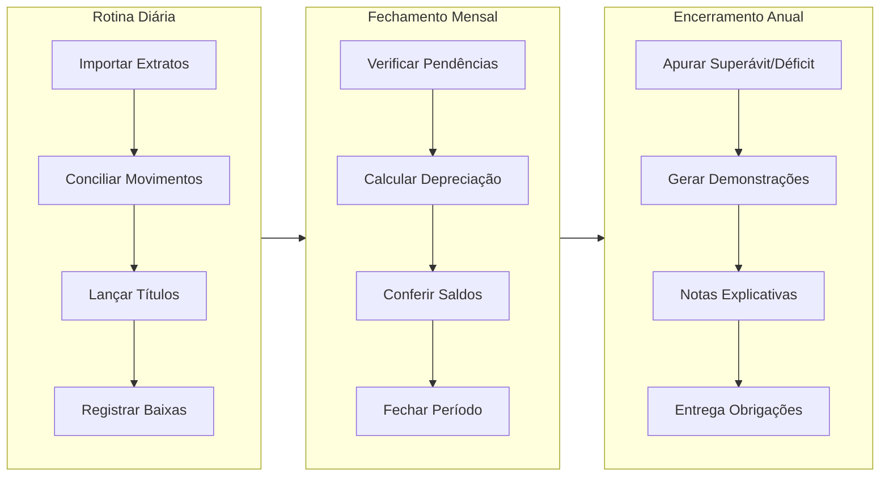
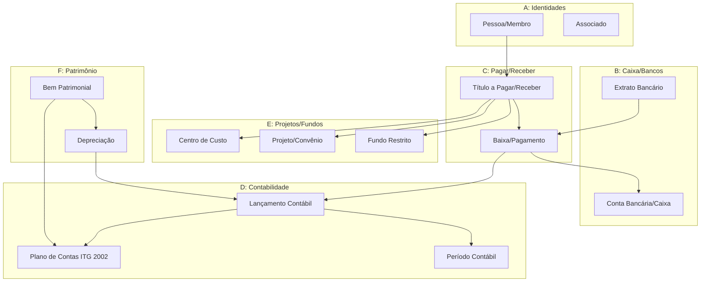

# CentrOS - Sistema de Gestão Contábil para Instituições Religiosas

## Para o Contador

Bem-vindo ao CentrOS, sistema desenvolvido especificamente para a gestão contábil de **entidades do terceiro setor sem fins lucrativos**, com foco em instituições religiosas (igrejas, templos, centros espíritas, associações religiosas).

Este sistema foi projetado para atender às exigências da **ITG 2002 (R1)** - Entidades sem Finalidade de Lucros - e da **NBC TG 26** - Apresentação das Demonstrações Contábeis, garantindo conformidade com as normas brasileiras de contabilidade.

---

## O que este Sistema Faz

| Necessidade do Contador | Módulo do Sistema | Benefício |
|------------------------|-------------------|-----------|
| Cadastrar membros, doadores e fornecedores | **A - Identidades** | Controle unificado de todas as pessoas |
| Controlar contas bancárias e caixa | **B - Caixa/Bancos** | Conciliação automática de extratos |
| Gerenciar contas a pagar e receber | **C - Pagar/Receber** | Fluxo de caixa e vencimentos |
| Fazer lançamentos contábeis | **D - Contabilidade** | Plano de contas ITG 2002 integrado |
| Controlar projetos e fundos restritos | **E - Projetos/Fundos** | Prestação de contas MROSC |
| Gerenciar patrimônio e depreciação | **F - Patrimônio** | Inventário e cálculo automático |
| Controlar acessos e aprovar operações | **G - Governança** | Segregação de funções e auditoria |

---

## Glossário Contábil - Terceiro Setor

| Termo no Sistema | Significado para Instituição Religiosa |
|------------------|----------------------------------------|
| **Patrimônio Social** | Equivalente ao Capital Social em empresas. Representa os recursos próprios da entidade. |
| **Superávit/Déficit** | Resultado positivo ou negativo do período. Não usamos "lucro/prejuízo" em entidades sem fins lucrativos. |
| **Receita com Restrição** | Doações vinculadas a um fim específico (ex: construção de templo). Devem ser controladas em Fundos. |
| **Receita sem Restrição** | Doações e contribuições de uso livre pela diretoria. |
| **Contribuição** | Mensalidade ou anuidade de associado/membro. Receita recorrente. |
| **Doação** | Valor recebido sem contrapartida. Pode ser de pessoa física ou jurídica. |
| **Dízimo** | Tipo específico de doação, geralmente 10% da renda do fiel. Classificar como Doação. |
| **Gratuidade** | Serviços prestados gratuitamente (assistência social). Deve ser mensurada e divulgada. |
| **MROSC** | Marco Regulatório das Organizações da Sociedade Civil (Lei 13.019/2014). Regula parcerias com poder público. |

---

## Normas Contábeis Aplicáveis

### ITG 2002 (R1) - Entidades sem Finalidade de Lucros

Esta interpretação técnica estabelece critérios e procedimentos específicos para:

- **Reconhecimento de receitas**: doações, contribuições, subvenções
- **Demonstrações contábeis obrigatórias**: Balanço Patrimonial, DRE, DMPL, DFC, Notas Explicativas
- **Gratuidades**: mensuração e divulgação de serviços voluntários e benefícios concedidos
- **Trabalho voluntário**: pode ser reconhecido quando mensurável

### NBC TG 26 - Apresentação das Demonstrações Contábeis

Define a estrutura e apresentação das demonstrações, incluindo:

- Nomenclatura apropriada (Patrimônio Social, não Capital Social)
- Segregação de receitas com e sem restrição
- Notas explicativas obrigatórias

---

## Visão Geral dos Módulos

### Status de Implementação

| Módulo | Descrição para o Contador | Entidades | Pronto | Pendente |
|--------|--------------------------|-----------|--------|----------|
| **A - Identidades** | Cadastro de pessoas, membros, doadores, fornecedores | 9 | 4 | 5 |
| **B - Caixa/Bancos** | Contas financeiras, extratos, conciliação bancária | 4 | 2 | 2 |
| **C - Pagar/Receber** | Títulos a pagar/receber, baixas, fluxo de caixa | 3 | 1 | 2 |
| **D - Contabilidade** | Plano de contas, lançamentos, períodos, fechamento | 4 | 1 | 3 |
| **E - Projetos/Fundos** | Centros de custo, projetos, fundos restritos | 5 | 0 | 5 |
| **F - Patrimônio** | Bens patrimoniais, imobilizado, depreciação | 2 | 0 | 2 |
| **G - Governança** | Usuários, permissões, aprovações, auditoria | 5 | 0 | 5 |

---

## Fluxo de Trabalho Típico do Contador

---

## Diagrama de Integração entre Módulos

---

## Legenda de Status nas Telas

| Ícone | Significado | Ação do Contador |
|-------|-------------|------------------|
| ✅ | Funcionalidade pronta e operacional | Pode utilizar normalmente |
| ⚠️ | Parcialmente implementado | Funciona, mas com limitações |
| ❌ | Ainda não disponível | Aguardar implementação |
| 🔒 | Automático/Somente leitura | Sistema calcula automaticamente |

---

## Matriz de Funcionalidades por Módulo

### A - Identidades (Cadastros)

| Funcionalidade | O que faz | Criar | Consultar | Editar | Excluir |
|----------------|-----------|-------|-----------|--------|---------|
| **Pessoa** | Cadastro geral de pessoas (membros, doadores, fornecedores) | ✅ | ✅ | ⚠️ | ❌ |
| **Documentos** | CPF, CNPJ, RG da pessoa | ⚠️ | ✅ | ⚠️ | ❌ |
| **Contatos** | Telefone, e-mail, WhatsApp | ⚠️ | ✅ | ⚠️ | ❌ |
| **Endereços** | Endereço residencial/comercial | ⚠️ | ✅ | ⚠️ | ❌ |
| **Associado** | Dados de filiação à entidade | ⚠️ | ✅ | ⚠️ | ❌ |
| **LGPD** | Consentimento de uso de dados | ❌ | ❌ | ❌ | ❌ |

### B - Caixa/Bancos

| Funcionalidade | O que faz | Criar | Consultar | Editar | Excluir |
|----------------|-----------|-------|-----------|--------|---------|
| **Conta Financeira** | Cadastro de contas bancárias e caixa | ❌ | ✅ | ❌ | ❌ |
| **Extrato Bancário** | Importação de extratos OFX/CSV | ⚠️ | ✅ | 🔒 | ❌ |
| **Conciliação** | Vincular movimentos do extrato a títulos | ✅ | ✅ | 🔒 | ✅ |

### C - Pagar/Receber

| Funcionalidade | O que faz | Criar | Consultar | Editar | Excluir |
|----------------|-----------|-------|-----------|--------|---------|
| **Título** | Contas a pagar e a receber | ❌ | ✅ | ❌ | ❌ |
| **Baixa** | Registro de pagamentos/recebimentos | ❌ | ✅ | ❌ | ❌ |
| **Anexo** | Notas fiscais, recibos, comprovantes | ❌ | ❌ | ❌ | ❌ |

### D - Contabilidade

| Funcionalidade | O que faz | Criar | Consultar | Editar | Excluir |
|----------------|-----------|-------|-----------|--------|---------|
| **Plano de Contas** | Estrutura de contas ITG 2002 | ❌ | ✅ | ❌ | ❌ |
| **Período Contábil** | Meses do exercício | ⚠️ | ✅ | ⚠️ | 🔒 |
| **Lançamento** | Registros de débito e crédito | ❌ | ❌ | ❌ | ❌ |
| **Saldo por Período** | Saldos calculados por conta/mês | 🔒 | ✅ | 🔒 | 🔒 |

### E - Projetos/Fundos

| Funcionalidade | O que faz | Criar | Consultar | Editar | Excluir |
|----------------|-----------|-------|-----------|--------|---------|
| **Centro de Custo** | Agrupamento por área (pastoral, social) | ❌ | ❌ | ❌ | ❌ |
| **Projeto** | Projetos específicos com orçamento | ❌ | ❌ | ❌ | ❌ |
| **Fundo** | Fundos restritos (doações vinculadas) | ❌ | ❌ | ❌ | ❌ |

### F - Patrimônio

| Funcionalidade | O que faz | Criar | Consultar | Editar | Excluir |
|----------------|-----------|-------|-----------|--------|---------|
| **Bem Patrimonial** | Cadastro de imóveis, veículos, equipamentos | ❌ | ❌ | ❌ | ❌ |
| **Depreciação** | Cálculo mensal automático | 🔒 | ❌ | 🔒 | 🔒 |

### G - Governança

| Funcionalidade | O que faz | Criar | Consultar | Editar | Excluir |
|----------------|-----------|-------|-----------|--------|---------|
| **Usuário** | Quem acessa o sistema | ❌ | ❌ | ❌ | ❌ |
| **Papel/Função** | Perfis de acesso (contador, tesoureiro) | ❌ | ❌ | ❌ | ❌ |
| **Aprovação** | Workflow de autorização | ❌ | ❌ | ❌ | ❌ |
| **Auditoria** | Registro de todas as operações | 🔒 | ✅ | 🔒 | 🔒 |

---

## Prioridades de Implementação

### Fase 1 - Essencial (Imediato)

Funcionalidades críticas para operação básica:

| Prioridade | Funcionalidade | Por que é importante |
|------------|----------------|---------------------|
| 1 | **Título (CRUD completo)** | Core do sistema - sem isso não há contas a pagar/receber |
| 2 | **Baixa de Título** | Registrar pagamentos e recebimentos |
| 3 | **Conta Financeira** | Cadastrar bancos e caixa |

### Fase 2 - Importante

| Prioridade | Funcionalidade | Por que é importante |
|------------|----------------|---------------------|
| 4 | **Pessoa (completar)** | Atualizar cadastros e inativar pessoas |
| 5 | **Plano de Contas** | Personalizar estrutura contábil |
| 6 | **Usuários e Permissões** | Controle de acesso por função |

### Fase 3 - Operacional

| Prioridade | Funcionalidade | Por que é importante |
|------------|----------------|---------------------|
| 7 | **Lançamento Contábil** | Registros manuais e ajustes |
| 8 | **Projetos e Fundos** | Controle orçamentário e restrições |
| 9 | **Anexos** | Guardar documentos comprobatórios |

### Fase 4 - Complementar

| Prioridade | Funcionalidade | Por que é importante |
|------------|----------------|---------------------|
| 10 | **Patrimônio** | Controle de imobilizado |
| 11 | **LGPD** | Compliance de dados pessoais |
| 12 | **Aprovações** | Workflow para valores altos |

---

## Casos de Uso Típicos

### Caso 1: Receber Dízimo de um Fiel

1. Verificar se a pessoa está cadastrada (Módulo A)
2. Criar título a receber do tipo "Doação" (Módulo C)
3. Registrar a baixa na conta bancária ou caixa (Módulo C)
4. Sistema gera lançamento contábil automático (Módulo D)

### Caso 2: Pagar Conta de Luz

1. Criar título a pagar do tipo "Utilidade" (Módulo C)
2. Vincular à conta contábil "Despesas com Energia" (Módulo D)
3. Anexar a fatura digitalizada (Módulo C)
4. Registrar a baixa quando pagar (Módulo C)

### Caso 3: Receber Doação para Obra Específica

1. Cadastrar um Fundo Restrito "Construção do Salão" (Módulo E)
2. Receber a doação vinculando ao fundo (Módulo C + E)
3. Ao usar o recurso, consumir do fundo (Módulo E)
4. Gerar relatório de prestação de contas (Módulo E)

### Caso 4: Fechamento Mensal

1. Importar extratos bancários do mês (Módulo B)
2. Conciliar todos os movimentos (Módulo B)
3. Verificar títulos pendentes (Módulo C)
4. Calcular depreciação do patrimônio (Módulo F)
5. Conferir saldos das contas (Módulo D)
6. Fechar o período contábil (Módulo D)

---

## Dúvidas Frequentes

### "Qual a diferença entre Contribuição e Doação?"

- **Contribuição**: valor pago regularmente por associados/membros (mensalidade, anuidade). Geralmente há um compromisso de pagamento.
- **Doação**: valor recebido espontaneamente, sem obrigação de continuidade. Inclui dízimos, ofertas, doações eventuais.

### "O que é um Fundo Restrito?"

É um recurso recebido com destinação específica definida pelo doador. Exemplo: doação para construção de templo, para assistência social, para missões. Conforme NBC TG 26, deve ser controlado separadamente e só pode ser usado para a finalidade definida.

### "Preciso registrar trabalho voluntário?"

A ITG 2002 permite o reconhecimento do trabalho voluntário como receita quando for possível mensurá-lo. Se a entidade optar por reconhecer, deve ter critérios documentados de mensuração.

### "Como diferenciar despesa administrativa de despesa com atividade-fim?"

- **Administrativa**: gastos com a gestão da entidade (contabilidade, aluguel da sede, materiais de escritório)
- **Atividade-fim**: gastos diretamente relacionados à missão (assistência social, ações religiosas, eventos comunitários)

---

## Referências Técnicas

| Recurso | Localização |
|---------|-------------|
| Schema do banco de dados | `/drizzle/schema.ts` |
| Rotas da API | `/server/routers.ts` |
| Páginas do sistema | `/client/src/pages/` |
| Plano de contas padrão | `/data/plano-de-contas.json` |

---

## Suporte e Documentação

Para cada módulo, consulte o documento específico:

- [Módulo A - Identidades](./01-MODULO-A-IDENTIDADES.md) - Cadastro de pessoas e associados
- [Módulo B - Caixa/Bancos](./02-MODULO-B-CAIXA-BANCOS.md) - Contas e conciliação
- [Módulo C - Pagar/Receber](./03-MODULO-C-PAGAR-RECEBER.md) - Títulos e baixas
- [Módulo D - Contabilidade](./04-MODULO-D-CONTABILIDADE.md) - Lançamentos e períodos
- [Módulo E - Projetos/Fundos](./05-MODULO-E-PROJETOS-FUNDOS.md) - Gestão orçamentária
- [Módulo F - Patrimônio](./06-MODULO-F-PATRIMONIO.md) - Imobilizado
- [Módulo G - Governança](./07-MODULO-G-GOVERNANCA.md) - Controles e auditoria
