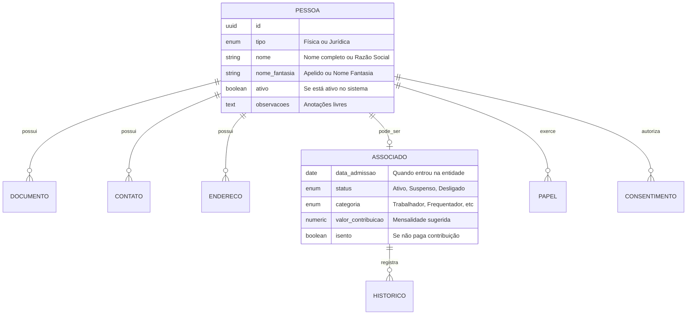

# Módulo A - Cadastro de Pessoas e Membros

## Para o Contador

Este módulo gerencia o **cadastro unificado de todas as pessoas** que se relacionam com a instituição religiosa:

- **Membros/Fiéis**: pessoas que frequentam e contribuem regularmente
- **Doadores**: pessoas físicas ou jurídicas que fazem doações eventuais
- **Fornecedores**: empresas e prestadores de serviços
- **Funcionários**: colaboradores com vínculo empregatício
- **Voluntários**: pessoas que prestam serviços sem remuneração

O cadastro centralizado é fundamental para:
- Emitir recibos de doação para dedução no IR (pessoas físicas até 6% do IR devido)
- Controlar contribuições de associados
- Manter histórico de relacionamento
- Cumprir obrigações da LGPD (Lei Geral de Proteção de Dados)

---

## Glossário do Módulo

| Termo | Significado |
|-------|-------------|
| **Pessoa Física** | Indivíduo identificado por CPF (membro, doador, funcionário) |
| **Pessoa Jurídica** | Empresa ou entidade identificada por CNPJ (fornecedor, parceiro) |
| **Associado** | Membro formal da entidade com direitos estatutários |
| **Contribuição** | Valor pago regularmente pelo associado (mensalidade) |
| **Captador** | Pessoa responsável por angariar doações |
| **Soft-delete** | Inativação que preserva histórico (não apaga definitivamente) |

---

## Diagrama de Relacionamentos

---

## 1. Cadastro de Pessoa

### O que é

Tela central para cadastrar qualquer pessoa que se relacione com a instituição. Uma única pessoa pode ter múltiplos papéis (ex: um membro que também é fornecedor).

### Status: ⚠️ Parcialmente implementado

| Operação | Disponível | Observação |
|----------|------------|------------|
| Criar novo cadastro | ✅ Sim | Funciona normalmente |
| Consultar cadastros | ✅ Sim | Com filtros e busca |
| Editar dados | ⚠️ Parcial | Precisa melhorias |
| Inativar/Excluir | ❌ Não | Em desenvolvimento |

---

### Campos do Formulário: Criar Pessoa

#### Seção: Dados Básicos

| Campo | Label na Tela | Obrigatório | Tooltip/Ajuda |
|-------|---------------|-------------|---------------|
| `tipo` | **Tipo de Pessoa** | Sim | "Pessoa Física: indivíduo (CPF). Pessoa Jurídica: empresa (CNPJ)." |
| `nome` | **Nome Completo / Razão Social** | Sim | "Para pessoa física: nome completo. Para jurídica: razão social conforme CNPJ." |
| `nomeFantasia` | **Apelido / Nome Fantasia** | Não | "Como a pessoa é conhecida na comunidade ou nome fantasia da empresa." |
| `observacoes` | **Observações** | Não | "Anotações internas sobre esta pessoa. Não aparece em documentos." |

**Exemplos de preenchimento:**

| Tipo | Nome | Nome Fantasia |
|------|------|---------------|
| Física | Maria da Silva Santos | Dona Maria |
| Física | João Pedro Oliveira | Seu João |
| Jurídica | Supermercado ABC Ltda | Mercadinho do Zé |
| Jurídica | Igreja Evangélica XYZ | Igreja da Paz |

---

#### Seção: Documentos

| Campo | Label na Tela | Tooltip/Ajuda |
|-------|---------------|---------------|
| `tipo` | **Tipo de Documento** | Selecione o tipo do documento |
| `numero` | **Número** | Digite apenas números, sem pontos ou traços |

**Tipos de Documento:**

| Código | Nome na Tela | Quando usar | Exemplo |
|--------|--------------|-------------|---------|
| `cpf` | CPF | Pessoa física (obrigatório para recibos de doação) | 123.456.789-00 |
| `cnpj` | CNPJ | Pessoa jurídica | 12.345.678/0001-00 |
| `rg` | RG | Documento de identidade (opcional) | 12.345.678-9 |
| `ie` | Inscrição Estadual | Empresas com IE (nota fiscal) | 123.456.789.123 |
| `im` | Inscrição Municipal | Prestadores de serviço | 12345678 |

**Validações:**
- CPF/CNPJ devem ser únicos no sistema
- Pessoa física deve ter CPF para emissão de recibo de doação
- Sistema valida dígitos verificadores automaticamente

---

#### Seção: Contatos

| Campo | Label na Tela | Tooltip/Ajuda |
|-------|---------------|---------------|
| `tipo` | **Tipo de Contato** | Selecione como prefere ser contatado |
| `valor` | **Contato** | Informe o número ou endereço |
| `principal` | **Contato Principal** | Marque o principal para comunicações |

**Tipos de Contato:**

| Código | Nome na Tela | Formato | Exemplo |
|--------|--------------|---------|---------|
| `email` | E-mail | email@dominio.com | maria@email.com |
| `telefone` | Telefone Fixo | (XX) XXXX-XXXX | (11) 3456-7890 |
| `celular` | Celular | (XX) XXXXX-XXXX | (11) 98765-4321 |
| `whatsapp` | WhatsApp | (XX) XXXXX-XXXX | (11) 98765-4321 |

**Regras:**
- Pelo menos um contato deve ser marcado como principal
- E-mail é importante para envio de recibos digitais

---

#### Seção: Endereços

| Campo | Label na Tela | Obrigatório | Tooltip/Ajuda |
|-------|---------------|-------------|---------------|
| `tipo` | **Tipo de Endereço** | Sim | "Residencial, Comercial ou para Correspondência" |
| `logradouro` | **Rua/Avenida** | Sim | "Nome da rua, avenida, praça, etc." |
| `numero` | **Número** | Não | "S/N se não houver número" |
| `complemento` | **Complemento** | Não | "Apartamento, bloco, sala, etc." |
| `bairro` | **Bairro** | Não | "Nome do bairro" |
| `cidade` | **Cidade** | Sim | "Nome da cidade" |
| `uf` | **Estado** | Sim | "Sigla do estado (SP, RJ, MG...)" |
| `cep` | **CEP** | Não | "Preencha para busca automática do endereço" |
| `principal` | **Endereço Principal** | - | "Marque o endereço para correspondências oficiais" |

**Tipos de Endereço:**

| Código | Nome na Tela | Uso |
|--------|--------------|-----|
| `residencial` | Residencial | Casa/apartamento da pessoa |
| `comercial` | Comercial | Endereço de trabalho ou empresa |
| `correspondencia` | Correspondência | Onde deseja receber cartas e documentos |

---

#### Seção: Dados de Associado (Opcional)

Esta seção só aparece se a pessoa for membro/associado formal da entidade.

| Campo | Label na Tela | Obrigatório | Tooltip/Ajuda |
|-------|---------------|-------------|---------------|
| `dataAdmissao` | **Data de Admissão** | Sim | "Quando a pessoa se tornou membro oficial da entidade" |
| `status` | **Situação** | Sim | "Status atual do associado" |
| `categoria` | **Categoria** | Sim | "Tipo de vínculo com a entidade" |
| `periodicidade` | **Frequência de Contribuição** | Sim | "Com que frequência paga a contribuição" |
| `valorContribuicaoSugerido` | **Valor Sugerido (R$)** | Não | "Valor de referência para a contribuição. O sistema usará para gerar títulos." |
| `diaVencimento` | **Dia de Vencimento** | Não | "Dia do mês para vencimento da contribuição (1 a 28)" |
| `isento` | **Isento de Contribuição** | - | "Marque se o associado não paga contribuição" |
| `motivoIsencao` | **Motivo da Isenção** | Se isento | "Explique o motivo da isenção (ex: idoso, doença)" |
| `numeroRegistro` | **Número de Registro** | Não | "Número de matrícula ou registro interno" |

**Situações do Associado:**

| Código | Nome na Tela | Significado | Impacto |
|--------|--------------|-------------|---------|
| `ativo` | Ativo | Membro regular em dia | Gera títulos de contribuição |
| `suspenso` | Suspenso | Temporariamente afastado | Não gera novos títulos |
| `desligado` | Desligado | Saiu da entidade | Não gera títulos, mantém histórico |
| `falecido` | Falecido | Membro faleceu | Encerra vínculos, preserva dados |

**Categorias de Associado:**

| Código | Nome na Tela | Descrição | Exemplo em Igreja |
|--------|--------------|-----------|-------------------|
| `trabalhador` | Trabalhador/Médium | Participa ativamente das atividades | Membro do coral, obreiro |
| `frequentador` | Frequentador | Assiste regularmente sem função | Fiel que frequenta cultos |
| `benemerito` | Benemérito | Reconhecido por contribuições | Doador significativo |
| `honorario` | Honorário | Título honorífico | Fundador, ex-presidente |

**Periodicidade:**

| Código | Nome na Tela | Intervalo | Títulos por ano |
|--------|--------------|-----------|-----------------|
| `mensal` | Mensal | Todo mês | 12 |
| `trimestral` | Trimestral | A cada 3 meses | 4 |
| `semestral` | Semestral | A cada 6 meses | 2 |
| `anual` | Anual | Uma vez por ano | 1 |

---

### Campos do Formulário: Editar Pessoa

Mesmos campos de criação, com adição de:

| Campo | Label na Tela | Tooltip/Ajuda |
|-------|---------------|---------------|
| `ativo` | **Pessoa Ativa** | "Desmarque para inativar esta pessoa. Ela não aparecerá em buscas, mas o histórico será preservado." |

---

### Campos do Formulário: Inativar Pessoa

| Campo | Label na Tela | Obrigatório | Tooltip/Ajuda |
|-------|---------------|-------------|---------------|
| `motivo` | **Motivo da Inativação** | Não | "Descreva por que está inativando este cadastro. Será registrado para auditoria." |

**Importante:** A inativação não apaga os dados, apenas oculta a pessoa das buscas. Todos os títulos e lançamentos permanecem no histórico.

---

## 2. Associados

### O que é

Gestão específica dos **membros formais** da entidade - aqueles que têm vínculo estatutário, pagam contribuições ou têm direitos em assembleias.

### Casos de Uso

**Caso 1: Novo membro entra na igreja**
1. Cadastrar a pessoa (seção anterior)
2. Marcar como associado com status "Ativo"
3. Definir categoria (trabalhador ou frequentador)
4. Configurar valor e periodicidade da contribuição
5. Sistema passa a gerar títulos automaticamente

**Caso 2: Membro para de frequentar**
1. Alterar status para "Suspenso"
2. Informar motivo (obrigatório)
3. Sistema para de gerar novos títulos
4. Títulos em aberto permanecem

**Caso 3: Membro solicita desligamento**
1. Alterar status para "Desligado"
2. Informar data de desligamento
3. Registrar motivo
4. Sistema gera histórico automático

---

### Campos: Alterar Situação do Associado

| Campo | Label na Tela | Obrigatório | Tooltip/Ajuda |
|-------|---------------|-------------|---------------|
| `novoStatus` | **Nova Situação** | Sim | "Selecione a nova situação do associado" |
| `motivo` | **Motivo da Alteração** | Sim | "Descreva o motivo da mudança. Mínimo 10 caracteres." |
| `dataEfetivacao` | **Data de Efetivação** | Não | "Quando a mudança entra em vigor. Se não informar, será a data de hoje." |

**Validações:**
- Motivo deve ter no mínimo 10 caracteres
- Toda alteração de status gera registro no histórico
- Status "Desligado" exige data de desligamento

---

## 3. Consentimento LGPD

### O que é

Registro do consentimento para tratamento de dados pessoais, conforme exigido pela **Lei Geral de Proteção de Dados (Lei 13.709/2018)**.

### Status: ❌ Não implementado

### Por que é importante

Instituições religiosas tratam **dados sensíveis** (religião é dado sensível pela LGPD). É necessário:
- Obter consentimento para comunicações
- Registrar base legal para tratamento
- Permitir revogação a qualquer momento
- Manter evidências para fiscalização

---

### Campos: Registrar Consentimento

| Campo | Label na Tela | Obrigatório | Tooltip/Ajuda |
|-------|---------------|-------------|---------------|
| `tipoTratamento` | **Finalidade** | Sim | "Para que serão usados os dados" |
| `baseLegal` | **Base Legal** | Sim | "Fundamento jurídico para o tratamento" |
| `consentido` | **Consentimento** | Sim | "Se a pessoa autorizou ou não" |
| `evidencia` | **Evidência** | Não | "Como o consentimento foi obtido" |

**Tipos de Tratamento:**

| Código | Nome na Tela | Descrição |
|--------|--------------|-----------|
| `marketing` | Marketing e Divulgação | Envio de materiais promocionais |
| `comunicacao` | Comunicação Institucional | Avisos, convites, informativos |
| `compartilhamento` | Compartilhamento com Terceiros | Envio de dados para outras entidades |
| `dados_sensiveis` | Dados Religiosos | Tratamento de informações de crença |

**Base Legal:**

| Código | Nome na Tela | Quando usar |
|--------|--------------|-------------|
| `consentimento` | Consentimento Explícito | Pessoa autorizou expressamente |
| `legitimo_interesse` | Legítimo Interesse | Necessário para atividade da entidade |
| `obrigacao_legal` | Obrigação Legal | Exigido por lei (ex: fiscal) |
| `execucao_contrato` | Execução de Contrato | Necessário para cumprir acordo |

---

## 4. Funções e Papéis

### O que é

Registro das **funções** que uma pessoa exerce na entidade, como captador de doações, administrador financeiro, conselheiro, etc.

### Status: ✅ Implementado

---

### Campos: Atribuir Função

| Campo | Label na Tela | Obrigatório | Tooltip/Ajuda |
|-------|---------------|-------------|---------------|
| `papelTipo` | **Função** | Sim | "Qual função a pessoa exercerá" |
| `dataInicio` | **Data de Início** | Sim | "Quando começa a exercer a função" |
| `dataFim` | **Data de Término** | Não | "Quando termina (deixe vazio se indefinido)" |
| `atoDesignacao` | **Ato de Designação** | Não | "Documento que formalizou a nomeação" |
| `observacoes` | **Observações** | Não | "Informações adicionais sobre a função" |

**Tipos de Função:**

| Código | Nome na Tela | Descrição | Permissões |
|--------|--------------|-----------|------------|
| `captador_doacao` | Captador de Doações | Angaria recursos para a entidade | Ver doações que captou |
| `administrador_financeiro` | Administrador Financeiro | Gerencia finanças | Aprovar pagamentos |
| `diretor` | Diretor/Presidente | Cargo estatutário de direção | Acesso amplo |
| `conselheiro` | Conselheiro | Membro de conselho | Ver relatórios |
| `voluntario` | Voluntário | Presta serviços sem remuneração | Acesso limitado |

---

### Campos Específicos: Captador de Doações

| Campo | Label na Tela | Tooltip/Ajuda |
|-------|---------------|---------------|
| `regiaoAtuacao` | **Região de Atuação** | "Área geográfica onde atua (bairro, cidade)" |
| `metaCaptacaoAnual` | **Meta Anual (R$)** | "Valor esperado de captação por ano" |

---

### Campos Específicos: Administrador Financeiro

| Campo | Label na Tela | Tooltip/Ajuda |
|-------|---------------|---------------|
| `responsabilidades` | **Responsabilidades** | "Descreva as atribuições específicas" |
| `alcadaValorMaximo` | **Alçada Máxima (R$)** | "Valor máximo que pode aprovar sozinho" |
| `podeAprovarPagamentos` | **Pode Aprovar Pagamentos** | "Se pode autorizar saídas de recursos" |
| `acessoContasBancarias` | **Acesso a Contas Bancárias** | "Se pode operar as contas bancárias" |
| `cargoEstatutario` | **Cargo Estatutário** | "Se é cargo previsto no estatuto social" |

---

## Regras de Negócio

### Cadastro de Pessoa

| Regra | Descrição | Mensagem de Erro |
|-------|-----------|------------------|
| CPF/CNPJ único | Não pode haver duas pessoas com mesmo documento | "Este CPF/CNPJ já está cadastrado" |
| Tipo × Documento | Pessoa física requer CPF, jurídica requer CNPJ | "Pessoa física deve ter CPF" |
| Contato principal | Ao menos um contato deve ser marcado como principal | "Marque um contato como principal" |
| Nome mínimo | Nome deve ter no mínimo 3 caracteres | "Nome muito curto" |

### Associados

| Regra | Descrição | Mensagem de Erro |
|-------|-----------|------------------|
| Um por pessoa | Uma pessoa só pode ter um registro de associado | "Esta pessoa já é associado" |
| Histórico automático | Mudanças de status geram registro automático | - |
| Isenção justificada | Associados isentos devem ter motivo preenchido | "Informe o motivo da isenção" |
| Data desligamento | Status "Desligado" exige data de desligamento | "Informe a data de desligamento" |

### LGPD

| Regra | Descrição | Mensagem de Erro |
|-------|-----------|------------------|
| Revogação preserva | Revogar consentimento não apaga o registro | - |
| Evidência obrigatória | Para consentimento, deve haver evidência | "Registre como foi obtido o consentimento" |
| Timestamp automático | Data/hora e IP são capturados automaticamente | - |

---

## Casos de Uso Detalhados

### Caso: Cadastrar Novo Doador para Emitir Recibo

**Contexto:** Um fiel fez uma doação significativa e quer o recibo para dedução no Imposto de Renda.

**Passo a passo:**
1. Acesse "Cadastros > Pessoas"
2. Clique em "Nova Pessoa"
3. Selecione "Pessoa Física"
4. Preencha nome completo conforme documento
5. **Obrigatório:** Cadastre o CPF (necessário para o recibo)
6. Cadastre endereço completo (aparece no recibo)
7. Salve o cadastro
8. Agora pode lançar a doação vinculada a esta pessoa

**Alerta:** Sem CPF válido, não é possível emitir recibo para dedução no IR.

---

### Caso: Membro Antigo Retorna à Comunidade

**Contexto:** Pessoa que estava desligada quer voltar a participar.

**Passo a passo:**
1. Busque a pessoa no cadastro (mesmo inativos)
2. Edite o cadastro e reative (ativo = Sim)
3. Na aba Associado, altere status para "Ativo"
4. Informe nova data de admissão (ou mantenha a original)
5. Configure contribuição se houver

**Dica:** O histórico anterior é preservado, mostrando todo o relacionamento.

---

### Caso: Registrar Voluntário para ITG 2002

**Contexto:** A entidade quer mensurar o trabalho voluntário conforme ITG 2002.

**Passo a passo:**
1. Cadastre a pessoa normalmente
2. Em "Funções", atribua papel "Voluntário"
3. Nas observações, documente as atividades
4. Para mensurar o valor, use critérios documentados
5. O valor pode ser reconhecido como receita de gratuidade

**Referência:** ITG 2002, item 19 - reconhecimento de trabalho voluntário.

---

## Checklist de Compliance

### LGPD - Lei Geral de Proteção de Dados

- [ ] Obter consentimento antes de enviar comunicações
- [ ] Informar a finalidade da coleta de dados
- [ ] Permitir acesso aos dados pelo titular
- [ ] Permitir correção de dados incorretos
- [ ] Permitir exclusão quando solicitado
- [ ] Manter registro de consentimentos

### ITG 2002 - Terceiro Setor

- [ ] Manter cadastro atualizado de associados
- [ ] Controlar contribuições por categoria
- [ ] Documentar critérios de isenção
- [ ] Registrar voluntários se for mensurar gratuidade

### Obrigações Fiscais

- [ ] CPF válido para emissão de recibos de doação
- [ ] CNPJ para fornecedores (notas fiscais)
- [ ] Endereço completo para documentos oficiais

---

## Dúvidas Frequentes

### "Posso cadastrar a mesma pessoa duas vezes?"

Não. O sistema não permite CPF/CNPJ duplicado. Se precisar atualizar, busque e edite o cadastro existente.

### "Como cadastrar uma pessoa sem CPF?"

É possível, mas ela não poderá receber recibos para dedução no IR. Recomendamos solicitar o CPF sempre que possível.

### "O que acontece quando inativo um cadastro?"

A pessoa deixa de aparecer em buscas e listas, mas todo o histórico de títulos, lançamentos e relacionamentos é preservado. É possível reativar a qualquer momento.

### "Posso excluir definitivamente um cadastro?"

Por questões de auditoria e compliance, o sistema usa "soft-delete" (inativação). Dados só são excluídos em casos específicos de LGPD, com procedimento próprio.

### "Como saber se um CPF é válido?"

O sistema valida automaticamente os dígitos verificadores do CPF ao salvar. Se inválido, mostrará mensagem de erro.
