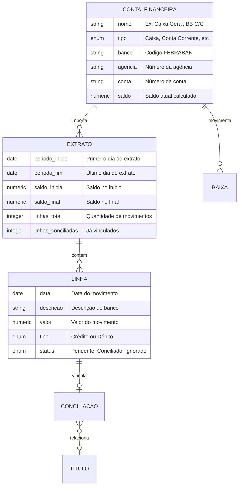
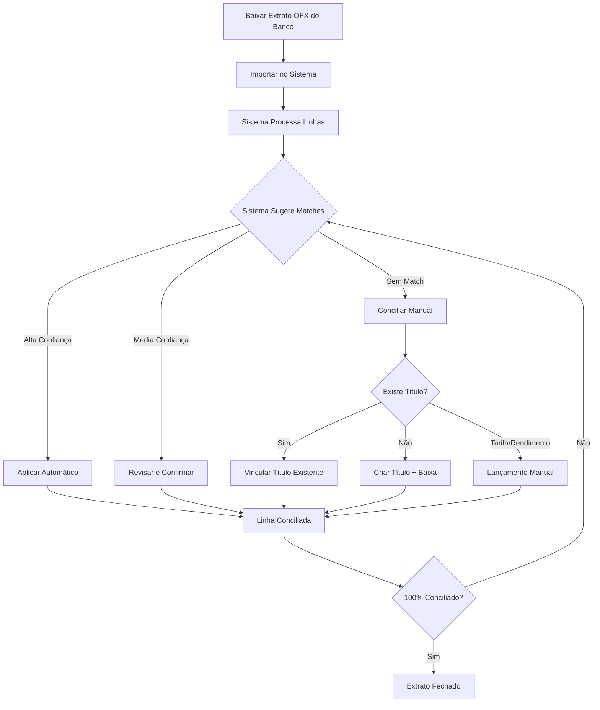

# Módulo B - Caixa, Bancos e Conciliação

## Para o Contador

Este módulo gerencia o **controle de disponibilidades** da instituição religiosa:

- **Caixa físico**: dinheiro em espécie guardado na tesouraria
- **Contas bancárias**: conta corrente, poupança, aplicações
- **Extratos**: importação e conciliação de movimentos bancários
- **PIX**: chaves cadastradas para recebimentos

A conciliação bancária é uma das atividades mais importantes do contador, garantindo que:
- Saldo contábil confere com saldo bancário
- Todos os movimentos estão registrados
- Não há lançamentos duplicados ou faltantes
- Base para fechamento mensal confiável

---

## Glossário do Módulo

| Termo | Significado |
|-------|-------------|
| **Conciliação Bancária** | Confronto entre extrato do banco e registros contábeis |
| **OFX** | Formato padrão de extrato bancário (Open Financial Exchange) |
| **FEBRABAN** | Federação Brasileira de Bancos - define códigos de bancos |
| **Saldo Inicial** | Saldo da conta na data de início do controle no sistema |
| **Linha Pendente** | Movimento do extrato ainda não vinculado a título |
| **Match Automático** | Sistema identifica automaticamente o título correspondente |

---

## Diagrama de Relacionamentos



---

## 1. Contas Financeiras

### O que é

Cadastro de todas as **contas de disponibilidades** da entidade: caixa físico, contas bancárias, poupança, aplicações financeiras.

### Status: ⚠️ Parcialmente implementado

| Operação | Disponível | Observação |
|----------|------------|------------|
| Listar contas | ✅ Sim | Com saldo calculado |
| Criar conta | ❌ Não | Em desenvolvimento |
| Editar conta | ❌ Não | Em desenvolvimento |
| Inativar conta | ❌ Não | Em desenvolvimento |

---

### Campos do Formulário: Criar Conta Financeira

#### Seção: Identificação

| Campo | Label na Tela | Obrigatório | Tooltip/Ajuda |
|-------|---------------|-------------|---------------|
| `tipo` | **Tipo de Conta** | Sim | "Selecione o tipo da conta financeira" |
| `nome` | **Nome da Conta** | Sim | "Nome para identificar a conta nos relatórios" |

**Tipos de Conta:**

| Código | Nome na Tela | Descrição | Requer Dados Bancários |
|--------|--------------|-----------|------------------------|
| `caixa` | Caixa | Dinheiro em espécie | Não |
| `conta_corrente` | Conta Corrente | Conta movimento no banco | Sim |
| `poupanca` | Poupança | Conta de poupança | Sim |
| `aplicacao` | Aplicação Financeira | CDB, fundos, etc. | Sim |
| `cartao` | Cartão (Crédito/Débito) | Conta de cartão | Sim |

**Exemplos de Nome:**

| Tipo | Exemplo de Nome |
|------|-----------------|
| Caixa | Caixa Geral, Caixa Eventos, Cofre Tesouraria |
| Conta Corrente | BB Conta Movimento, Caixa Econômica Principal |
| Poupança | BB Poupança Reserva, Caixa Poupança |
| Aplicação | CDB BB 90 dias, Fundo DI Bradesco |

---

#### Seção: Dados Bancários

Esta seção aparece apenas para contas que não são "Caixa".

| Campo | Label na Tela | Obrigatório | Tooltip/Ajuda |
|-------|---------------|-------------|---------------|
| `bancoCodigo` | **Código do Banco** | Sim* | "Código FEBRABAN de 3 dígitos. Ex: 001 = Banco do Brasil" |
| `bancoNome` | **Nome do Banco** | Sim* | "Preenchido automaticamente ao informar o código" |
| `agencia` | **Agência** | Sim* | "Número da agência, com dígito se houver" |
| `contaNumero` | **Número da Conta** | Sim* | "Número da conta sem o dígito" |
| `contaDigito` | **Dígito** | Não | "Dígito verificador da conta" |

*Obrigatório para contas bancárias (não caixa)

**Códigos FEBRABAN mais comuns:**

| Código | Banco |
|--------|-------|
| 001 | Banco do Brasil |
| 104 | Caixa Econômica Federal |
| 237 | Bradesco |
| 341 | Itaú Unibanco |
| 033 | Santander |
| 756 | Sicoob |
| 748 | Sicredi |

---

#### Seção: Chave PIX

| Campo | Label na Tela | Obrigatório | Tooltip/Ajuda |
|-------|---------------|-------------|---------------|
| `pixTipo` | **Tipo da Chave** | Não | "Tipo de chave PIX cadastrada" |
| `pixChave` | **Chave PIX** | Não | "Valor da chave conforme tipo selecionado" |

**Tipos de Chave PIX:**

| Código | Nome na Tela | Formato | Exemplo |
|--------|--------------|---------|---------|
| `cpf` | CPF | 000.000.000-00 | 123.456.789-00 |
| `cnpj` | CNPJ | 00.000.000/0000-00 | 12.345.678/0001-00 |
| `email` | E-mail | email@dominio.com | financeiro@igreja.org |
| `telefone` | Telefone | +55 (XX) XXXXX-XXXX | +55 (11) 98765-4321 |
| `aleatoria` | Chave Aleatória | UUID | a1b2c3d4-e5f6-... |

**Dica:** Cadastrar a chave PIX facilita a identificação automática de depósitos recebidos.

---

#### Seção: Saldo Inicial

| Campo | Label na Tela | Obrigatório | Tooltip/Ajuda |
|-------|---------------|-------------|---------------|
| `saldoInicial` | **Saldo Inicial (R$)** | Sim | "Saldo da conta na data de início do controle" |
| `dataSaldoInicial` | **Data do Saldo** | Sim | "Data de referência do saldo inicial" |

**Exemplo:** Se começar a usar o sistema em 01/01/2025 e a conta tinha R$ 5.000,00, informe:
- Saldo Inicial: 5.000,00
- Data do Saldo: 01/01/2025

---

#### Seção: Vínculo Contábil

| Campo | Label na Tela | Obrigatório | Tooltip/Ajuda |
|-------|---------------|-------------|---------------|
| `contaContabilId` | **Conta Contábil** | Não | "Conta do plano de contas para lançamentos automáticos" |

**Exemplos de vínculo:**

| Conta Financeira | Conta Contábil Sugerida |
|-----------------|------------------------|
| Caixa Geral | 1.1.1.01 - Caixa |
| BB Conta Movimento | 1.1.1.02 - Bancos Conta Movimento |
| BB Poupança | 1.1.1.03 - Bancos Conta Poupança |
| CDB | 1.1.2.01 - Aplicações Financeiras |

---

### Campos do Formulário: Editar Conta

| Campo | Label na Tela | Pode Editar | Tooltip/Ajuda |
|-------|---------------|-------------|---------------|
| `nome` | **Nome da Conta** | Sim | "Altere o nome de exibição" |
| `pixChave` | **Chave PIX** | Sim | "Atualize a chave PIX" |
| `contaContabilId` | **Conta Contábil** | Sim | "Altere o vínculo contábil" |
| `ativo` | **Conta Ativa** | Sim | "Desmarque para inativar" |

**Ajuste de Saldo (Operação Especial):**

| Campo | Label na Tela | Tooltip/Ajuda |
|-------|---------------|---------------|
| `novoSaldo` | **Novo Saldo (R$)** | "Saldo correto que deveria constar" |
| `dataReferencia` | **Data de Referência** | "Data em que o saldo está sendo ajustado" |
| `justificativa` | **Justificativa** | "Explique o motivo do ajuste. Obrigatório para auditoria." |

**Alerta:** Ajuste de saldo deve ser usado apenas para correções. Movimentos normais devem ser lançados via títulos.

---

### Campos do Formulário: Inativar Conta

| Validação | Mensagem |
|-----------|----------|
| Saldo zerado | "Conta só pode ser inativada com saldo zero" |
| Sem pendências | "Existem extratos pendentes de conciliação" |

---

## 2. Extratos Bancários

### O que é

Importação de extratos para confronto com os registros do sistema. Aceita arquivos nos formatos OFX (padrão bancário), CSV e TXT.

### Status: ⚠️ Parcialmente implementado

| Operação | Disponível | Observação |
|----------|------------|------------|
| Importar extrato | ✅ Sim | OFX automático |
| Listar extratos | ✅ Sim | Por conta |
| Ver detalhes | ✅ Sim | Com linhas |
| Excluir extrato | ❌ Não | Em desenvolvimento |

---

### Campos do Formulário: Importar Extrato

| Campo | Label na Tela | Obrigatório | Tooltip/Ajuda |
|-------|---------------|-------------|---------------|
| `contaFinanceiraId` | **Conta** | Sim | "Selecione a conta bancária do extrato" |
| `arquivoTipo` | **Formato do Arquivo** | Sim | "Tipo de arquivo que será importado" |
| `arquivoNome` | **Arquivo** | Sim | "Selecione o arquivo do extrato" |

**Formatos Suportados:**

| Formato | Nome | Processamento | Recomendação |
|---------|------|---------------|--------------|
| `ofx` | OFX (Open Financial Exchange) | Automático | Preferível - formato padrão |
| `csv` | CSV (valores separados) | Manual | Requer configuração |
| `txt` | TXT (texto) | Manual | Requer configuração |
| `pdf` | PDF (documento) | Manual | Em desenvolvimento |

**Como obter arquivo OFX:**

| Banco | Onde encontrar |
|-------|----------------|
| Banco do Brasil | Internet Banking > Conta Corrente > Extrato > Salvar OFX |
| Caixa | Internet Banking > Extrato > Exportar OFX |
| Itaú | Internet Banking > Conta > Extrato > Download OFX |
| Bradesco | Internet Banking > Conta Corrente > Extrato > OFX |

---

### Configuração para CSV/TXT

Se o arquivo não for OFX, é necessário configurar como ler os dados:

| Campo | Label na Tela | Padrão | Tooltip/Ajuda |
|-------|---------------|--------|---------------|
| `separador` | **Separador de Colunas** | ; | "Caractere que separa as colunas (vírgula, ponto-vírgula, tab)" |
| `colunaData` | **Coluna da Data** | 0 | "Número da coluna com a data (começa em 0)" |
| `colunaDescricao` | **Coluna da Descrição** | 1 | "Número da coluna com a descrição do movimento" |
| `colunaValor` | **Coluna do Valor** | 2 | "Número da coluna com o valor" |
| `colunaTipo` | **Coluna do Tipo** | - | "Coluna que indica se é débito ou crédito (opcional)" |
| `formatoData` | **Formato da Data** | DD/MM/YYYY | "Como a data está formatada no arquivo" |
| `linhasIgnorar` | **Linhas de Cabeçalho** | 0 | "Quantas linhas ignorar no início (cabeçalho)" |

**Exemplo de CSV:**
```
Data;Descrição;Valor;Tipo
01/01/2025;DEPOSITO PIX;100,00;C
02/01/2025;PAGAMENTO BOLETO;-50,00;D
```
Configuração: separador=; colunaData=0 colunaDescricao=1 colunaValor=2 linhasIgnorar=1

---

### Campos do Formulário: Excluir Extrato

| Campo | Label na Tela | Tooltip/Ajuda |
|-------|---------------|---------------|
| `forcarExclusao` | **Forçar Exclusão** | "Marque para excluir mesmo com linhas já conciliadas. As conciliações serão desfeitas." |

**Validações:**
- Se há linhas conciliadas e não forçar, não permite excluir
- Excluir remove todas as linhas e conciliações do extrato

---

## 3. Linhas do Extrato

### O que é

Cada movimento do extrato bancário vira uma **linha** no sistema. As linhas são criadas automaticamente na importação.

### Status: 🔒 Somente leitura (criado automaticamente)

---

### Campos da Linha (Somente Visualização)

| Campo | Label na Tela | Descrição |
|-------|---------------|-----------|
| `dataMovimento` | **Data** | Data do movimento no banco |
| `descricaoOriginal` | **Descrição Original** | Texto original do banco |
| `descricaoNormalizada` | **Descrição Normalizada** | Texto limpo para matching |
| `valor` | **Valor** | Valor do movimento (sempre positivo) |
| `tipo` | **Tipo** | Crédito (entrada) ou Débito (saída) |
| `status` | **Status** | Situação da conciliação |

**Status da Linha:**

| Status | Nome na Tela | Significado | Cor |
|--------|--------------|-------------|-----|
| `pendente` | Pendente | Aguardando conciliação | Amarelo |
| `conciliado` | Conciliado | Vinculado a título | Verde |
| `ignorado` | Ignorado | Marcado para não conciliar | Cinza |
| `duplicado` | Duplicado | Movimento repetido | Vermelho |

---

### Campos do Formulário: Atualizar Status da Linha

| Campo | Label na Tela | Tooltip/Ajuda |
|-------|---------------|---------------|
| `status` | **Novo Status** | "Altere o status da linha" |
| `motivoIgnorado` | **Motivo** | "Se ignorar, explique o motivo" |

**Quando ignorar uma linha:**
- Transferência entre contas da própria entidade
- Estorno de movimento já tratado
- Movimento incorreto do banco (contestar)

---

## 4. Conciliação Bancária

### O que é

Processo de vincular cada movimento do extrato bancário a um título (conta a pagar/receber) ou lançamento contábil. Garante que o saldo contábil confere com o saldo do banco.

### Status: ⚠️ Parcialmente implementado

| Operação | Disponível | Observação |
|----------|------------|------------|
| Conciliar manual | ✅ Sim | Vincular linha a título |
| Sugestões automáticas | ✅ Sim | Sistema sugere matches |
| Desconciliar | ❌ Não | Em desenvolvimento |

---

### Tipos de Conciliação

| Tipo | Nome na Tela | Quando usar | O que acontece |
|------|--------------|-------------|----------------|
| `titulo` | Título Existente | O título já foi lançado antes | Vincula e cria baixa |
| `lancamento_manual` | Lançamento Manual | Tarifas, rendimentos | Cria lançamento contábil |
| `tarifa` | Tarifa Bancária | Taxas do banco | Cria despesa automática |
| `rendimento` | Rendimento | Juros de aplicação | Cria receita automática |

---

### Campos do Formulário: Conciliar Manual

#### Opção 1: Vincular a Título Existente

| Campo | Label na Tela | Tooltip/Ajuda |
|-------|---------------|---------------|
| `tituloId` | **Título** | "Selecione o título que corresponde a este movimento" |

O sistema mostra títulos com:
- Mesmo valor (ou próximo)
- Pessoa com nome similar à descrição
- Data de vencimento próxima

---

#### Opção 2: Criar Novo Título

Se não existe título correspondente, pode criar na hora:

| Campo | Label na Tela | Obrigatório | Tooltip/Ajuda |
|-------|---------------|-------------|---------------|
| `tipo` | **Tipo** | Sim | "A Pagar ou A Receber" |
| `natureza` | **Natureza** | Sim | "Categoria da receita/despesa" |
| `descricao` | **Descrição** | Sim | "Descrição para o título" |
| `pessoaId` | **Pessoa** | Não | "Doador, fornecedor ou membro" |
| `contaContabilId` | **Conta Contábil** | Não | "Conta para lançamento" |
| `centroCustoId` | **Centro de Custo** | Não | "Área ou departamento" |

**Naturezas mais comuns em igrejas:**

| Para Créditos (Entradas) | Para Débitos (Saídas) |
|-------------------------|----------------------|
| Contribuição | Utilidade (luz, água) |
| Doação | Serviço (limpeza, manutenção) |
| Evento | Material (escritório, limpeza) |
| | Imposto/Taxa |
| | Tarifa bancária |

---

#### Opção 3: Lançamento Manual (Tarifas e Rendimentos)

Para movimentos que não são títulos (tarifas bancárias, rendimentos):

| Campo | Label na Tela | Tooltip/Ajuda |
|-------|---------------|---------------|
| `historico` | **Histórico** | "Descrição do lançamento contábil" |
| `contaDebitoId` | **Conta Débito** | "Conta a debitar" |
| `contaCreditoId` | **Conta Crédito** | "Conta a creditar" |

**Exemplos de lançamento manual:**

| Movimento | Débito | Crédito |
|-----------|--------|---------|
| Tarifa de manutenção | 5.1.2 Despesas Bancárias | 1.1.1 Bancos |
| Rendimento poupança | 1.1.1 Bancos | 4.2.1 Receitas Financeiras |
| IOF | 5.1.3 Impostos | 1.1.1 Bancos |

---

### Campos do Formulário: Conciliação Automática

O sistema pode sugerir conciliações automaticamente:

| Campo | Label na Tela | Padrão | Tooltip/Ajuda |
|-------|---------------|--------|---------------|
| `confiancaMinima` | **Confiança Mínima** | 80% | "Só sugerir matches com score acima deste valor" |
| `aplicarSugestoes` | **Aplicar Automaticamente** | Não | "Se marcado, concilia sem pedir confirmação" |

**Níveis de Confiança:**

| Score | Significado | Ação |
|-------|-------------|------|
| 80-100% | Match muito provável | Pode aplicar automático |
| 50-80% | Match possível | Revisar antes de aplicar |
| 0-50% | Match improvável | Provavelmente não é |

---

### Campos do Formulário: Desconciliar

| Campo | Label na Tela | Obrigatório | Tooltip/Ajuda |
|-------|---------------|-------------|---------------|
| `motivo` | **Motivo** | Sim | "Explique por que está desfazendo a conciliação" |

**O que acontece ao desconciliar:**
- Linha volta para status "Pendente"
- Se havia baixa criada, é estornada automaticamente
- Título volta ao status anterior (aberto)

---

## Fluxo de Trabalho: Conciliação Mensal



---

## Regras de Negócio

### Conta Financeira

| Regra | Validação | Mensagem |
|-------|-----------|----------|
| Dados bancários | Conta corrente/poupança requer banco, agência, conta | "Informe os dados bancários" |
| Código FEBRABAN | Deve ser código válido de 3 dígitos | "Código de banco inválido" |
| Saldo para inativar | Só inativa com saldo zero | "Conta tem saldo, não pode inativar" |
| Duplicidade | Não permite mesma agência/conta duplicada | "Esta conta já está cadastrada" |

### Extrato Bancário

| Regra | Validação | Mensagem |
|-------|-----------|----------|
| Arquivo duplicado | Sistema verifica hash do arquivo | "Este extrato já foi importado" |
| Período sobreposto | Alerta se período já importado | "Já existe extrato para este período" |
| Conta ativa | Só importa para contas ativas | "Conta está inativa" |

### Conciliação

| Regra | Validação | Mensagem |
|-------|-----------|----------|
| Uma conciliação por linha | Linha só pode ter um vínculo | "Linha já está conciliada" |
| Valor compatível | Sistema alerta se valores diferem | "Valor difere do título" |
| Baixa automática | Conciliação cria baixa no título | - |
| Estorno automático | Desconciliação estorna a baixa | - |

---

## Casos de Uso Detalhados

### Caso: Conciliar Doação via PIX

**Contexto:** Fiel fez doação por PIX que apareceu no extrato.

1. Importe o extrato OFX do banco
2. Localize a linha do crédito PIX
3. Verifique se já existe título de doação lançado
   - Se sim: vincule ao título existente
   - Se não: crie novo título tipo "Doação"
4. Informe a pessoa (doador) se identificável
5. Concilie - sistema cria a baixa automaticamente

**Dica:** Se a chave PIX está cadastrada na conta, o sistema pode sugerir automaticamente.

---

### Caso: Tratar Tarifa Bancária

**Contexto:** Banco cobrou tarifa de manutenção.

1. Na linha do débito da tarifa
2. Selecione tipo "Tarifa Bancária"
3. Sistema sugere:
   - Débito: 5.1.2 Despesas Bancárias
   - Crédito: 1.1.1 Bancos (conta do extrato)
4. Confirme o lançamento
5. Linha fica conciliada, despesa contabilizada

---

### Caso: Ignorar Transferência entre Contas

**Contexto:** Transferência entre duas contas da própria entidade.

1. Na linha da saída (TED enviada)
2. Altere status para "Ignorado"
3. Informe motivo: "Transferência entre contas próprias"
4. Na linha da entrada (na outra conta)
5. Proceda da mesma forma

**Por que ignorar:** Se conciliar, geraria movimento duplo. O dinheiro apenas mudou de conta.

---

### Caso: Rendimento de Aplicação Financeira

**Contexto:** Poupança rendeu juros no mês.

1. Na linha do crédito (rendimento)
2. Selecione tipo "Rendimento"
3. Sistema sugere:
   - Débito: 1.1.1 Bancos (conta da poupança)
   - Crédito: 4.2.1 Receitas Financeiras
4. Confirme o lançamento
5. Receita financeira contabilizada

---

## Checklist de Fechamento Mensal

### Antes de Fechar

- [ ] Importar extrato de todas as contas bancárias
- [ ] Conciliar 100% das linhas de cada extrato
- [ ] Verificar se saldo do sistema = saldo do banco
- [ ] Tratar todas as tarifas e rendimentos
- [ ] Resolver linhas marcadas como pendentes

### Conferência de Saldos

| Conta | Saldo Sistema | Saldo Banco | Diferença |
|-------|---------------|-------------|-----------|
| Caixa | R$ X.XXX,XX | Contagem física | - |
| BB C/C | R$ X.XXX,XX | Extrato final | R$ 0,00 |
| BB Poupança | R$ X.XXX,XX | Extrato final | R$ 0,00 |

---

## Dúvidas Frequentes

### "O que fazer se o saldo não bate?"

1. Verifique se todos os movimentos foram importados
2. Confira se não há títulos lançados em duplicidade
3. Verifique se a data do saldo inicial está correta
4. Procure por movimentos não conciliados
5. Use o ajuste de saldo apenas como último recurso

### "Posso importar extrato de meses anteriores?"

Sim, mas cuidado com sobreposição de períodos. O sistema alerta se houver movimentos duplicados pelo código de transação.

### "Por que o sistema não encontra match automático?"

O matching usa: valor, data próxima, e similaridade de descrição. Se nenhum título foi lançado previamente, não haverá match. Crie o título durante a conciliação.

### "Qual a diferença entre Conciliado e Ignorado?"

- **Conciliado**: movimento vinculado a título, contabilizado
- **Ignorado**: movimento descartado (não contabiliza), com justificativa

### "Posso editar uma linha do extrato?"

Não. Os dados do extrato são somente leitura. Se precisar ajustar a descrição normalizada para melhor matching futuro, há opção específica para isso.
