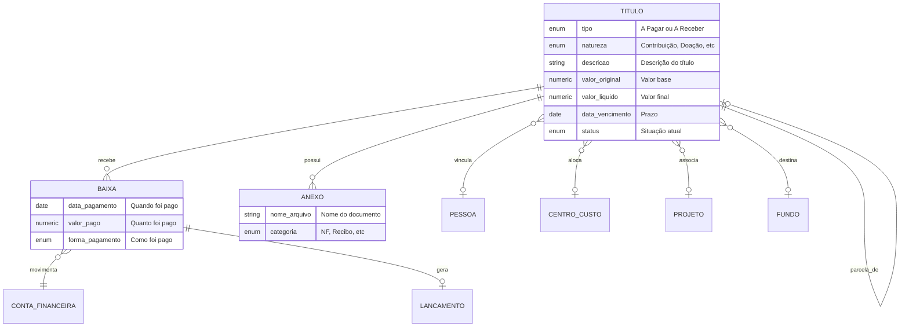
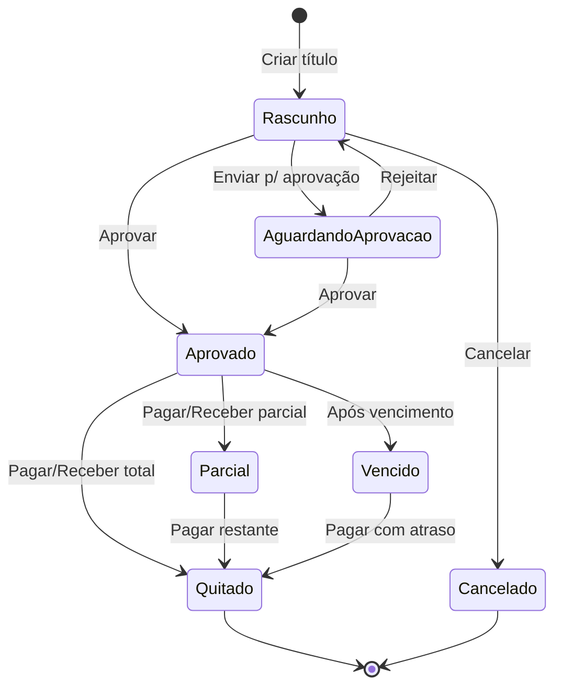

# Módulo C - Contas a Pagar e Receber

## Para o Contador

Este é o **módulo central do sistema**, onde são gerenciadas todas as obrigações financeiras da instituição religiosa:

- **Contas a Receber**: contribuições de membros, doações, eventos, convênios
- **Contas a Pagar**: despesas operacionais, fornecedores, impostos, tarifas
- **Baixas**: registro de pagamentos e recebimentos efetivados
- **Anexos**: notas fiscais, recibos, comprovantes digitalizados

Este módulo é fundamental para:
- Controlar o fluxo de caixa (entradas e saídas previstas)
- Gerar lançamentos contábeis automaticamente
- Emitir recibos de doação para dedução no IR
- Acompanhar inadimplência de contribuições
- Manter documentação para auditoria e fiscalização

---

## Glossário do Módulo

| Termo | Significado |
|-------|-------------|
| **Título** | Documento que representa direito a receber ou obrigação a pagar |
| **Baixa** | Registro do pagamento/recebimento efetivo do título |
| **Data de Emissão** | Quando o documento foi gerado |
| **Data de Competência** | Mês a que a receita/despesa pertence (regime de competência) |
| **Data de Vencimento** | Prazo para pagamento |
| **Valor Líquido** | Valor final = Original - Desconto + Acréscimo |
| **Estorno** | Cancelamento de uma baixa já realizada |
| **Parcelamento** | Divisão de um título em várias parcelas |

---

## Diagrama de Relacionamentos



---

## 1. Títulos (Contas a Pagar e Receber)

### O que é

Título é o registro de uma **obrigação financeira** - algo que a entidade tem direito de receber ou obrigação de pagar. É o documento base para todo o controle financeiro.

### Status: ⚠️ Parcialmente implementado - CRÍTICO

| Operação | Disponível | Observação |
|----------|------------|------------|
| Listar títulos | ✅ Sim | Com filtros e totais |
| Criar título | ❌ Não | Em desenvolvimento |
| Editar título | ❌ Não | Em desenvolvimento |
| Aprovar título | ❌ Não | Em desenvolvimento |
| Registrar baixa | ❌ Não | Em desenvolvimento |
| Parcelar | ❌ Não | Em desenvolvimento |

---

### Campos do Formulário: Criar Título

#### Seção: Identificação

| Campo | Label na Tela | Obrigatório | Tooltip/Ajuda |
|-------|---------------|-------------|---------------|
| `tipo` | **Tipo** | Sim | "A Pagar: despesas, fornecedores. A Receber: contribuições, doações." |
| `natureza` | **Natureza** | Sim | "Classifique o tipo de receita ou despesa. Importante para DRE e relatórios." |

**Tipos de Título:**

| Código | Nome na Tela | Descrição | Exemplo |
|--------|--------------|-----------|---------|
| `pagar` | A Pagar | Obrigação da entidade | Conta de luz, fornecedor |
| `receber` | A Receber | Direito da entidade | Dízimo, contribuição, doação |

**Naturezas - Para Títulos A RECEBER:**

| Código | Nome na Tela | Descrição | Conta Contábil Sugerida |
|--------|--------------|-----------|------------------------|
| `contribuicao` | Contribuição/Mensalidade | Pagamento regular de associados | 4.1.1 - Contribuições de Associados |
| `doacao` | Doação | Valores recebidos sem contrapartida | 4.1.2 - Doações e Ofertas |
| `evento` | Evento | Receita de bazares, festas, encontros | 4.2.1 - Receitas de Eventos |
| `convenio` | Convênio/Subvenção | Recursos de parceria com governo | 4.3.1 - Subvenções |

**Naturezas - Para Títulos A PAGAR:**

| Código | Nome na Tela | Descrição | Conta Contábil Sugerida |
|--------|--------------|-----------|------------------------|
| `servico` | Serviço | Prestadores, manutenção, limpeza | 5.1.1 - Serviços de Terceiros |
| `utilidade` | Utilidade | Água, luz, telefone, internet | 5.1.2 - Despesas com Utilidades |
| `taxa` | Taxa/Tarifa | Tarifas bancárias, cartório | 5.1.3 - Taxas e Tarifas |
| `imposto` | Imposto | IPTU, ISS, taxas municipais | 5.1.4 - Impostos e Taxas |
| `material` | Material | Escritório, limpeza, consumo | 5.2.1 - Materiais de Consumo |
| `outros` | Outros | Demais despesas | 5.9.1 - Outras Despesas |

---

#### Seção: Valores

| Campo | Label na Tela | Obrigatório | Tooltip/Ajuda |
|-------|---------------|-------------|---------------|
| `valorOriginal` | **Valor Original (R$)** | Sim | "Valor base do título, sem descontos ou acréscimos" |
| `valorDesconto` | **Desconto (R$)** | Não | "Desconto concedido (ex: pagamento antecipado)" |
| `valorAcrescimo` | **Acréscimo (R$)** | Não | "Juros, multa ou ajuste de valor" |

**Cálculo Automático:**
```
Valor Líquido = Valor Original - Desconto + Acréscimo
```

**Exemplo:**
- Valor Original: R$ 1.000,00
- Desconto: R$ 50,00 (5% por pagamento antecipado)
- Acréscimo: R$ 0,00
- **Valor Líquido: R$ 950,00**

---

#### Seção: Datas

| Campo | Label na Tela | Obrigatório | Tooltip/Ajuda |
|-------|---------------|-------------|---------------|
| `dataEmissao` | **Data de Emissão** | Sim | "Quando o documento foi gerado ou a obrigação surgiu" |
| `dataCompetencia` | **Data de Competência** | Sim | "Mês a que pertence a receita/despesa. Define o período contábil." |
| `dataVencimento` | **Data de Vencimento** | Sim | "Prazo final para pagamento" |

**Diferença importante:**

| Data | O que significa | Exemplo |
|------|-----------------|---------|
| Emissão | Quando foi criado | 28/01/2025 (NF emitida) |
| Competência | A que mês pertence | 01/2025 (despesa de janeiro) |
| Vencimento | Quando deve pagar | 10/02/2025 (prazo) |

**Dica para o contador:** A Data de Competência é usada para o regime de competência. Se receber uma conta de luz em fevereiro referente a janeiro, a competência é janeiro.

---

#### Seção: Documento

| Campo | Label na Tela | Obrigatório | Tooltip/Ajuda |
|-------|---------------|-------------|---------------|
| `numeroDocumento` | **Número do Documento** | Não | "Número da NF, boleto, recibo ou outro documento" |
| `serieDocumento` | **Série** | Não | "Série da nota fiscal, se houver" |
| `descricao` | **Descrição** | Sim | "Descrição detalhada do título para identificação" |
| `observacoes` | **Observações** | Não | "Anotações internas, não aparecem em relatórios externos" |

**Exemplos de Descrição:**

| Tipo | Natureza | Boa Descrição |
|------|----------|---------------|
| A Pagar | Utilidade | Conta de energia elétrica - Janeiro/2025 |
| A Pagar | Serviço | Serviço de limpeza - NF 12345 |
| A Receber | Contribuição | Contribuição mensal - João da Silva - Jan/2025 |
| A Receber | Doação | Doação anônima via PIX - 15/01/2025 |

---

#### Seção: Vínculos

| Campo | Label na Tela | Obrigatório | Tooltip/Ajuda |
|-------|---------------|-------------|---------------|
| `pessoaId` | **Pessoa** | Não* | "Fornecedor, doador ou membro relacionado" |
| `contaContabilId` | **Conta Contábil** | Não | "Conta do plano de contas para classificação" |
| `centroCustoId` | **Centro de Custo** | Não | "Área ou departamento responsável" |
| `projetoId` | **Projeto** | Não | "Se vinculado a projeto específico" |
| `fundoId` | **Fundo** | Não | "Se doação com restrição, vincule ao fundo" |

*Obrigatório para emissão de recibo de doação

**Quando vincular a Fundo:**
- Doação com destinação específica (ex: "para construção do salão")
- Recursos de convênio com uso restrito
- Reservas designadas pela diretoria

---

#### Seção: Status Inicial

| Campo | Label na Tela | Padrão | Tooltip/Ajuda |
|-------|---------------|--------|---------------|
| `status` | **Status Inicial** | Rascunho | "Define se o título já pode ser pago/cobrado" |

**Status Iniciais:**

| Status | Nome na Tela | Quando usar |
|--------|--------------|-------------|
| `rascunho` | Rascunho | Ainda em elaboração, pode editar livremente |
| `pendente_aprovacao` | Aguardando Aprovação | Precisa aprovação de superior |
| `aprovado` | Aprovado | Liberado para pagamento/cobrança |

---

#### Seção: Parcelamento (Opcional)

| Campo | Label na Tela | Tooltip/Ajuda |
|-------|---------------|---------------|
| `totalParcelas` | **Número de Parcelas** | "Quantas parcelas (2 a 60)" |
| `intervaloMeses` | **Intervalo (meses)** | "Meses entre parcelas (1 = mensal)" |
| `valorPrimeiraParcela` | **Valor 1ª Parcela** | "Se diferente das demais, informe aqui" |

**Exemplo de Parcelamento:**
- Valor Total: R$ 1.200,00
- Parcelas: 12
- Intervalo: 1 mês
- Resultado: 12 títulos de R$ 100,00 cada

---

### Estados do Título (Ciclo de Vida)



**Status do Título:**

| Status | Cor | Significado | Pode Editar | Pode Baixar |
|--------|-----|-------------|-------------|-------------|
| Rascunho | Cinza | Em elaboração | Sim | Não |
| Aguardando Aprovação | Amarelo | Esperando aprovador | Não | Não |
| Aprovado | Azul | Liberado | Parcial* | Sim |
| Parcial | Laranja | Pago parcialmente | Não | Sim |
| Vencido | Vermelho | Passou do prazo | Não | Sim |
| Quitado | Verde | Totalmente pago | Não | Não |
| Cancelado | Preto | Desconsiderado | Não | Não |

*Só desconto, acréscimo, vencimento e observações

---

## 2. Baixas (Pagamentos e Recebimentos)

### O que é

Baixa é o registro do **pagamento ou recebimento efetivo** de um título. Quando você paga uma conta ou recebe uma doação, registra uma baixa.

### Status: ❌ Não implementado

---

### Campos do Formulário: Registrar Baixa

#### Seção: Identificação do Pagamento

| Campo | Label na Tela | Obrigatório | Tooltip/Ajuda |
|-------|---------------|-------------|---------------|
| `tituloId` | **Título** | Sim | "Selecione o título que está sendo pago/recebido" |
| `contaFinanceiraId` | **Conta** | Sim | "Conta bancária ou caixa de saída/entrada do dinheiro" |
| `dataPagamento` | **Data do Pagamento** | Sim | "Quando efetivamente ocorreu o pagamento" |

---

#### Seção: Valores

| Campo | Label na Tela | Obrigatório | Tooltip/Ajuda |
|-------|---------------|-------------|---------------|
| `valorPago` | **Valor Pago (R$)** | Sim | "Valor efetivamente pago ou recebido" |
| `valorJuros` | **Juros (R$)** | Não | "Juros por atraso (acréscimo)" |
| `valorMulta` | **Multa (R$)** | Não | "Multa por atraso (acréscimo)" |
| `valorDesconto` | **Desconto (R$)** | Não | "Desconto obtido no pagamento" |

**Cálculo do Valor Total:**
```
Total Pago = Valor Base + Juros + Multa - Desconto
```

---

#### Seção: Forma de Pagamento

| Campo | Label na Tela | Obrigatório | Tooltip/Ajuda |
|-------|---------------|-------------|---------------|
| `formaPagamento` | **Forma de Pagamento** | Sim | "Como foi realizado o pagamento" |
| `documentoReferencia` | **Documento/Comprovante** | Não | "Número do comprovante, autenticação, chave PIX" |

**Formas de Pagamento:**

| Código | Nome na Tela | Descrição |
|--------|--------------|-----------|
| `dinheiro` | Dinheiro | Pagamento em espécie |
| `pix` | PIX | Transferência instantânea |
| `ted` | TED | Transferência bancária |
| `doc` | DOC | Transferência bancária |
| `boleto` | Boleto | Pagamento de boleto bancário |
| `debito` | Cartão Débito | Débito em conta |
| `credito` | Cartão Crédito | Pagamento no crédito |
| `cheque` | Cheque | Pagamento com cheque |

---

#### Seção: Contabilização

| Campo | Label na Tela | Padrão | Tooltip/Ajuda |
|-------|---------------|--------|---------------|
| `gerarLancamento` | **Gerar Lançamento Contábil** | Sim | "Se marcado, cria o lançamento automaticamente" |

**Lançamento Automático - Recebimento:**

| Conta | Débito | Crédito |
|-------|--------|---------|
| Bancos (conta da baixa) | R$ X | - |
| Receita (conta do título) | - | R$ X |

**Lançamento Automático - Pagamento:**

| Conta | Débito | Crédito |
|-------|--------|---------|
| Despesa (conta do título) | R$ X | - |
| Bancos (conta da baixa) | - | R$ X |

---

### Baixa Parcial

Quando o valor pago é menor que o valor do título:

1. Sistema calcula saldo restante
2. Título muda para status "Parcial"
3. Pode registrar novas baixas até quitar
4. Histórico mostra todas as baixas

**Exemplo:**
- Título: R$ 1.000,00
- Baixa 1: R$ 600,00 (status vira "Parcial")
- Baixa 2: R$ 400,00 (status vira "Quitado")

---

### Estornar Baixa

Quando precisa desfazer um pagamento registrado incorretamente:

| Campo | Label na Tela | Obrigatório | Tooltip/Ajuda |
|-------|---------------|-------------|---------------|
| `motivo` | **Motivo do Estorno** | Sim | "Explique por que está estornando. Mínimo 10 caracteres." |
| `dataEstorno` | **Data do Estorno** | Não | "Se diferente de hoje, informe a data" |

**O que acontece no estorno:**
1. Cria nova baixa com valor negativo
2. Título volta ao status anterior (Aprovado ou Parcial)
3. Lançamento contábil é estornado
4. Saldo da conta é ajustado
5. Histórico mantém registro completo

---

### Baixa em Lote

Para pagar ou receber múltiplos títulos de uma vez:

| Campo | Label na Tela | Tooltip/Ajuda |
|-------|---------------|---------------|
| `contaFinanceiraId` | **Conta** | "Conta para todos os pagamentos" |
| `dataPagamento` | **Data** | "Data para todos os pagamentos" |
| `formaPagamento` | **Forma** | "Forma para todos os pagamentos" |
| `titulos` | **Títulos** | "Selecione os títulos e informe valores" |

**Uso comum:** Baixar várias contribuições de associados recebidas no mesmo dia.

---

## 3. Anexos (Documentos)

### O que é

Digitalização e armazenamento de documentos comprobatórios: notas fiscais, recibos, comprovantes de pagamento, contratos.

### Status: ❌ Não implementado

---

### Campos do Formulário: Upload de Anexo

| Campo | Label na Tela | Obrigatório | Tooltip/Ajuda |
|-------|---------------|-------------|---------------|
| `categoria` | **Categoria** | Não | "Tipo de documento" |
| `nomeArquivo` | **Arquivo** | Sim | "Selecione o arquivo (PDF, JPG, PNG)" |
| `descricao` | **Descrição** | Não | "Descrição adicional do documento" |

**Categorias de Anexo:**

| Código | Nome na Tela | Quando usar |
|--------|--------------|-------------|
| `nota_fiscal` | Nota Fiscal | NF-e, NFS-e, cupom fiscal |
| `recibo` | Recibo | Recibo simples, declaração |
| `comprovante` | Comprovante | Comprovante bancário, PIX |
| `contrato` | Contrato | Contratos e termos |
| `outros` | Outros | Demais documentos |

**Limites:**
- Tamanho máximo: 10 MB por arquivo
- Formatos aceitos: PDF, JPG, PNG, XML

---

## Contabilização Automática

### Recebimento de Doação

**Cenário:** Igreja recebe doação de R$ 500,00 via PIX

**Título criado:**
- Tipo: A Receber
- Natureza: Doação
- Valor: R$ 500,00
- Pessoa: Maria da Silva
- Conta Contábil: 4.1.2 - Doações

**Baixa registrada:**
- Conta: BB Conta Movimento
- Forma: PIX
- Valor: R$ 500,00

**Lançamento gerado automaticamente:**

| Conta | Débito | Crédito | Histórico |
|-------|--------|---------|-----------|
| 1.1.1.02 - Bancos C/M | R$ 500,00 | - | Recebimento doação - Maria da Silva |
| 4.1.2 - Doações | - | R$ 500,00 | Recebimento doação - Maria da Silva |

---

### Pagamento de Despesa

**Cenário:** Pagamento de conta de luz R$ 350,00

**Título criado:**
- Tipo: A Pagar
- Natureza: Utilidade
- Valor: R$ 350,00
- Pessoa: Concessionária de Energia
- Conta Contábil: 5.1.2.01 - Energia Elétrica

**Baixa registrada:**
- Conta: BB Conta Movimento
- Forma: Boleto
- Valor: R$ 350,00

**Lançamento gerado automaticamente:**

| Conta | Débito | Crédito | Histórico |
|-------|--------|---------|-----------|
| 5.1.2.01 - Energia Elétrica | R$ 350,00 | - | Pagto conta luz Jan/2025 |
| 1.1.1.02 - Bancos C/M | - | R$ 350,00 | Pagto conta luz Jan/2025 |

---

## Regras de Negócio

### Títulos

| Regra | Validação | Mensagem |
|-------|-----------|----------|
| Valor positivo | Valor líquido > 0 | "Valor líquido deve ser positivo" |
| Competência válida | Data no período aberto | "Período contábil está fechado" |
| Pessoa para recibo | Doação com recibo requer pessoa | "Informe a pessoa para gerar recibo" |
| Edição limitada | Quitado não edita | "Título quitado não pode ser editado" |

### Baixas

| Regra | Validação | Mensagem |
|-------|-----------|----------|
| Valor válido | Valor ≤ saldo do título | "Valor excede saldo do título" |
| Data passada | Data ≤ hoje | "Data de pagamento não pode ser futura" |
| Conta ativa | Conta financeira ativa | "Conta está inativa" |
| Estorno justificado | Motivo ≥ 10 caracteres | "Informe o motivo do estorno" |

### Anexos

| Regra | Validação | Mensagem |
|-------|-----------|----------|
| Tamanho | ≤ 10 MB | "Arquivo excede 10MB" |
| Formato | PDF, JPG, PNG, XML | "Formato não suportado" |
| Duplicidade | Hash único | "Arquivo já anexado" |

---

## Casos de Uso Detalhados

### Caso: Lançar Contribuição Mensal de Associado

1. Acesse "Financeiro > Títulos"
2. Clique em "Novo Título"
3. Tipo: **A Receber**
4. Natureza: **Contribuição**
5. Pessoa: Selecione o associado
6. Valor: Conforme cadastro do associado
7. Competência: Mês de referência
8. Vencimento: Dia configurado para o associado
9. Salve e aprove

**Dica:** Para associados regulares, o sistema pode gerar títulos automaticamente.

---

### Caso: Registrar Doação Anônima

1. Crie título A Receber, natureza Doação
2. **Não vincule pessoa** (anônimo)
3. Na descrição: "Doação anônima via ofertório - 15/01/2025"
4. Registre a baixa no caixa
5. Sistema contabiliza automaticamente

**Observação:** Doação anônima não gera recibo para IR, mas deve ser contabilizada.

---

### Caso: Parcelar Compra de Equipamento

1. Crie título A Pagar de R$ 6.000,00
2. Na seção Parcelamento:
   - Parcelas: 6
   - Intervalo: 1 mês
   - 1ª parcela: 10/02/2025
3. Sistema cria 6 títulos de R$ 1.000,00 cada
4. Cada parcela vence no dia 10 dos próximos meses

---

### Caso: Estornar Pagamento Incorreto

1. Localize a baixa na lista
2. Clique em "Estornar"
3. Informe motivo: "Pagamento duplicado - já havia sido pago anteriormente"
4. Confirme
5. Sistema:
   - Cria baixa negativa
   - Estorna lançamento contábil
   - Título volta para "Aprovado"

---

## Checklist para Fechamento Mensal

### Contas a Receber

- [ ] Todos os recebimentos do mês foram baixados
- [ ] Títulos vencidos foram analisados (inadimplência)
- [ ] Contribuições de associados conferidas
- [ ] Doações identificadas e vinculadas a pessoas

### Contas a Pagar

- [ ] Todas as despesas do mês foram lançadas
- [ ] Notas fiscais anexadas
- [ ] Pagamentos baixados e conciliados com extrato
- [ ] Competência correta para cada despesa

### Documentação

- [ ] Anexos de notas fiscais e recibos
- [ ] Comprovantes de pagamento
- [ ] Recibos de doação emitidos

---

## Dúvidas Frequentes

### "Qual a diferença entre Data de Emissão e Competência?"

- **Emissão**: quando o documento foi gerado
- **Competência**: a que período pertence

Exemplo: NF emitida em 05/02 referente a serviço de janeiro → Competência = Janeiro.

### "Posso editar um título já pago?"

Não. Após quitado, o título fica bloqueado. Se precisar corrigir, estorne a baixa, edite o título, e refaça a baixa.

### "O que acontece se eu cancelar um título?"

O título muda para status "Cancelado", sai dos relatórios de pendências, mas permanece no histórico para auditoria. Se tinha baixa, não pode cancelar.

### "Como gerar recibo de doação para IR?"

1. O título deve ter natureza "Doação"
2. Deve estar vinculado a uma pessoa com CPF
3. Deve estar quitado
4. Acesse o título e clique em "Emitir Recibo"

### "Posso pagar um título com valor diferente?"

Sim. Informe o valor pago e a diferença como:
- **Juros/Multa**: se pagou mais por atraso
- **Desconto**: se pagou menos por negociação
O sistema contabiliza adequadamente cada componente.
