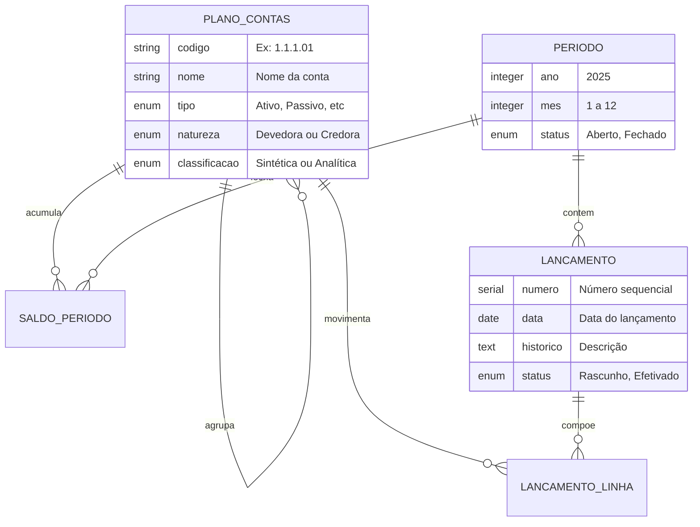
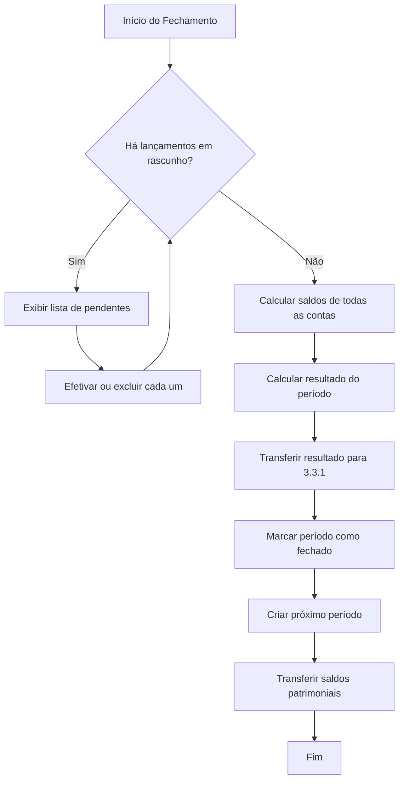

# Módulo D - Contabilidade

## Para o Contador

Este módulo é o **coração contábil** do sistema, onde são gerenciados:

- **Plano de Contas**: estrutura de contas conforme ITG 2002 para entidades sem fins lucrativos
- **Períodos Contábeis**: controle mensal com fechamento e reabertura
- **Lançamentos**: registros de débito e crédito pelo método das partidas dobradas
- **Saldos**: cálculo automático de saldos por conta e período

O sistema segue rigorosamente as normas brasileiras de contabilidade:
- **ITG 2002 (R1)** - Entidades sem Finalidade de Lucros
- **NBC TG 26** - Apresentação das Demonstrações Contábeis
- **NBC TG 1000** - Contabilidade para PME (aplicável por analogia)

---

## Glossário do Módulo

| Termo | Significado |
|-------|-------------|
| **Conta Sintética** | Conta que agrupa outras (não recebe lançamentos) |
| **Conta Analítica** | Conta de último nível (recebe lançamentos) |
| **Natureza Devedora** | Aumenta com débitos (Ativo, Despesa) |
| **Natureza Credora** | Aumenta com créditos (Passivo, PL, Receita) |
| **Partidas Dobradas** | Todo débito tem um crédito correspondente |
| **Período Contábil** | Mês de competência dos lançamentos |
| **Fechamento** | Encerramento do período com cálculo de saldos |
| **Patrimônio Social** | Equivalente ao PL em entidades sem fins lucrativos |

---

## Diagrama de Relacionamentos



---

## 1. Plano de Contas

### O que é

O Plano de Contas é a estrutura organizada de todas as contas contábeis da entidade. Para instituições religiosas, deve seguir a **ITG 2002** que define nomenclaturas específicas (Patrimônio Social ao invés de Capital Social, Superávit ao invés de Lucro).

### Status: ⚠️ Parcialmente implementado

| Operação | Disponível | Observação |
|----------|------------|------------|
| Visualizar árvore | ✅ Sim | Estrutura hierárquica |
| Estatísticas | ✅ Sim | Quantidade por tipo |
| Criar conta | ❌ Não | Em desenvolvimento |
| Editar conta | ❌ Não | Em desenvolvimento |
| Inativar conta | ❌ Não | Em desenvolvimento |

---

### Estrutura ITG 2002 para Terceiro Setor

```
1 - ATIVO
├── 1.1 - ATIVO CIRCULANTE
│   ├── 1.1.1 - Disponibilidades
│   │   ├── 1.1.1.01 - Caixa Geral
│   │   ├── 1.1.1.02 - Bancos Conta Movimento
│   │   └── 1.1.1.03 - Aplicações de Liquidez Imediata
│   ├── 1.1.2 - Créditos a Receber
│   │   ├── 1.1.2.01 - Contribuições a Receber
│   │   └── 1.1.2.02 - Doações a Receber
│   └── 1.1.3 - Estoques
│       └── 1.1.3.01 - Materiais de Consumo
├── 1.2 - ATIVO NÃO CIRCULANTE
│   ├── 1.2.1 - Realizável a Longo Prazo
│   └── 1.2.2 - Imobilizado
│       ├── 1.2.2.01 - Imóveis
│       ├── 1.2.2.02 - Veículos
│       ├── 1.2.2.03 - Móveis e Utensílios
│       └── 1.2.2.99 - (-) Depreciação Acumulada

2 - PASSIVO
├── 2.1 - PASSIVO CIRCULANTE
│   ├── 2.1.1 - Obrigações Trabalhistas
│   │   ├── 2.1.1.01 - Salários a Pagar
│   │   ├── 2.1.1.02 - FGTS a Recolher
│   │   └── 2.1.1.03 - INSS a Recolher
│   ├── 2.1.2 - Obrigações Tributárias
│   │   └── 2.1.2.01 - ISS a Recolher
│   └── 2.1.3 - Contas a Pagar
│       └── 2.1.3.01 - Fornecedores
└── 2.2 - PASSIVO NÃO CIRCULANTE

3 - PATRIMÔNIO SOCIAL
├── 3.1 - Patrimônio Social
│   └── 3.1.1 - Patrimônio Social Constituído
├── 3.2 - Reservas
│   └── 3.2.1 - Fundo de Reserva
└── 3.3 - Superávit/Déficit Acumulados
    └── 3.3.1 - Superávit do Exercício

4 - RECEITAS
├── 4.1 - Receitas com Restrição
│   ├── 4.1.1 - Doações com Restrição
│   └── 4.1.2 - Subvenções com Restrição
└── 4.2 - Receitas sem Restrição
    ├── 4.2.1 - Contribuições de Associados
    ├── 4.2.2 - Doações Livres
    ├── 4.2.3 - Receitas de Eventos
    └── 4.2.4 - Receitas Financeiras

5 - DESPESAS
├── 5.1 - Despesas com Pessoal
│   ├── 5.1.1 - Salários e Ordenados
│   ├── 5.1.2 - Encargos Sociais
│   └── 5.1.3 - Benefícios
├── 5.2 - Despesas Administrativas
│   ├── 5.2.1 - Água, Luz e Telefone
│   ├── 5.2.2 - Material de Escritório
│   ├── 5.2.3 - Serviços de Terceiros
│   └── 5.2.4 - Despesas Bancárias
├── 5.3 - Despesas com Atividade-Fim
│   ├── 5.3.1 - Materiais para Atividades
│   └── 5.3.2 - Eventos e Celebrações
└── 5.4 - Depreciação e Amortização
    └── 5.4.1 - Depreciação de Imobilizado
```

---

### Campos do Formulário: Criar Conta

#### Seção: Identificação

| Campo | Label na Tela | Obrigatório | Tooltip/Ajuda |
|-------|---------------|-------------|---------------|
| `codigo` | **Código da Conta** | Sim | "Código hierárquico. Ex: 1.1.1.01 (segue estrutura da conta pai)" |
| `nome` | **Nome da Conta** | Sim | "Nome descritivo da conta" |
| `descricao` | **Descrição** | Não | "Detalhamento de quando usar esta conta" |

**Regras de Codificação:**

| Nível | Formato | Exemplo | Tipo de Conta |
|-------|---------|---------|---------------|
| 1 | X | 1 | Grupo principal |
| 2 | X.X | 1.1 | Subgrupo |
| 3 | X.X.X | 1.1.1 | Categoria |
| 4 | X.X.X.XX | 1.1.1.01 | Conta analítica |

---

#### Seção: Classificação

| Campo | Label na Tela | Obrigatório | Tooltip/Ajuda |
|-------|---------------|-------------|---------------|
| `tipo` | **Tipo** | Sim | "Grupo principal a que pertence" |
| `naturezaSaldo` | **Natureza do Saldo** | Sim | "Define se aumenta com débito ou crédito" |
| `classificacao` | **Classificação** | Sim | "Sintética agrupa, Analítica recebe lançamentos" |

**Tipos de Conta:**

| Código | Nome | Natureza | Descrição |
|--------|------|----------|-----------|
| `ativo` | Ativo | Devedora | Bens e direitos |
| `passivo` | Passivo | Credora | Obrigações |
| `patrimonio_social` | Patrimônio Social | Credora | Recursos próprios (PL) |
| `receita` | Receita | Credora | Entradas de recursos |
| `despesa` | Despesa | Devedora | Saídas de recursos |

**Classificação:**

| Código | Nome | Aceita Lançamento | Quando usar |
|--------|------|-------------------|-------------|
| `sintetica` | Sintética | Não | Agrupa outras contas (ex: 1.1) |
| `analitica` | Analítica | Sim | Recebe lançamentos (ex: 1.1.1.01) |

---

#### Seção: Hierarquia

| Campo | Label na Tela | Obrigatório | Tooltip/Ajuda |
|-------|---------------|-------------|---------------|
| `contaPaiId` | **Conta Pai** | Não* | "Conta de nível superior que agrupa esta" |

*Obrigatório para contas de nível 2 em diante

**Exemplo de Hierarquia:**
- 1 - ATIVO (pai de nenhuma, é raiz)
  - 1.1 - ATIVO CIRCULANTE (pai = 1)
    - 1.1.1 - Disponibilidades (pai = 1.1)
      - 1.1.1.01 - Caixa (pai = 1.1.1)

---

#### Seção: Configuração

| Campo | Label na Tela | Tooltip/Ajuda |
|-------|---------------|---------------|
| `tags` | **Tags** | "Palavras-chave para facilitar buscas e relatórios" |

**Exemplos de Tags:**
- `igreja`, `centro-espirita`, `templo`
- `administrativo`, `atividade-fim`
- `com-restricao`, `sem-restricao`
- `depreciavel`, `imobilizado`

---

### Regras de Negócio - Plano de Contas

| Regra | Validação | Mensagem |
|-------|-----------|----------|
| Código único | Não duplicar código | "Código já existe" |
| Hierarquia correta | Código deve seguir pai | "Código incompatível com conta pai" |
| Tipo × Natureza | Natureza deve ser consistente | "Ativo/Despesa = Devedora; Passivo/PL/Receita = Credora" |
| Sintética sem lançamento | Sintética não recebe lançamento | "Conta sintética não aceita lançamentos" |
| Exclusão bloqueada | Com lançamentos não exclui | "Conta possui lançamentos" |

---

## 2. Períodos Contábeis

### O que é

Cada mês do ano é um período contábil. O controle por período permite:
- Evitar lançamentos em meses já fechados
- Calcular saldos mensais das contas
- Gerar demonstrações por período
- Manter histórico de fechamentos

### Status: ⚠️ Parcialmente implementado

| Operação | Disponível | Observação |
|----------|------------|------------|
| Listar períodos | ✅ Sim | Todos os meses |
| Criar período | ❌ Não | Em desenvolvimento |
| Fechar período | ❌ Não | Em desenvolvimento |
| Reabrir período | ❌ Não | Em desenvolvimento |

---

### Estados do Período

| Status | Cor | Pode Lançar | Pode Fechar | Pode Reabrir |
|--------|-----|-------------|-------------|--------------|
| Aberto | Verde | Sim | Sim | - |
| Em Revisão | Amarelo | Não | Sim | - |
| Fechado | Azul | Não | - | Sim* |
| Reaberto | Laranja | Sim | Sim | - |

*Requer permissão especial e justificativa

---

### Campos do Formulário: Criar Período

| Campo | Label na Tela | Obrigatório | Tooltip/Ajuda |
|-------|---------------|-------------|---------------|
| `ano` | **Ano** | Sim | "Ano do período (ex: 2025)" |
| `mes` | **Mês** | Sim | "Mês do período (1 a 12)" |
| `observacoes` | **Observações** | Não | "Anotações sobre este período" |

**Cálculo Automático:**
- Data início: primeiro dia do mês
- Data fim: último dia do mês

---

### Campos do Formulário: Fechar Período

| Campo | Label na Tela | Obrigatório | Tooltip/Ajuda |
|-------|---------------|-------------|---------------|
| `observacoes` | **Observações do Fechamento** | Não | "Comentários sobre o fechamento" |

**O que acontece no fechamento:**

1. Sistema verifica se há lançamentos em rascunho
   - Se houver, exibe lista para efetivar ou excluir
2. Calcula saldo final de cada conta
3. Marca período como fechado
4. Registra quem fechou e quando
5. Cria próximo período se não existir
6. Transfere saldos para o próximo período

---

### Campos do Formulário: Reabrir Período

| Campo | Label na Tela | Obrigatório | Tooltip/Ajuda |
|-------|---------------|-------------|---------------|
| `motivoReabertura` | **Motivo da Reabertura** | Sim | "Justifique a reabertura. Mínimo 20 caracteres. Será registrado para auditoria." |

**Alerta:** Reabertura é operação excepcional. Os saldos do período seguinte podem ficar inconsistentes até novo fechamento.

---

## 3. Lançamentos Contábeis

### O que é

Lançamento é o registro das operações contábeis pelo método das **partidas dobradas**: todo débito tem um crédito correspondente de mesmo valor.

### Status: ❌ Não implementado

---

### Tipos de Lançamento

| Origem | Descrição | Automático |
|--------|-----------|------------|
| `manual` | Lançamento feito pelo usuário | Não |
| `baixa` | Gerado ao baixar título | Sim |
| `extrato` | Gerado na conciliação (tarifas, rendimentos) | Sim |
| `depreciacao` | Cálculo mensal de depreciação | Sim |
| `fechamento` | Apuração de resultado | Sim |
| `ajuste` | Correção ou reclassificação | Não |

---

### Campos do Formulário: Lançamento Simples (D/C)

Para lançamentos com apenas duas linhas (débito e crédito):

| Campo | Label na Tela | Obrigatório | Tooltip/Ajuda |
|-------|---------------|-------------|---------------|
| `dataLancamento` | **Data do Lançamento** | Sim | "Data de registro no sistema" |
| `historico` | **Histórico** | Sim | "Descrição do fato contábil. Mínimo 10 caracteres." |
| `contaDebitoId` | **Conta Débito** | Sim | "Conta que será debitada" |
| `contaCreditoId` | **Conta Crédito** | Sim | "Conta que será creditada" |
| `valor` | **Valor (R$)** | Sim | "Valor do lançamento" |
| `centroCustoId` | **Centro de Custo** | Não | "Área ou departamento" |
| `projetoId` | **Projeto** | Não | "Se vinculado a projeto" |
| `fundoId` | **Fundo** | Não | "Se vinculado a fundo restrito" |
| `efetivar` | **Efetivar Imediatamente** | - | "Se marcado, já fica efetivado" |

**Exemplos de Histórico:**

| Operação | Bom Histórico |
|----------|---------------|
| Pagamento de luz | Pagto conta luz Jan/2025 - NF 12345 - Concessionária XYZ |
| Recebimento de doação | Recebimento doação Maria Silva via PIX |
| Depreciação | Depreciação imobilizado Jan/2025 conforme mapa |
| Ajuste | Reclassificação de conta - era despesa admin, é atividade-fim |

---

### Campos do Formulário: Lançamento Composto

Para lançamentos com múltiplas linhas (rateios, composições):

| Campo | Label na Tela | Obrigatório | Tooltip/Ajuda |
|-------|---------------|-------------|---------------|
| `periodoId` | **Período** | Sim | "Mês de competência" |
| `dataLancamento` | **Data** | Sim | "Data do lançamento" |
| `dataCompetencia` | **Competência** | Sim | "Data do fato gerador" |
| `historico` | **Histórico Geral** | Sim | "Descrição do fato contábil" |
| `origem` | **Origem** | Sim | "De onde vem este lançamento" |
| `linhas` | **Partidas** | Sim | "Débitos e créditos (mínimo 2)" |

**Para cada linha:**

| Campo | Label | Tooltip |
|-------|-------|---------|
| `contaId` | Conta | Conta contábil |
| `tipo` | D/C | Débito ou Crédito |
| `valor` | Valor | Valor desta linha |
| `historicoComplementar` | Complemento | Detalhe adicional |
| `centroCustoId` | CC | Centro de custo |
| `projetoId` | Projeto | Projeto |
| `fundoId` | Fundo | Fundo |

**Validação Fundamental:**
```
Σ Débitos = Σ Créditos
```
Se não forem iguais, o lançamento não pode ser salvo.

---

### Estados do Lançamento

| Status | Pode Editar | Pode Efetivar | Pode Estornar | Afeta Saldos |
|--------|-------------|---------------|---------------|--------------|
| Rascunho | Sim | Sim | Não | Não |
| Efetivado | Não | - | Sim | Sim |
| Estornado | Não | - | - | Não* |

*O estorno é um novo lançamento que anula o efeito

---

### Campos do Formulário: Estornar Lançamento

| Campo | Label na Tela | Obrigatório | Tooltip/Ajuda |
|-------|---------------|-------------|---------------|
| `motivo` | **Motivo do Estorno** | Sim | "Por que está estornando? Mínimo 10 caracteres." |
| `dataEstorno` | **Data do Estorno** | Não | "Se diferente de hoje" |

**O que acontece no estorno:**
1. Cria novo lançamento com débitos e créditos invertidos
2. Histórico: "ESTORNO: [motivo] - Ref: Lançamento nº XXX"
3. Lançamento original permanece, marcado como estornado
4. Saldos são ajustados

---

## Cálculo de Saldos

### Fórmula por Natureza

**Contas de Natureza Devedora (Ativo, Despesa):**
```
Saldo Final = Saldo Anterior + Débitos - Créditos
```

**Contas de Natureza Credora (Passivo, PL, Receita):**
```
Saldo Final = Saldo Anterior + Créditos - Débitos
```

### Exemplo Prático

| Conta | Natureza | Saldo Ant | Débitos | Créditos | Saldo Final |
|-------|----------|-----------|---------|----------|-------------|
| 1.1.1.01 Caixa | Devedora | 1.000 | 500 | 300 | 1.200 |
| 2.1.3.01 Fornecedores | Credora | 500 | 400 | 200 | 300 |
| 4.2.2 Doações | Credora | 0 | 0 | 800 | 800 |
| 5.2.1 Água e Luz | Devedora | 0 | 150 | 0 | 150 |

---

## Fluxo de Fechamento Mensal



---

## Regras de Negócio

### Lançamentos

| Regra | Validação | Mensagem |
|-------|-----------|----------|
| Partidas dobradas | Débitos = Créditos | "Total de débitos diferente de créditos" |
| Período aberto | Período não pode estar fechado | "Período está fechado" |
| Conta analítica | Só analíticas recebem lançamento | "Conta não aceita lançamentos" |
| Conta ativa | Conta deve estar ativa | "Conta está inativa" |
| Histórico mínimo | ≥ 10 caracteres | "Histórico muito curto" |
| Edição de efetivado | Não permite edição | "Lançamento efetivado, use estorno" |

### Períodos

| Regra | Validação | Mensagem |
|-------|-----------|----------|
| Único por mês | Um período por mês/ano | "Período já existe" |
| Sequencial | Não pular meses | "Período anterior não existe" |
| Reabertura justificada | Motivo obrigatório | "Informe o motivo da reabertura" |

---

## Casos de Uso Detalhados

### Caso: Lançamento de Ajuste de Saldo

**Contexto:** Saldo do caixa está divergente da contagem física.

1. Crie lançamento manual
2. Se saldo contábil > físico (sobra):
   - D: 5.9.9 Outras Despesas
   - C: 1.1.1.01 Caixa
3. Se saldo contábil < físico (falta):
   - D: 1.1.1.01 Caixa
   - C: 4.9.9 Outras Receitas
4. Histórico: "Ajuste de caixa conforme contagem física de XX/XX/XXXX"

---

### Caso: Apuração do Resultado Mensal

No fechamento, o sistema automaticamente:

1. Soma todas as receitas (grupo 4)
2. Soma todas as despesas (grupo 5)
3. Calcula: Resultado = Receitas - Despesas
4. Se Superávit (R > D):
   - D: 4.x Receitas (encerramento)
   - C: 3.3.1 Superávit do Exercício
5. Se Déficit (R < D):
   - D: 3.3.1 Déficit do Exercício
   - C: 5.x Despesas (encerramento)

---

### Caso: Reclassificação de Conta

**Contexto:** Despesa foi lançada em conta errada.

1. Estorne o lançamento original (ou faça ajuste)
2. Crie novo lançamento:
   - D: Conta correta
   - C: Conta onde estava errado
3. Histórico: "Reclassificação - transferência de [conta A] para [conta B] ref. NF XXX"

---

## Demonstrações Contábeis Obrigatórias

### Conforme ITG 2002, a entidade deve elaborar:

| Demonstração | Sigla | Conteúdo |
|--------------|-------|----------|
| Balanço Patrimonial | BP | Ativo, Passivo, Patrimônio Social |
| Demonstração do Resultado | DRE | Receitas, Despesas, Superávit/Déficit |
| Demonstração das Mutações do PL | DMPL | Variações no Patrimônio Social |
| Demonstração de Fluxo de Caixa | DFC | Entradas e saídas de caixa |
| Notas Explicativas | NE | Detalhamento e políticas |

---

## Checklist de Fechamento Mensal

### Antes de Fechar

- [ ] Todos os títulos do mês foram baixados
- [ ] Conciliação bancária está 100%
- [ ] Depreciação do mês foi calculada
- [ ] Não há lançamentos em rascunho
- [ ] Provisões necessárias foram feitas
- [ ] Contas do grupo 4 e 5 conferidas

### Ao Fechar

- [ ] Verificar saldos das disponibilidades
- [ ] Conferir saldo de fornecedores
- [ ] Validar receitas e despesas
- [ ] Conferir resultado do período
- [ ] Documentar observações

### Após Fechar

- [ ] Gerar balancete de verificação
- [ ] Arquivar documentação
- [ ] Comunicar diretoria se necessário

---

## Dúvidas Frequentes

### "Qual a diferença entre data de lançamento e competência?"

- **Data de lançamento**: quando o registro foi feito no sistema
- **Data de competência**: a que período pertence o fato

Exemplo: Em 05/02 você lança uma despesa de janeiro. Lançamento = 05/02, Competência = Janeiro.

### "Posso lançar em período fechado?"

Não diretamente. É necessário reabrir o período (com justificativa) ou fazer lançamento de ajuste no período atual.

### "O que fazer se errei um lançamento efetivado?"

Faça estorno. Isso cria um lançamento inverso que anula o efeito do original, mantendo trilha de auditoria.

### "Por que Patrimônio Social e não Capital Social?"

Entidades sem fins lucrativos não têm capital (não há sócios investidores). O Patrimônio Social representa os recursos acumulados pela entidade ao longo do tempo, conforme ITG 2002.

### "Qual a diferença entre Superávit e Lucro?"

São equivalentes em valor, mas a terminologia difere:
- **Lucro/Prejuízo**: usado em empresas com fins lucrativos
- **Superávit/Déficit**: usado em entidades sem fins lucrativos (ITG 2002)
