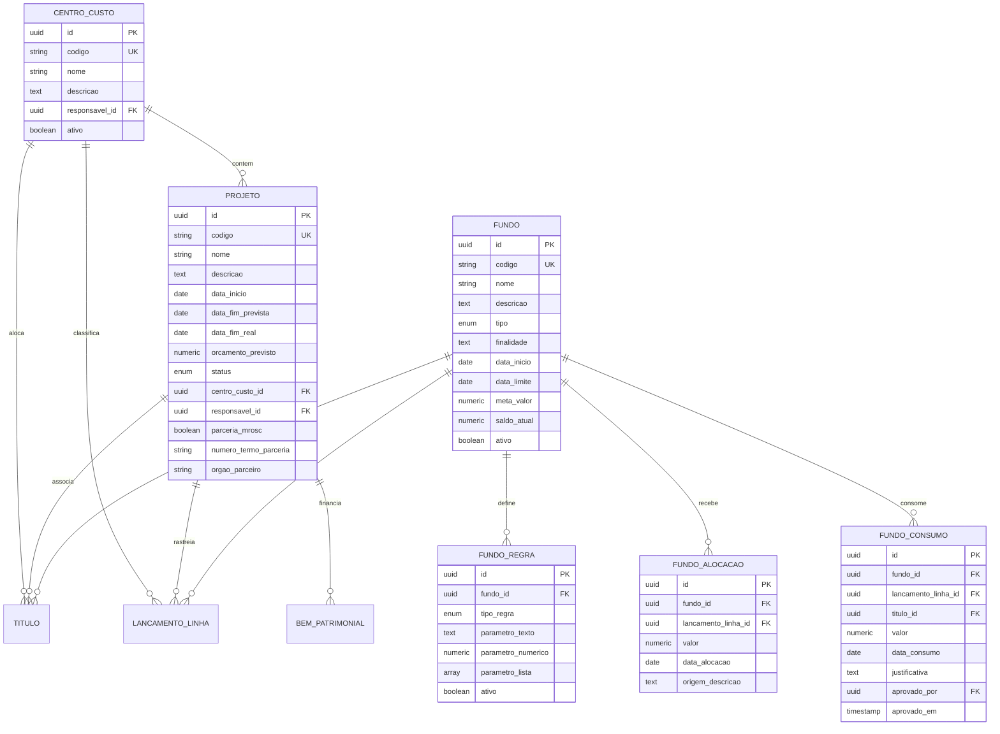
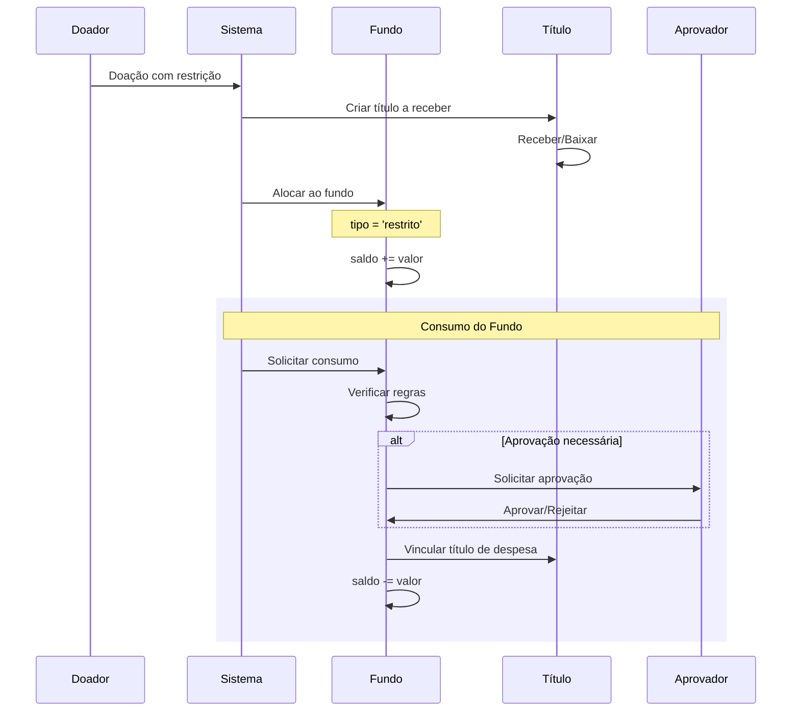

# Módulo E - Projetos, Centros de Custo e Fundos

## Para o Contador

Este módulo gerencia a **alocação e controle de recursos** em entidades do terceiro setor, permitindo:

- **Centros de Custo**: Agrupar receitas e despesas por área de atuação (pastoral, assistência social, administrativa)
- **Projetos**: Controlar iniciativas com prazo e orçamento definidos, especialmente parcerias MROSC
- **Fundos**: Segregar recursos com ou sem restrição de uso, conforme exigido pela NBC TG 26

Este controle é fundamental para:
- Prestar contas de doações vinculadas (fundos restritos)
- Demonstrar a aplicação de recursos de convênios públicos (MROSC)
- Gerar relatórios por área de atuação da entidade
- Atender exigências de transparência e accountability

---

## Glossário do Módulo

| Termo | Significado para Instituição Religiosa |
|-------|----------------------------------------|
| **Centro de Custo** | Agrupamento por área: "Pastoral", "Assistência Social", "Administração", "Eventos" |
| **Projeto** | Iniciativa com início, fim e orçamento: "Reforma do Salão", "Campanha do Agasalho 2025" |
| **Fundo Restrito** | Doação vinculada pelo doador a fim específico. Só pode ser usada para aquele fim. |
| **Fundo Designado** | Recurso reservado pela diretoria para fim específico. Pode ser redesignado. |
| **Fundo Livre** | Recurso sem restrição. Equivale ao patrimônio social disponível. |
| **MROSC** | Marco Regulatório das OSC (Lei 13.019/2014). Regula parcerias com poder público. |
| **Termo de Fomento** | Instrumento de parceria MROSC quando há transferência de recursos públicos. |
| **Prestação de Contas** | Relatório detalhado de receitas e despesas de um projeto ou fundo. |
| **Alocação** | Entrada de recursos em um fundo (doação recebida). |
| **Consumo** | Saída de recursos de um fundo (despesa vinculada). |

---

## Diagrama ER



---

## 1. Centro de Custo

### O que é

Agrupamento lógico para classificar receitas e despesas por **área de atuação** da entidade. Permite gerar DRE e relatórios segmentados.

### Status: ❌ Não implementado

| Operação | Disponível | Observação |
|----------|------------|------------|
| Criar centro de custo | ❌ Não | Em desenvolvimento |
| Consultar centros | ❌ Não | Em desenvolvimento |
| Editar centro | ❌ Não | Em desenvolvimento |
| Inativar centro | ❌ Não | Em desenvolvimento |

---

### Campos do Formulário: Criar Centro de Custo

| Campo | Label na Tela | Obrigatório | Tooltip/Ajuda |
|-------|---------------|-------------|---------------|
| `codigo` | **Código** | Sim | "Código único para identificar o centro. Ex: ADM, PAST, SOC" |
| `nome` | **Nome do Centro** | Sim | "Nome descritivo. Ex: Administração, Pastoral, Assistência Social" |
| `descricao` | **Descrição** | Não | "Detalhes sobre as atividades deste centro de custo" |
| `responsavelId` | **Responsável** | Não | "Pessoa responsável por este centro de custo" |

**Exemplos de Centros de Custo para Instituições Religiosas:**

| Código | Nome | Descrição |
|--------|------|-----------|
| ADM | Administração | Despesas administrativas gerais da entidade |
| PAST | Pastoral | Atividades religiosas e espirituais |
| SOC | Assistência Social | Projetos de assistência à comunidade |
| EVT | Eventos | Festas, encontros, retiros |
| MANUT | Manutenção | Conservação predial e equipamentos |
| JOVENS | Juventude | Atividades para jovens |

---

### Campos do Formulário: Editar Centro de Custo

| Campo | Label na Tela | Obrigatório | Tooltip/Ajuda |
|-------|---------------|-------------|---------------|
| `nome` | **Nome do Centro** | Não | "Altere o nome se necessário" |
| `descricao` | **Descrição** | Não | "Atualize a descrição" |
| `responsavelId` | **Responsável** | Não | "Altere o responsável" |
| `ativo` | **Centro Ativo** | Não | "Desmarque para inativar. Centros inativos não aceitam novos lançamentos." |

---

## 2. Projeto

### O que é

Iniciativa com **prazo e orçamento definidos**. Usado para controlar ações específicas, especialmente parcerias com poder público (MROSC).

### Status: ❌ Não implementado

---

### Campos do Formulário: Criar Projeto

#### Seção: Identificação

| Campo | Label na Tela | Obrigatório | Tooltip/Ajuda |
|-------|---------------|-------------|---------------|
| `codigo` | **Código do Projeto** | Sim | "Código único. Ex: OBRA-2025, NATAL-2025" |
| `nome` | **Nome do Projeto** | Sim | "Nome completo do projeto" |
| `descricao` | **Descrição** | Não | "Objetivos e escopo do projeto" |

#### Seção: Cronograma

| Campo | Label na Tela | Obrigatório | Tooltip/Ajuda |
|-------|---------------|-------------|---------------|
| `dataInicio` | **Data de Início** | Não | "Quando o projeto começa ou começou" |
| `dataFimPrevista` | **Previsão de Término** | Não | "Data prevista para conclusão" |

#### Seção: Orçamento

| Campo | Label na Tela | Obrigatório | Tooltip/Ajuda |
|-------|---------------|-------------|---------------|
| `orcamentoPrevisto` | **Orçamento Previsto (R$)** | Não | "Valor total estimado para o projeto" |

#### Seção: Vínculos

| Campo | Label na Tela | Obrigatório | Tooltip/Ajuda |
|-------|---------------|-------------|---------------|
| `centroCustoId` | **Centro de Custo** | Não | "A qual área este projeto pertence" |
| `responsavelId` | **Responsável** | Não | "Pessoa responsável pela execução" |

#### Seção: Parceria MROSC (se aplicável)

| Campo | Label na Tela | Obrigatório | Tooltip/Ajuda |
|-------|---------------|-------------|---------------|
| `parceriaMrosc` | **É Parceria com Poder Público?** | Não | "Marque se for convênio, termo de fomento ou colaboração" |
| `numeroTermoParceria` | **Número do Termo** | Se MROSC | "Número do termo de parceria ou convênio" |
| `orgaoParceiro` | **Órgão Parceiro** | Se MROSC | "Nome do órgão público parceiro. Ex: Prefeitura de São Paulo" |

**Exemplos de Projetos:**

| Código | Nome | Orçamento | MROSC? |
|--------|------|-----------|--------|
| OBRA-SALAO | Reforma do Salão Paroquial | R$ 150.000,00 | Não |
| NATAL-2025 | Campanha de Natal 2025 | R$ 25.000,00 | Não |
| CRAS-2025 | Convênio CRAS Assistência | R$ 80.000,00 | Sim |
| CAMP-AGASALHO | Campanha do Agasalho | R$ 15.000,00 | Não |

---

### Status do Projeto

| Código | Nome na Tela | Significado | Impacto |
|--------|--------------|-------------|---------|
| `planejamento` | Em Planejamento | Ainda não iniciou | Pode editar orçamento e datas |
| `em_andamento` | Em Andamento | Em execução | Aceita lançamentos |
| `suspenso` | Suspenso | Paralisado temporariamente | Não aceita novos lançamentos |
| `concluido` | Concluído | Finalizado | Bloqueado para novos lançamentos |
| `cancelado` | Cancelado | Descontinuado | Bloqueado, gera relatório de encerramento |

---

## 3. Fundo

### O que é

Recurso segregado com ou sem restrição de uso. A **NBC TG 26** exige que entidades do terceiro setor apresentem separadamente:
- Patrimônio com restrições (Fundo Restrito)
- Patrimônio sem restrições (Fundo Livre)
- Recursos designados pela administração (Fundo Designado)

### Status: ❌ Não implementado

---

### Campos do Formulário: Criar Fundo

#### Seção: Identificação

| Campo | Label na Tela | Obrigatório | Tooltip/Ajuda |
|-------|---------------|-------------|---------------|
| `codigo` | **Código** | Sim | "Código único do fundo. Ex: OBRA, RESERVA, MISSOES" |
| `nome` | **Nome do Fundo** | Sim | "Nome descritivo do fundo" |
| `descricao` | **Descrição** | Não | "Detalhes sobre a finalidade" |

#### Seção: Tipo e Finalidade

| Campo | Label na Tela | Obrigatório | Tooltip/Ajuda |
|-------|---------------|-------------|---------------|
| `tipo` | **Tipo de Fundo** | Sim | "Define as restrições de uso" |
| `finalidade` | **Finalidade Específica** | Não | "Para que este fundo deve ser usado" |

**Tipos de Fundo (NBC TG 26):**

| Tipo | Nome na Tela | Descrição | Quem Define | Pode Mudar? |
|------|--------------|-----------|-------------|-------------|
| `restrito` | Restrito | Uso definido pelo **doador** | Doador externo | Não |
| `designado` | Designado | Uso definido pela **diretoria** | Diretoria/Conselho | Sim, com ata |
| `livre` | Livre | Sem restrição de uso | - | - |

#### Seção: Vigência e Meta

| Campo | Label na Tela | Obrigatório | Tooltip/Ajuda |
|-------|---------------|-------------|---------------|
| `dataInicio` | **Data de Criação** | Não | "Quando o fundo foi criado" |
| `dataLimite` | **Data Limite** | Não | "Até quando o fundo deve ser usado" |
| `metaValor` | **Meta de Arrecadação (R$)** | Não | "Valor objetivo a ser arrecadado" |

#### Seção: Saldo Inicial (Migração)

| Campo | Label na Tela | Obrigatório | Tooltip/Ajuda |
|-------|---------------|-------------|---------------|
| `saldoInicial` | **Saldo Inicial (R$)** | Não | "Para migração: saldo existente antes do sistema" |

**Exemplos de Fundos:**

| Código | Nome | Tipo | Finalidade | Meta |
|--------|------|------|------------|------|
| OBRA-TEMPLO | Construção do Templo | Restrito | Construção da nova sede | R$ 500.000 |
| RESERVA | Fundo de Reserva | Designado | Emergências e imprevistos | R$ 50.000 |
| MISSOES | Fundo Missionário | Restrito | Apoio a missionários | - |
| MANUT | Manutenção Predial | Designado | Reformas e reparos | R$ 20.000 |

---

### Campos: Regras do Fundo

| Campo | Label na Tela | Tooltip/Ajuda |
|-------|---------------|---------------|
| `tipoRegra` | **Tipo de Regra** | "Que tipo de controle aplicar" |
| `parametroNumerico` | **Valor** | "Valor numérico da regra (% ou R$)" |
| `parametroTexto` | **Descrição** | "Detalhes da regra" |
| `parametroLista` | **Categorias** | "Lista de categorias permitidas ou proibidas" |

**Tipos de Regras:**

| Tipo | Nome na Tela | Exemplo | Efeito |
|------|--------------|---------|--------|
| `percentual_receita` | Destinar % das Receitas | 10% | Toda receita aloca automaticamente 10% ao fundo |
| `categoria_permitida` | Categorias Permitidas | Material, Serviço | Só aceita despesas dessas categorias |
| `categoria_proibida` | Categorias Proibidas | Pessoal | Não aceita despesas dessa categoria |
| `valor_maximo` | Limite por Consumo | R$ 5.000 | Cada retirada não pode exceder este valor |
| `aprovador_obrigatorio` | Requer Aprovação | Diretor | Qualquer consumo precisa de aprovação |

---

### Campos: Alocar Recurso ao Fundo

| Campo | Label na Tela | Obrigatório | Tooltip/Ajuda |
|-------|---------------|-------------|---------------|
| `fundoId` | **Fundo** | Sim | "Qual fundo receberá o recurso" |
| `valor` | **Valor (R$)** | Sim | "Valor a ser alocado" |
| `dataAlocacao` | **Data** | Sim | "Data da alocação" |
| `origemDescricao` | **Origem** | Sim | "De onde veio o recurso. Ex: Doação de João Silva" |

---

### Campos: Consumir Recurso do Fundo

| Campo | Label na Tela | Obrigatório | Tooltip/Ajuda |
|-------|---------------|-------------|---------------|
| `fundoId` | **Fundo** | Sim | "De qual fundo sairá o recurso" |
| `valor` | **Valor (R$)** | Sim | "Valor a ser consumido" |
| `dataConsumo` | **Data** | Sim | "Data do consumo" |
| `justificativa` | **Justificativa** | Sim | "Por que está usando este recurso. Mínimo 10 caracteres." |
| `tituloId` | **Título Vinculado** | Não | "Título de despesa que será pago com este recurso" |

---

## Regras de Negócio

### Centro de Custo

| Regra | Descrição | Mensagem de Erro |
|-------|-----------|------------------|
| Código único | Não pode haver dois centros com mesmo código | "Este código já está em uso" |
| Inativação | Centro com lançamentos não pode ser excluído, apenas inativado | "Centro possui lançamentos. Use inativação." |
| Projetos ativos | Não pode inativar centro com projetos ativos | "Conclua ou cancele os projetos deste centro" |

### Projeto

| Regra | Descrição | Mensagem de Erro |
|-------|-----------|------------------|
| Código único | Não pode haver dois projetos com mesmo código | "Este código já está em uso" |
| MROSC completo | Se é parceria MROSC, requer número do termo e órgão | "Informe o número do termo e órgão parceiro" |
| Conclusão | Só pode concluir se tiver data fim real | "Informe a data de conclusão efetiva" |
| Orçamento | Orçamento deve ser maior que zero | "Orçamento deve ser positivo" |

### Fundo

| Regra | Descrição | Mensagem de Erro |
|-------|-----------|------------------|
| Código único | Não pode haver dois fundos com mesmo código | "Este código já está em uso" |
| Saldo não negativo | Saldo não pode ficar negativo | "Saldo insuficiente no fundo" |
| Regras validadas | Consumo deve respeitar regras configuradas | Varia conforme a regra violada |
| Aprovação | Se fundo exige aprovação, consumo fica pendente | "Aguardando aprovação do responsável" |
| Restrito imutável | Tipo "restrito" não pode ser alterado para "livre" | "Fundos restritos não podem mudar de tipo" |

### Consumo de Fundo

| Regra | Descrição | Mensagem de Erro |
|-------|-----------|------------------|
| Justificativa obrigatória | Mínimo 10 caracteres | "Justificativa muito curta. Mínimo 10 caracteres." |
| Valor máximo | Respeitar limite por consumo se configurado | "Valor excede limite de R$ X por operação" |
| Categoria permitida | Se configurado, validar categoria da despesa | "Esta categoria não é permitida neste fundo" |
| Saldo disponível | Verificar saldo antes de consumir | "Saldo insuficiente. Disponível: R$ X" |

---

## Fluxo de Gestão de Fundo Restrito



---

## Casos de Uso Detalhados

### Caso 1: Receber Doação para Construção do Templo

**Contexto:** Um fiel doou R$ 10.000 especificamente para a obra do templo novo.

**Passo a passo:**
1. Verifique se o Fundo "Construção do Templo" existe (tipo: restrito)
2. Se não existir, crie o fundo com tipo "restrito"
3. Crie um título a receber do tipo "Doação" com valor R$ 10.000
4. Na baixa do título, vincule ao fundo
5. Sistema aloca automaticamente R$ 10.000 ao fundo
6. O saldo do fundo aumenta para refletir a doação

**Importante:** Por ser restrito, este valor só pode ser usado para a obra.

---

### Caso 2: Pagar Despesa com Fundo Restrito

**Contexto:** A igreja comprou materiais de construção por R$ 5.000 e vai pagar com o fundo da obra.

**Passo a passo:**
1. Crie título a pagar para o fornecedor (R$ 5.000)
2. Ao registrar a baixa, vincule ao Fundo "Construção do Templo"
3. Sistema verifica:
   - Saldo disponível no fundo (deve ter >= R$ 5.000)
   - Regras do fundo (se permite categoria "material")
   - Se requer aprovação
4. Se aprovado, sistema consome R$ 5.000 do fundo
5. Gera registro de consumo com justificativa

**Alerta:** Se o fundo exigir aprovação, o consumo ficará pendente.

---

### Caso 3: Criar Projeto de Parceria MROSC

**Contexto:** A entidade fechou convênio com a Prefeitura para projeto de assistência social.

**Passo a passo:**
1. Acesse "Projetos > Novo Projeto"
2. Preencha código e nome: "CRAS-2025 - Convênio CRAS"
3. Marque "É Parceria com Poder Público?"
4. Preencha:
   - Número do Termo: 123/2025
   - Órgão Parceiro: Prefeitura Municipal de São Paulo - SMADS
   - Data Início e Fim previsto
   - Orçamento: valor do convênio
5. Vincule ao Centro de Custo "Assistência Social"
6. Defina responsável pelo projeto

**Importante:** Todos os lançamentos devem ser vinculados a este projeto para prestação de contas.

---

### Caso 4: Gerar Prestação de Contas de Projeto

**Contexto:** Projeto MROSC precisa prestar contas ao órgão parceiro.

**Passo a passo:**
1. Acesse o projeto
2. Selecione "Relatório > Prestação de Contas"
3. Escolha período
4. Sistema gera automaticamente:
   - Receitas por fonte (repasses, contrapartida)
   - Despesas por categoria
   - Saldo/Resultado
   - Cronograma físico-financeiro
5. Exporte em PDF para envio ao órgão

---

## Checklist de Compliance

### MROSC (Lei 13.019/2014)

- [ ] Manter conta bancária exclusiva para recursos do convênio
- [ ] Vincular todos os lançamentos ao projeto
- [ ] Guardar documentação comprobatória por 10 anos
- [ ] Prestar contas conforme cronograma do termo
- [ ] Não desviar recursos para finalidade diversa

### ITG 2002 - Fundos e Restrições

- [ ] Segregar patrimônio com e sem restrições
- [ ] Demonstrar movimentação de fundos restritos
- [ ] Divulgar em notas explicativas a natureza das restrições
- [ ] Controlar prazos de fundos com data limite
- [ ] Registrar transferências entre fundos

### NBC TG 26 - Apresentação

- [ ] Apresentar DRE por fundo (se material)
- [ ] Detalhar receitas por fonte e restrição
- [ ] Demonstrar saldos de fundos no balanço
- [ ] Incluir notas sobre políticas de fundos

---

## Dúvidas Frequentes

### "Qual a diferença entre Fundo Restrito e Designado?"

- **Restrito**: A restrição vem do **doador** externo. Você não pode mudar. Ex: "Doei para a obra do templo" - só pode usar para a obra.
- **Designado**: A restrição vem da **diretoria**. Pode ser alterada com ata. Ex: "Separamos R$ 50 mil para emergências" - pode redesignar se precisar.

### "Preciso criar um projeto para cada convênio?"

Sim. Projetos com parceria MROSC exigem controle segregado de receitas e despesas para prestação de contas. O sistema facilita gerando relatórios específicos.

### "Posso usar recurso de um fundo restrito para outra finalidade?"

Não. Fundos restritos só podem ser usados para a finalidade definida pelo doador. Se sobrar saldo após conclusão da finalidade, entre em contato com o doador para definir novo destino.

### "O que acontece se o saldo do fundo ficar negativo?"

O sistema não permite. Você verá a mensagem "Saldo insuficiente no fundo". Antes de consumir, verifique se há recursos disponíveis.

### "Como demonstrar os fundos nas demonstrações contábeis?"

A NBC TG 26 exige que o Patrimônio Social seja segregado em:
- Patrimônio Social sem restrições
- Patrimônio Social com restrições temporárias
- Patrimônio Social com restrições permanentes

O sistema gera esta segregação automaticamente com base nos tipos de fundo.

### "Centro de Custo é obrigatório?"

Não é obrigatório para todos os lançamentos, mas é muito útil para análise gerencial. Recomendamos usar pelo menos para as principais áreas: Administração, Pastoral/Religiosa, Assistência Social.

---

## Input: Create CentroCusto

```typescript
const createCentroCustoInput = z.object({
  codigo: z.string().min(1).max(20),
  nome: z.string().min(3).max(100),
  descricao: z.string().optional(),
  responsavelId: z.string().uuid().optional(),
});
// Validação: código único
```

## Input: Update CentroCusto

```typescript
const updateCentroCustoInput = z.object({
  id: z.string().uuid(),
  nome: z.string().min(3).max(100).optional(),
  descricao: z.string().nullable().optional(),
  responsavelId: z.string().uuid().nullable().optional(),
  ativo: z.boolean().optional(),
});
// Validação: código não pode ser alterado se tiver movimentos
```

## Input: Delete CentroCusto

```typescript
const deleteCentroCustoInput = z.object({
  id: z.string().uuid(),
});
// Resultado: ativo = false
// Validação: não pode ter projetos ativos vinculados
```

## Input: Create Projeto

```typescript
const createProjetoInput = z.object({
  codigo: z.string().min(1).max(20),
  nome: z.string().min(3).max(200),
  descricao: z.string().optional(),
  dataInicio: z.string().regex(/^\d{4}-\d{2}-\d{2}$/).optional(),
  dataFimPrevista: z.string().regex(/^\d{4}-\d{2}-\d{2}$/).optional(),
  orcamentoPrevisto: z.number().positive().optional(),
  status: z.enum(['planejamento', 'em_andamento', 'suspenso', 'concluido', 'cancelado']).default('planejamento'),
  centroCustoId: z.string().uuid().optional(),
  responsavelId: z.string().uuid().optional(),
  parceriaMrosc: z.boolean().default(false),
  numeroTermoParceria: z.string().max(50).optional(),
  orgaoParceiro: z.string().max(200).optional(),
}).refine(data => {
  if (data.parceriaMrosc) {
    return !!data.numeroTermoParceria && !!data.orgaoParceiro;
  }
  return true;
}, { message: 'Parceria MROSC requer número do termo e órgão' });
```

## Input: Update Projeto

```typescript
const updateProjetoInput = z.object({
  id: z.string().uuid(),
  nome: z.string().min(3).max(200).optional(),
  descricao: z.string().nullable().optional(),
  dataFimPrevista: z.string().regex(/^\d{4}-\d{2}-\d{2}$/).optional(),
  orcamentoPrevisto: z.number().positive().optional(),
  responsavelId: z.string().uuid().nullable().optional(),
  status: z.enum(['planejamento', 'em_andamento', 'suspenso', 'concluido', 'cancelado']).optional(),
  dataFimReal: z.string().regex(/^\d{4}-\d{2}-\d{2}$/).optional(),
  parceriaMrosc: z.boolean().optional(),
  numeroTermoParceria: z.string().max(50).optional(),
  orgaoParceiro: z.string().max(200).optional(),
});
```

## Input: Concluir Projeto

```typescript
const concluirProjetoInput = z.object({
  id: z.string().uuid(),
  dataFimReal: z.string().regex(/^\d{4}-\d{2}-\d{2}$/),
  observacoes: z.string().optional(),
});
// Define: status = 'concluido', data_fim_real
// Validação: calcula resumo financeiro
```

## Input: Create Fundo

```typescript
const createFundoInput = z.object({
  codigo: z.string().min(1).max(20),
  nome: z.string().min(3).max(200),
  descricao: z.string().optional(),
  tipo: z.enum(['restrito', 'designado', 'livre']),
  finalidade: z.string().optional(),
  dataInicio: z.string().regex(/^\d{4}-\d{2}-\d{2}$/).optional(),
  dataLimite: z.string().regex(/^\d{4}-\d{2}-\d{2}$/).optional(),
  metaValor: z.number().positive().optional(),
  saldoInicial: z.number().min(0).default(0),
  regras: z.array(z.object({
    tipoRegra: z.enum([
      'percentual_receita', 
      'categoria_permitida', 
      'categoria_proibida', 
      'valor_maximo', 
      'aprovador_obrigatorio'
    ]),
    parametroTexto: z.string().optional(),
    parametroNumerico: z.number().optional(),
    parametroLista: z.array(z.string()).optional(),
  })).optional(),
});
```

## Input: Update Fundo

```typescript
const updateFundoInput = z.object({
  id: z.string().uuid(),
  nome: z.string().min(3).max(200).optional(),
  descricao: z.string().nullable().optional(),
  finalidade: z.string().nullable().optional(),
  dataLimite: z.string().regex(/^\d{4}-\d{2}-\d{2}$/).optional(),
  metaValor: z.number().positive().optional(),
  ativo: z.boolean().optional(),
});
// saldo_atual não é editável diretamente
```

## Input: Alocar para Fundo

```typescript
const alocarFundoInput = z.object({
  fundoId: z.string().uuid(),
  valor: z.number().positive(),
  dataAlocacao: z.string().regex(/^\d{4}-\d{2}-\d{2}$/),
  origemDescricao: z.string().max(500),
  lancamentoLinhaId: z.string().uuid().optional(),
});
// Atualiza: saldo_atual += valor
```

## Input: Consumir Fundo

```typescript
const consumirFundoInput = z.object({
  fundoId: z.string().uuid(),
  valor: z.number().positive(),
  dataConsumo: z.string().regex(/^\d{4}-\d{2}-\d{2}$/),
  justificativa: z.string().min(10).max(1000),
  tituloId: z.string().uuid().optional(),
  lancamentoLinhaId: z.string().uuid().optional(),
});
// Validação: verifica regras do fundo
// Validação: verifica saldo disponível
// Se aprovador_obrigatorio: status = 'pendente_aprovacao'
```

## Input: Aprovar Consumo

```typescript
const aprovarConsumoFundoInput = z.object({
  id: z.string().uuid(),
  aprovado: z.boolean(),
  observacao: z.string().optional(),
});
// Se aprovado: atualiza saldo_atual -= valor
// Se rejeitado: cancela o consumo
```

---

## Relatórios Necessários

### Prestação de Contas de Projeto
- Receitas por fonte
- Despesas por categoria
- Saldo/Resultado
- Cronograma físico-financeiro
- Anexos e comprovantes

### Demonstração por Fundo
- Saldo inicial
- Alocações no período
- Consumos no período
- Saldo final
- Compliance com regras
