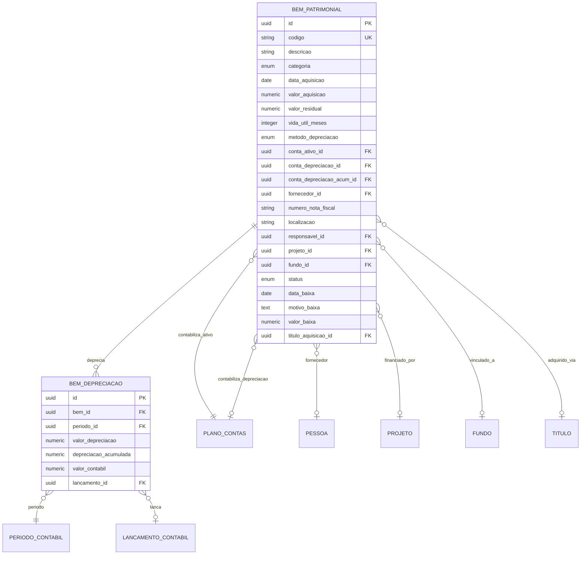
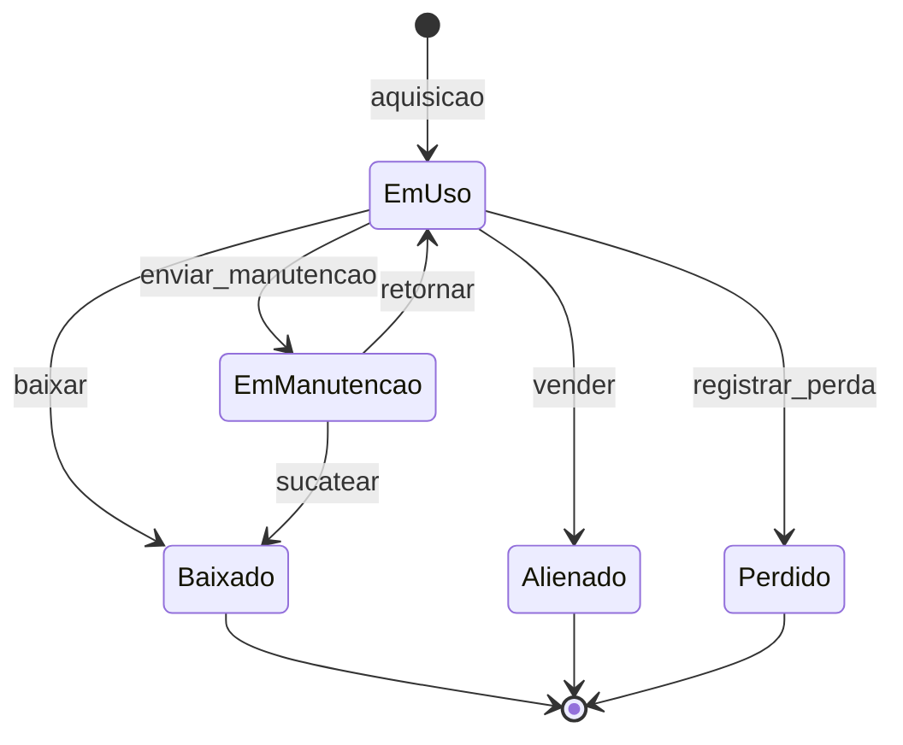

# Módulo F - Patrimônio e Imobilizado

## Para o Contador

Este módulo gerencia o **ativo imobilizado** da entidade religiosa, incluindo:

- **Imóveis**: Templos, salões, sedes, terrenos
- **Veículos**: Vans, ônibus, carros para transporte de fiéis
- **Equipamentos**: Som, projeção, instrumentos musicais
- **Mobiliário**: Cadeiras, mesas, altares, bancos
- **Informática**: Computadores, impressoras, sistemas

O controle patrimonial é obrigatório pela **ITG 2002** e permite:
- Inventário físico dos bens da entidade
- Cálculo automático de depreciação mensal
- Baixa de bens obsoletos, perdidos ou alienados
- Vinculação de bens a projetos e fundos (ex: van comprada com doação restrita)
- Termo de responsabilidade por custodiante

---

## Glossário do Módulo

| Termo | Significado para Instituição Religiosa |
|-------|----------------------------------------|
| **Imobilizado** | Bens de uso duradouro (mais de 1 ano). Ex: templo, veículos, equipamentos. |
| **Depreciação** | Perda de valor do bem pelo uso ou obsolescência. Calculada mensalmente. |
| **Valor de Aquisição** | Quanto custou o bem (preço + impostos + frete + instalação). |
| **Valor Residual** | Valor estimado do bem ao final da vida útil. |
| **Vida Útil** | Tempo estimado de uso do bem. Definido pela categoria. |
| **Valor Contábil** | Valor de aquisição menos depreciação acumulada. |
| **Baixa** | Retirada do bem do patrimônio (obsolescência, perda, venda). |
| **Alienação** | Venda do bem. Pode gerar ganho ou perda. |
| **Depreciação Acumulada** | Soma de todas as depreciações desde a aquisição. |
| **Inventário** | Levantamento físico dos bens e conferência com registros. |

---

## Diagrama ER



---

## 1. Bem Patrimonial

### O que é

Cadastro de cada bem físico da entidade. Cada item de valor significativo deve ter seu próprio registro para controle de localização, responsável e depreciação.

### Status: ❌ Não implementado

| Operação | Disponível | Observação |
|----------|------------|------------|
| Cadastrar bem | ❌ Não | Em desenvolvimento |
| Consultar bens | ❌ Não | Em desenvolvimento |
| Editar bem | ❌ Não | Em desenvolvimento |
| Baixar bem | ❌ Não | Em desenvolvimento |
| Calcular depreciação | 🔒 Automático | Executado no fechamento mensal |

---

### Categorias de Bens e Vida Útil

| Categoria | Nome na Tela | Vida Útil Típica | Taxa Anual | Exemplos |
|-----------|--------------|------------------|------------|----------|
| `imovel` | Imóvel | 25 anos (300 meses) | 4% | Templo, salão, terreno |
| `veiculo` | Veículo | 5 anos (60 meses) | 20% | Van, ônibus, carro |
| `equipamento` | Equipamento | 10 anos (120 meses) | 10% | Som, ar-condicionado |
| `mobiliario` | Mobiliário | 10 anos (120 meses) | 10% | Cadeiras, mesas, bancos |
| `informatica` | Informática | 5 anos (60 meses) | 20% | Computadores, projetores |
| `outro` | Outro | Variável | Variável | Instrumentos musicais |

**Observação:** Terrenos não depreciam. Configure como "Imóvel" com método "Nenhum".

---

### Campos do Formulário: Cadastrar Bem

#### Seção: Identificação

| Campo | Label na Tela | Obrigatório | Tooltip/Ajuda |
|-------|---------------|-------------|---------------|
| `codigo` | **Código/Plaqueta** | Sim | "Código único para identificar o bem. Ex: VEI-001, MOB-045" |
| `descricao` | **Descrição do Bem** | Sim | "Descrição completa. Ex: Van Mercedes Sprinter 2020 Branca" |
| `categoria` | **Categoria** | Sim | "Tipo do bem. Define vida útil padrão." |

#### Seção: Aquisição

| Campo | Label na Tela | Obrigatório | Tooltip/Ajuda |
|-------|---------------|-------------|---------------|
| `dataAquisicao` | **Data de Aquisição** | Sim | "Data da compra ou recebimento em doação" |
| `valorAquisicao` | **Valor de Aquisição (R$)** | Sim | "Valor total pago (preço + frete + instalação)" |
| `fornecedorId` | **Fornecedor** | Não | "De quem foi adquirido" |
| `numeroNotaFiscal` | **Nota Fiscal** | Não | "Número da NF de aquisição" |
| `tituloAquisicaoId` | **Título de Compra** | Não | "Vincular ao título a pagar da compra" |

#### Seção: Depreciação

| Campo | Label na Tela | Obrigatório | Tooltip/Ajuda |
|-------|---------------|-------------|---------------|
| `valorResidual` | **Valor Residual (R$)** | Não | "Valor estimado ao fim da vida útil. Padrão: 0" |
| `vidaUtilMeses` | **Vida Útil (meses)** | Sim | "Tempo de uso esperado. Sugestão por categoria." |
| `metodoDepreciacao` | **Método de Depreciação** | Sim | "Linear: quotas iguais. Nenhum: para terrenos." |

**Métodos de Depreciação:**

| Método | Nome na Tela | Descrição |
|--------|--------------|-----------|
| `linear` | Linear (Quotas Constantes) | Mesmo valor todo mês: (Aquisição - Residual) / Vida Útil |
| `nenhum` | Não Depreciar | Para terrenos e bens que não perdem valor |

#### Seção: Contas Contábeis

| Campo | Label na Tela | Obrigatório | Tooltip/Ajuda |
|-------|---------------|-------------|---------------|
| `contaAtivoId` | **Conta do Ativo** | Sim | "Conta contábil do imobilizado. Ex: 1.2.1 Imóveis" |
| `contaDepreciacaoId` | **Conta de Despesa** | Se deprecia | "Conta de despesa de depreciação. Ex: 5.3.1" |
| `contaDepreciacaoAcumId` | **Conta de Depreciação Acumulada** | Se deprecia | "Conta redutora do ativo. Ex: 1.2.9" |

#### Seção: Localização e Responsável

| Campo | Label na Tela | Obrigatório | Tooltip/Ajuda |
|-------|---------------|-------------|---------------|
| `localizacao` | **Localização Física** | Não | "Onde o bem está. Ex: Salão Principal, Secretaria" |
| `responsavelId` | **Responsável/Custodiante** | Não | "Pessoa responsável pela guarda do bem" |

#### Seção: Vínculos (Opcional)

| Campo | Label na Tela | Obrigatório | Tooltip/Ajuda |
|-------|---------------|-------------|---------------|
| `projetoId` | **Projeto** | Não | "Se adquirido para projeto específico" |
| `fundoId` | **Fundo** | Não | "Se adquirido com recursos de fundo restrito" |

---

**Exemplos de Cadastro de Bens:**

| Código | Descrição | Categoria | Valor | Vida Útil |
|--------|-----------|-----------|-------|-----------|
| IMO-001 | Templo Principal - Rua das Flores, 100 | Imóvel | R$ 800.000 | 300 meses |
| VEI-001 | Van Mercedes Sprinter 2020 Branca | Veículo | R$ 180.000 | 60 meses |
| SOM-001 | Mesa de Som Yamaha 32 canais | Equipamento | R$ 15.000 | 120 meses |
| PRJ-001 | Projetor Epson 5000 lumens | Informática | R$ 8.000 | 60 meses |
| MOB-100 | Conjunto 50 cadeiras estofadas | Mobiliário | R$ 12.500 | 120 meses |

---

### Campos do Formulário: Editar Bem

| Campo | Label na Tela | Obrigatório | Tooltip/Ajuda |
|-------|---------------|-------------|---------------|
| `descricao` | **Descrição** | Não | "Atualize se necessário" |
| `localizacao` | **Localização Física** | Não | "Atualize se o bem mudou de lugar" |
| `responsavelId` | **Responsável** | Não | "Atualize se mudou o custodiante" |
| `categoria` | **Categoria** | Não | "Alterar só se houve erro no cadastro inicial" |

**Importante:** Valores contábeis (aquisição, depreciação) não podem ser alterados diretamente. Use estorno e novo lançamento se necessário.

---

### Campos do Formulário: Baixar Bem

| Campo | Label na Tela | Obrigatório | Tooltip/Ajuda |
|-------|---------------|-------------|---------------|
| `dataBaixa` | **Data da Baixa** | Sim | "Quando o bem saiu do patrimônio" |
| `status` | **Motivo da Baixa** | Sim | "Por que está sendo baixado" |
| `motivoBaixa` | **Descrição do Motivo** | Sim | "Detalhe o motivo. Mínimo 10 caracteres." |
| `valorBaixa` | **Valor de Venda (R$)** | Se alienado | "Quanto recebeu pela venda do bem" |

**Tipos de Baixa:**

| Status | Nome na Tela | Descrição | Lançamento Contábil |
|--------|--------------|-----------|---------------------|
| `baixado` | Baixa por Obsolescência | Bem não tem mais utilidade | Reconhece perda |
| `alienado` | Venda/Alienação | Bem foi vendido | Reconhece ganho ou perda |
| `perdido` | Perda/Sinistro | Furto, incêndio, acidente | Reconhece perda |

---

## 2. Depreciação

### O que é

Cálculo mensal da perda de valor dos bens pelo uso ou tempo. Executado automaticamente no fechamento de período.

### Status: 🔒 Automático

A depreciação é calculada pelo sistema no fechamento mensal.

---

### Cálculo de Depreciação Linear

```
Depreciação Mensal = (Valor de Aquisição - Valor Residual) / Vida Útil em Meses
```

**Exemplo:**
- Van adquirida por R$ 180.000
- Valor residual: R$ 30.000
- Vida útil: 60 meses (5 anos)
- Depreciação mensal: (180.000 - 30.000) / 60 = **R$ 2.500/mês**

---

### Campos: Calcular Depreciação (Batch)

| Campo | Label na Tela | Obrigatório | Tooltip/Ajuda |
|-------|---------------|-------------|---------------|
| `periodoId` | **Período** | Sim | "Mês para calcular a depreciação" |
| `simular` | **Apenas Simular** | Não | "Se marcado, mostra prévia sem efetivar" |

---

## Regras de Negócio

### Bem Patrimonial

| Regra | Descrição | Mensagem de Erro |
|-------|-----------|------------------|
| Código único | Não pode haver dois bens com mesmo código | "Este código já está em uso" |
| Valor residual | Deve ser menor que valor de aquisição | "Valor residual não pode ser maior que aquisição" |
| Contas obrigatórias | Se deprecia, requer contas de despesa e acumulada | "Configure as contas contábeis de depreciação" |
| Vida útil | Deve ser entre 1 e 600 meses (50 anos) | "Vida útil deve ser entre 1 e 600 meses" |

### Depreciação

| Regra | Descrição | Mensagem de Erro |
|-------|-----------|------------------|
| Período aberto | Só calcula em período não fechado | "Período já está fechado" |
| Uma vez por mês | Não recalcula depreciação já lançada | "Depreciação já calculada para este período" |
| Limite | Para quando atinge valor residual | - |
| Início | Começa no mês seguinte à aquisição | - |

### Baixa

| Regra | Descrição | Mensagem de Erro |
|-------|-----------|------------------|
| Calcula até baixa | Depreciação é calculada até a data da baixa | - |
| Motivo obrigatório | Mínimo 10 caracteres | "Descreva o motivo da baixa" |
| Valor de venda | Obrigatório se alienação | "Informe o valor recebido na venda" |

---

## Lançamentos Contábeis

### Aquisição de Bem

```
Histórico: Aquisição de [descrição] - NF [número]
D: 1.2.1 Imobilizado              R$ 10.000,00
C: 1.1.1 Banco Conta Movimento    R$ 10.000,00
```

### Depreciação Mensal

```
Histórico: Depreciação mês [MM/YYYY] - [código bem]
D: 5.3.1 Despesa de Depreciação   R$ 166,67
C: 1.2.9 Depreciação Acumulada    R$ 166,67
```

### Baixa por Obsolescência

```
Histórico: Baixa de [código] - [motivo]
D: 5.9.1 Perdas com Imobilizado   R$ 5.000,00 (valor contábil)
D: 1.2.9 Depreciação Acumulada    R$ 5.000,00 (já depreciado)
C: 1.2.1 Imobilizado              R$ 10.000,00 (valor original)
```

### Alienação com Ganho

```
Histórico: Venda de [código] - [valor venda]
D: 1.1.1 Banco Conta Movimento    R$ 6.000,00 (recebido)
D: 1.2.9 Depreciação Acumulada    R$ 5.000,00 (já depreciado)
C: 1.2.1 Imobilizado              R$ 10.000,00 (valor original)
C: 4.9.1 Ganho na Venda de Ativos R$ 1.000,00 (diferença positiva)
```

### Alienação com Perda

```
Histórico: Venda de [código] - [valor venda]
D: 1.1.1 Banco Conta Movimento    R$ 3.000,00 (recebido)
D: 1.2.9 Depreciação Acumulada    R$ 5.000,00 (já depreciado)
D: 5.9.1 Perda na Venda de Ativos R$ 2.000,00 (diferença negativa)
C: 1.2.1 Imobilizado              R$ 10.000,00 (valor original)
```

---

## Fluxo de Vida do Bem



---

## Casos de Uso Detalhados

### Caso 1: Cadastrar o Templo da Igreja

**Contexto:** A igreja possui um templo próprio que precisa ser registrado no patrimônio.

**Passo a passo:**
1. Acesse "Patrimônio > Novo Bem"
2. Preencha:
   - Código: IMO-001
   - Descrição: Templo Principal - Rua das Flores, 100 - Centro
   - Categoria: Imóvel
   - Data de Aquisição: data da escritura
   - Valor de Aquisição: valor da escritura ou avaliação
3. Configure depreciação:
   - Vida útil: 300 meses (25 anos) para edificação
   - Valor residual: 20% do valor (opcional)
   - **Atenção:** Se for terreno, use método "Não Depreciar"
4. Vincule às contas contábeis de imóveis
5. Salve o cadastro

**Dica:** Terrenos não depreciam. Cadastre separadamente do prédio se possível.

---

### Caso 2: Registrar Van Comprada com Doação Restrita

**Contexto:** A igreja recebeu doações para comprar uma van e agora precisa registrar o veículo.

**Passo a passo:**
1. Verifique se a compra já gerou título a pagar
2. Acesse "Patrimônio > Novo Bem"
3. Preencha os dados da van:
   - Código: VEI-001
   - Descrição: Van Mercedes Sprinter 2020 15 lugares
   - Categoria: Veículo
   - Valor: R$ 180.000
4. Configure depreciação:
   - Vida útil: 60 meses (5 anos)
   - Valor residual: R$ 30.000 (estimativa de revenda)
5. **Vincule ao Fundo** restrito de onde saíram os recursos
6. Vincule ao título de compra
7. Defina localização e responsável

**Importante:** O vínculo ao fundo permite rastrear que a van foi comprada com a doação restrita.

---

### Caso 3: Calcular Depreciação Mensal

**Contexto:** Fechamento do mês, precisa calcular a depreciação de todos os bens.

**Passo a passo:**
1. Verifique se o período está aberto
2. Acesse "Patrimônio > Calcular Depreciação"
3. Selecione o período (mês/ano)
4. Clique em "Simular" para ver prévia
5. Confira os valores por bem
6. Clique em "Efetivar" para gerar os lançamentos
7. Sistema cria um lançamento contábil para cada bem (ou agrupado)

**Resultado por bem:**
| Bem | Valor Aquisição | Deprec. Acumulada | Deprec. Mês | Valor Contábil |
|-----|-----------------|-------------------|-------------|----------------|
| VEI-001 | R$ 180.000 | R$ 27.500 | R$ 2.500 | R$ 152.500 |
| SOM-001 | R$ 15.000 | R$ 1.500 | R$ 125 | R$ 13.500 |

---

### Caso 4: Baixar Equipamento Obsoleto

**Contexto:** O projetor antigo estragou e não compensa consertar.

**Passo a passo:**
1. Acesse o cadastro do bem (PRJ-001)
2. Clique em "Baixar Bem"
3. Preencha:
   - Data da baixa: data atual
   - Motivo: Baixa por Obsolescência
   - Descrição: "Projetor queimou a lâmpada e placa. Orçamento de reparo (R$ 3.500) inviável."
4. Sistema calcula depreciação até a data da baixa
5. Sistema gera lançamento de baixa com a perda
6. Bem fica marcado como "Baixado"

---

### Caso 5: Vender Veículo Antigo

**Contexto:** A van antiga foi vendida por R$ 45.000.

**Passo a passo:**
1. Acesse o cadastro do bem
2. Clique em "Baixar Bem"
3. Preencha:
   - Data da baixa: data da venda
   - Motivo: Venda/Alienação
   - Descrição: "Venda para renovação de frota"
   - Valor de venda: R$ 45.000
4. Sistema calcula:
   - Valor contábil na data: R$ 40.000 (exemplo)
   - Ganho na venda: R$ 5.000 (45.000 - 40.000)
5. Sistema gera lançamento reconhecendo o ganho
6. Crie título a receber para registrar a entrada

---

## Checklist de Compliance

### ITG 2002 - Patrimônio

- [ ] Manter inventário atualizado de todos os bens
- [ ] Calcular depreciação mensalmente
- [ ] Documentar método de depreciação utilizado
- [ ] Registrar baixas com justificativa
- [ ] Conciliar inventário físico com contábil anualmente
- [ ] Divulgar em notas explicativas os critérios adotados

### Controles Internos

- [ ] Codificar/plaquetear todos os bens
- [ ] Designar responsável para cada bem
- [ ] Manter notas fiscais e documentos de aquisição
- [ ] Realizar inventário físico anual
- [ ] Aprovar baixas por alçada adequada

### Demonstrações Contábeis

- [ ] Apresentar imobilizado segregado por categoria
- [ ] Demonstrar depreciação acumulada por categoria
- [ ] Divulgar adições, baixas e transferências do período
- [ ] Explicar critérios de depreciação em notas

---

## Dúvidas Frequentes

### "Terrenos depreciam?"

Não. Terrenos têm vida útil indefinida e não perdem valor pelo uso. Cadastre com método "Não Depreciar". Se o terreno tem edificação, separe os valores: terreno (não deprecia) e construção (deprecia em 25 anos).

### "Como cadastrar bens recebidos em doação?"

Cadastre normalmente, usando como valor de aquisição o **valor justo** na data do recebimento. Documente a base da avaliação (laudo, valor de mercado, etc.). Vincule ao fundo restrito se a doação tinha essa condição.

### "Preciso depreciar todos os bens?"

Sim, exceto:
- Terrenos (vida útil indefinida)
- Bens já totalmente depreciados
- Bens de valor imaterial (use política de materialidade)

### "Qual a diferença entre depreciação e amortização?"

- **Depreciação**: bens tangíveis (imóveis, veículos, equipamentos)
- **Amortização**: bens intangíveis (softwares, marcas, direitos)

Neste sistema, focamos em depreciação de bens tangíveis.

### "Como fazer inventário físico?"

1. Gere relatório de bens ativos com localização
2. Confira fisicamente cada item
3. Marque os encontrados e anote divergências
4. Para bens não encontrados: investigue e, se confirmada perda, baixe como "Perdido"
5. Documente o inventário e guarde por 5 anos

### "Posso alterar o valor de um bem já cadastrado?"

Valores de aquisição não devem ser alterados diretamente (afeta histórico). Para correções:
- Se erro de digitação: estorne e relance
- Se reavaliação: use procedimento específico de reavaliação (não implementado nesta versão)

---

## Input: Create BemPatrimonial

```typescript
const createBemPatrimonialInput = z.object({
  codigo: z.string().min(1).max(30),
  descricao: z.string().min(3).max(500),
  categoria: z.enum(['imovel', 'veiculo', 'equipamento', 'mobiliario', 'informatica', 'outro']),
  dataAquisicao: z.string().regex(/^\d{4}-\d{2}-\d{2}$/),
  valorAquisicao: z.number().positive(),
  fornecedorId: z.string().uuid().optional(),
  numeroNotaFiscal: z.string().max(50).optional(),
  tituloAquisicaoId: z.string().uuid().optional(),
  valorResidual: z.number().min(0).default(0),
  vidaUtilMeses: z.number().min(1).max(600),
  metodoDepreciacao: z.enum(['linear', 'nenhum']).default('linear'),
  contaAtivoId: z.string().uuid(),
  contaDepreciacaoId: z.string().uuid().optional(),
  contaDepreciacaoAcumId: z.string().uuid().optional(),
  localizacao: z.string().max(200).optional(),
  responsavelId: z.string().uuid().optional(),
  projetoId: z.string().uuid().optional(),
  fundoId: z.string().uuid().optional(),
}).refine(data => {
  if (data.metodoDepreciacao === 'linear') {
    return !!data.contaDepreciacaoId && !!data.contaDepreciacaoAcumId;
  }
  return true;
}, { message: 'Depreciação linear requer contas contábeis configuradas' })
.refine(data => {
  return data.valorResidual < data.valorAquisicao;
}, { message: 'Valor residual deve ser menor que valor de aquisição' });
```

## Input: Update BemPatrimonial

```typescript
const updateBemPatrimonialInput = z.object({
  id: z.string().uuid(),
  descricao: z.string().min(3).max(500).optional(),
  localizacao: z.string().max(200).nullable().optional(),
  responsavelId: z.string().uuid().nullable().optional(),
  categoria: z.enum(['imovel', 'veiculo', 'equipamento', 'mobiliario', 'informatica', 'outro']).optional(),
});
// Validação: valores contábeis não podem ser alterados diretamente
```

## Input: Baixar Bem

```typescript
const baixarBemInput = z.object({
  id: z.string().uuid(),
  dataBaixa: z.string().regex(/^\d{4}-\d{2}-\d{2}$/),
  status: z.enum(['baixado', 'alienado', 'perdido']),
  motivoBaixa: z.string().min(10).max(1000),
  valorBaixa: z.number().min(0).optional(),
});
// Calcula depreciação até data da baixa
// Gera lançamento contábil de baixa
// Reconhece ganho/perda na alienação
```

## Input: Transferir Bem

```typescript
const transferirBemInput = z.object({
  id: z.string().uuid(),
  novaLocalizacao: z.string().max(200).optional(),
  novoResponsavelId: z.string().uuid().optional(),
  motivo: z.string().max(500).optional(),
});
// Registra histórico de transferência
```

## Input: Calcular Depreciação Mensal (Batch)

```typescript
const calcularDepreciacaoInput = z.object({
  periodoId: z.string().uuid(),
  simular: z.boolean().default(false),
});
// Processa todos os bens ativos com depreciação linear
// Gera um lançamento contábil por bem (ou agrupado)
// Atualiza depreciacao_acumulada e valor_contabil
```

---

## Relatórios Necessários

### Inventário Patrimonial
- Lista completa de bens
- Valor original, depreciado e contábil
- Localização e responsável
- Status

### Mapa de Depreciação
- Por categoria
- Por período
- Projeção anual

### Termo de Responsabilidade
- Bens por responsável
- Para assinatura
