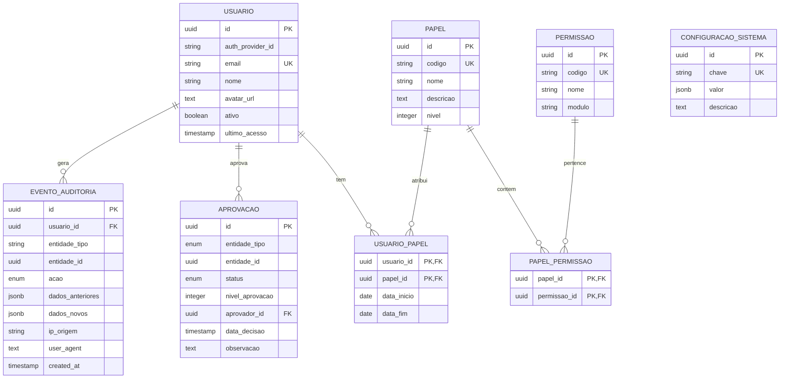
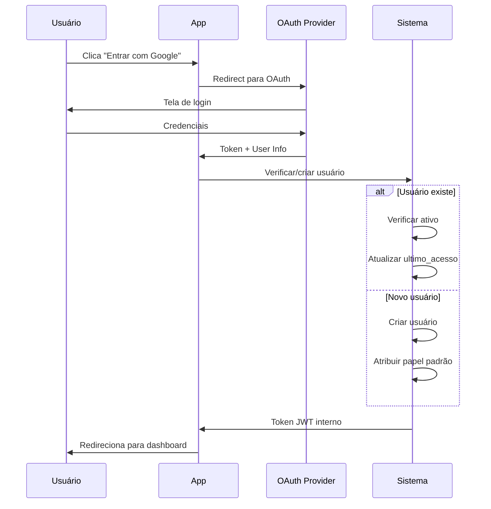
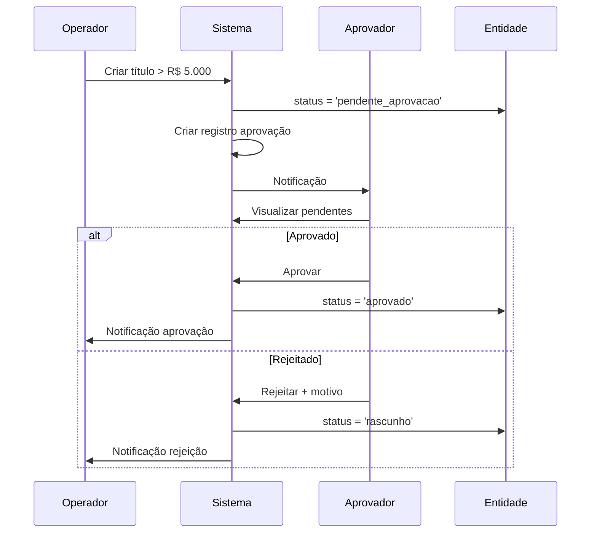

# Módulo G - Governança e Auditoria

## Para o Contador

Este módulo gerencia os **controles internos e acessos** ao sistema, fundamentais para:

- **Segregação de Funções**: Quem registra não pode aprovar, quem paga não pode conciliar
- **Controle de Alçadas**: Limites de valores por função (tesoureiro até R$ 5.000, diretor acima)
- **Trilha de Auditoria**: Registro de todas as operações para fiscalização
- **Gestão de Usuários**: Quem pode acessar e o que pode fazer

Boas práticas de governança são exigidas por:
- **ITG 2002**: Controles internos adequados à natureza e porte da entidade
- **MROSC**: Prestação de contas em parcerias públicas
- **Estatuto Social**: Atribuições de diretoria e conselhos

---

## Glossário do Módulo

| Termo | Significado para Instituição Religiosa |
|-------|----------------------------------------|
| **Usuário** | Pessoa que acessa o sistema (contador, tesoureiro, secretário) |
| **Papel/Função** | Perfil de permissões (Tesoureiro, Contador, Visualizador) |
| **Permissão** | Ação específica permitida (criar título, aprovar pagamento) |
| **Alçada** | Limite de valor que um papel pode aprovar sozinho |
| **Aprovação** | Autorização de operação por pessoa com alçada adequada |
| **Auditoria** | Registro histórico de todas as operações realizadas |
| **Segregação de Funções** | Separar responsabilidades para evitar fraudes |
| **OAuth** | Login via Google/Microsoft, sem senha no sistema |
| **Workflow** | Fluxo de aprovação por níveis hierárquicos |

---

## Diagrama ER



---

## 1. Usuário

### O que é

Pessoa que acessa o sistema. A autenticação é feita via **OAuth** (Google, Microsoft), sem necessidade de cadastrar senhas.

### Status: ❌ Não implementado

| Operação | Disponível | Observação |
|----------|------------|------------|
| Criar usuário | ❌ Não | Criação automática no primeiro login |
| Listar usuários | ❌ Não | Em desenvolvimento |
| Editar usuário | ❌ Não | Em desenvolvimento |
| Desativar usuário | ❌ Não | Em desenvolvimento |
| Atribuir papel | ❌ Não | Em desenvolvimento |

---

### Campos do Formulário: Primeiro Acesso (Automático)

Quando o usuário faz login pela primeira vez, o sistema cria automaticamente:

| Campo | Origem | Descrição |
|-------|--------|-----------|
| `authProviderId` | OAuth | ID único do provedor (Google, Microsoft) |
| `email` | OAuth | E-mail do usuário (não pode ser alterado) |
| `nome` | OAuth | Nome completo |
| `avatarUrl` | OAuth | Foto do perfil |

---

### Campos do Formulário: Editar Usuário

| Campo | Label na Tela | Obrigatório | Tooltip/Ajuda |
|-------|---------------|-------------|---------------|
| `nome` | **Nome** | Não | "Nome exibido no sistema" |
| `avatarUrl` | **Foto** | Não | "URL da foto de perfil" |
| `ativo` | **Usuário Ativo** | Não | "Desmarque para bloquear o acesso" |

---

### Campos do Formulário: Atribuir Papel

| Campo | Label na Tela | Obrigatório | Tooltip/Ajuda |
|-------|---------------|-------------|---------------|
| `papelId` | **Função/Papel** | Sim | "Qual perfil de acesso terá" |
| `dataInicio` | **Data de Início** | Sim | "Quando começa a ter esta função" |
| `dataFim` | **Data de Término** | Não | "Deixe vazio se permanente" |

---

### Campos do Formulário: Desativar Usuário

| Campo | Label na Tela | Obrigatório | Tooltip/Ajuda |
|-------|---------------|-------------|---------------|
| `motivo` | **Motivo** | Sim | "Por que está desativando este acesso. Mínimo 10 caracteres." |

**Efeito:** Usuário não consegue mais fazer login. Todos os papéis são encerrados.

---

## 2. Papéis (Funções)

### O que é

Perfis de acesso que agrupam permissões. Um usuário pode ter múltiplos papéis simultaneamente.

### Status: ❌ Não implementado

---

### Papéis Padrão do Sistema

| Código | Nome na Tela | Nível | Descrição | Exemplo em Igreja |
|--------|--------------|-------|-----------|-------------------|
| `admin` | Administrador | 100 | Acesso total ao sistema | Pastor titular, Presidente |
| `diretor` | Diretor | 80 | Gestão estratégica, aprovações altas | Diretoria estatutária |
| `contador` | Contador | 60 | Contabilidade completa | Contador terceirizado |
| `financeiro` | Financeiro | 50 | Contas a pagar/receber | Tesoureiro |
| `operador` | Operador | 30 | Lançamentos básicos | Secretário financeiro |
| `auditor` | Auditor | 70 | Visualização e relatórios | Conselho Fiscal |
| `visualizador` | Visualizador | 10 | Somente leitura | Membros do conselho |

**Nível**: Usado para definir hierarquia de aprovação. Quanto maior, mais autoridade.

---

### Campos do Formulário: Criar Papel

| Campo | Label na Tela | Obrigatório | Tooltip/Ajuda |
|-------|---------------|-------------|---------------|
| `codigo` | **Código** | Sim | "Identificador único. Usar letras minúsculas e underline. Ex: tesoureiro_auxiliar" |
| `nome` | **Nome da Função** | Sim | "Nome exibido na tela" |
| `descricao` | **Descrição** | Não | "O que esta função pode fazer" |
| `nivel` | **Nível Hierárquico** | Sim | "De 1 a 100. Maior = mais autoridade para aprovações" |
| `permissoes` | **Permissões** | Não | "Selecione as permissões deste papel" |

---

### Campos do Formulário: Editar Papel

| Campo | Label na Tela | Obrigatório | Tooltip/Ajuda |
|-------|---------------|-------------|---------------|
| `nome` | **Nome** | Não | "Altere o nome se necessário" |
| `descricao` | **Descrição** | Não | "Atualize a descrição" |
| `nivel` | **Nível** | Não | "Altere a hierarquia" |

**Atenção:** O código não pode ser alterado após criação.

---

### Exemplos de Configuração de Papéis

**Tesoureiro (nível 50):**
- Criar títulos a pagar/receber
- Registrar baixas
- Ver extratos e conciliar
- Aprovar pagamentos até R$ 5.000
- **Não pode**: Fechar períodos, gerenciar usuários

**Contador (nível 60):**
- Tudo do Tesoureiro
- Fazer lançamentos contábeis
- Fechar períodos
- Gerar demonstrações
- **Não pode**: Gerenciar usuários

**Conselho Fiscal (nível 70):**
- Visualizar tudo
- Gerar relatórios
- Ver trilha de auditoria
- **Não pode**: Criar ou editar nada

---

## 3. Permissões

### O que é

Ações específicas que um papel pode executar. Seguem o padrão: `modulo.entidade.acao`

### Status: ❌ Não implementado

---

### Estrutura de Permissões por Módulo

#### Módulo A - Identidades

| Código | Nome na Tela | Descrição |
|--------|--------------|-----------|
| `pessoas.pessoa.criar` | Criar Pessoa | Cadastrar novos membros, doadores, fornecedores |
| `pessoas.pessoa.editar` | Editar Pessoa | Alterar dados cadastrais |
| `pessoas.pessoa.excluir` | Inativar Pessoa | Desativar cadastros |
| `pessoas.pessoa.visualizar` | Ver Pessoas | Consultar cadastros |
| `pessoas.associado.gerenciar` | Gerenciar Associados | Alterar status de associados |

#### Módulo B - Caixa/Bancos

| Código | Nome na Tela | Descrição |
|--------|--------------|-----------|
| `bancos.conta.criar` | Criar Conta | Cadastrar contas bancárias |
| `bancos.conta.editar` | Editar Conta | Alterar dados das contas |
| `bancos.extrato.importar` | Importar Extrato | Upload de extratos OFX/CSV |
| `bancos.conciliacao.executar` | Conciliar | Vincular extratos a títulos |

#### Módulo C - Pagar/Receber

| Código | Nome na Tela | Descrição |
|--------|--------------|-----------|
| `titulos.titulo.criar` | Criar Título | Lançar contas a pagar/receber |
| `titulos.titulo.editar` | Editar Título | Alterar títulos existentes |
| `titulos.titulo.aprovar` | Aprovar Título | Autorizar pagamentos |
| `titulos.titulo.baixar` | Baixar Título | Registrar pagamentos/recebimentos |
| `titulos.titulo.estornar` | Estornar Baixa | Reverter pagamentos |

#### Módulo D - Contabilidade

| Código | Nome na Tela | Descrição |
|--------|--------------|-----------|
| `contabilidade.lancamento.criar` | Criar Lançamento | Fazer lançamentos manuais |
| `contabilidade.lancamento.efetivar` | Efetivar Lançamento | Confirmar lançamentos |
| `contabilidade.lancamento.estornar` | Estornar Lançamento | Reverter lançamentos |
| `contabilidade.periodo.fechar` | Fechar Período | Encerrar mês contábil |
| `contabilidade.periodo.reabrir` | Reabrir Período | Reabrir mês fechado |

#### Módulo E - Projetos/Fundos

| Código | Nome na Tela | Descrição |
|--------|--------------|-----------|
| `projetos.projeto.criar` | Criar Projeto | Cadastrar projetos |
| `projetos.projeto.gerenciar` | Gerenciar Projeto | Alterar e encerrar projetos |
| `projetos.fundo.consumir` | Consumir Fundo | Usar recursos de fundos |
| `projetos.fundo.aprovar_consumo` | Aprovar Consumo | Autorizar uso de fundos |

#### Módulo F - Patrimônio

| Código | Nome na Tela | Descrição |
|--------|--------------|-----------|
| `patrimonio.bem.criar` | Cadastrar Bem | Registrar bens patrimoniais |
| `patrimonio.bem.baixar` | Baixar Bem | Registrar baixa de bens |
| `patrimonio.depreciacao.executar` | Calcular Depreciação | Executar depreciação mensal |

#### Módulo G - Sistema

| Código | Nome na Tela | Descrição |
|--------|--------------|-----------|
| `sistema.usuario.gerenciar` | Gerenciar Usuários | Criar, editar, desativar usuários |
| `sistema.papel.gerenciar` | Gerenciar Papéis | Criar e editar perfis de acesso |
| `sistema.configuracao.editar` | Configurar Sistema | Alterar parâmetros do sistema |
| `sistema.auditoria.visualizar` | Ver Auditoria | Consultar trilha de auditoria |

---

## 4. Aprovações

### O que é

Workflow de autorização para operações que exigem validação por alçada. Usado para controle de valores altos ou operações sensíveis.

### Status: ❌ Não implementado

---

### Campos do Formulário: Criar Aprovação (Automático)

O sistema cria automaticamente quando uma operação requer aprovação:

| Campo | Descrição |
|-------|-----------|
| `entidadeTipo` | Tipo da entidade (titulo, lancamento, fundo_consumo) |
| `entidadeId` | ID da entidade que precisa de aprovação |
| `nivelAprovacao` | Nível mínimo do papel para aprovar |
| `status` | "pendente" |

---

### Campos do Formulário: Decidir Aprovação

| Campo | Label na Tela | Obrigatório | Tooltip/Ajuda |
|-------|---------------|-------------|---------------|
| `decisao` | **Decisão** | Sim | "Aprovar ou Rejeitar" |
| `observacao` | **Observação** | Não | "Comentário sobre a decisão" |

**Opções de Decisão:**

| Decisão | Nome na Tela | Efeito |
|---------|--------------|--------|
| `aprovado` | Aprovar | Operação é liberada |
| `rejeitado` | Rejeitar | Operação é cancelada, notifica criador |

---

### Matriz de Aprovação por Valor

Exemplo de configuração de alçadas:

| Faixa de Valor | Nível Mínimo | Papel Típico |
|----------------|--------------|--------------|
| Até R$ 1.000 | 30 | Operador |
| R$ 1.001 a R$ 5.000 | 50 | Tesoureiro |
| R$ 5.001 a R$ 20.000 | 60 | Contador |
| Acima de R$ 20.000 | 80 | Diretor |

---

### Campos: Configurar Matriz de Aprovação

| Campo | Label na Tela | Obrigatório | Tooltip/Ajuda |
|-------|---------------|-------------|---------------|
| `entidadeTipo` | **Tipo de Operação** | Sim | "Título, Lançamento ou Consumo de Fundo" |
| `valorMinimo` | **Valor Mínimo (R$)** | Sim | "A partir de qual valor aplica esta regra" |
| `valorMaximo` | **Valor Máximo (R$)** | Sim | "Até qual valor aplica esta regra" |
| `nivelAprovacao` | **Nível de Aprovação** | Sim | "Nível mínimo do papel aprovador" |

---

## 5. Configurações do Sistema

### O que é

Parâmetros gerais que afetam o comportamento do sistema.

### Status: ❌ Não implementado

---

### Configurações Disponíveis

#### Organização

| Chave | Nome na Tela | Tipo | Descrição |
|-------|--------------|------|-----------|
| `organizacao.nome` | Nome da Entidade | Texto | Razão social da igreja/entidade |
| `organizacao.cnpj` | CNPJ | Texto | CNPJ da entidade |
| `organizacao.endereco` | Endereço | Objeto | Endereço completo |

#### Financeiro

| Chave | Nome na Tela | Tipo | Descrição |
|-------|--------------|------|-----------|
| `financeiro.dia_vencimento_padrao` | Dia de Vencimento Padrão | Número | Dia do mês para contribuições (1-28) |
| `financeiro.tolerancia_vencimento` | Dias de Tolerância | Número | Dias além do vencimento sem multa |

#### Contabilidade

| Chave | Nome na Tela | Tipo | Descrição |
|-------|--------------|------|-----------|
| `contabilidade.inicio_exercicio` | Mês de Início | Número | Mês de início do exercício (geralmente 1) |
| `contabilidade.plano_contas_versao` | Versão do Plano | Texto | Identificador do plano de contas |

#### Notificações

| Chave | Nome na Tela | Tipo | Descrição |
|-------|--------------|------|-----------|
| `notificacoes.email_financeiro` | E-mail Financeiro | Texto | E-mail para alertas de vencimentos |
| `notificacoes.vencimentos_antecedencia` | Antecedência de Alerta | Número | Dias antes do vencimento para avisar |

---

### Campos: Atualizar Configuração

| Campo | Label na Tela | Obrigatório | Tooltip/Ajuda |
|-------|---------------|-------------|---------------|
| `chave` | **Configuração** | Sim | "Qual configuração alterar" |
| `valor` | **Valor** | Sim | "Novo valor da configuração" |
| `descricao` | **Descrição** | Não | "Anotação sobre a alteração" |

---

## 6. Trilha de Auditoria

### O que é

Registro automático de todas as operações realizadas no sistema. Fundamental para fiscalização e investigação de problemas.

### Status: 🔒 Somente Leitura (Automático)

A auditoria é registrada automaticamente pelo sistema.

---

### O que é Registrado

| Ação | Código | Descrição |
|------|--------|-----------|
| Criação | `criar` | Novo registro foi inserido |
| Alteração | `atualizar` | Registro foi modificado |
| Exclusão | `excluir` | Registro foi removido ou inativado |
| Visualização | `visualizar` | Registro foi consultado (opcional) |
| Exportação | `exportar` | Dados foram exportados |
| Fechamento | `fechar` | Período foi fechado |
| Reabertura | `reabrir` | Período foi reaberto |
| Aprovação | `aprovar` | Operação foi aprovada |
| Rejeição | `rejeitar` | Operação foi rejeitada |

---

### Dados Registrados por Evento

| Campo | Descrição |
|-------|-----------|
| `usuario_id` | Quem fez a operação |
| `entidade_tipo` | Tipo do registro (pessoa, titulo, etc) |
| `entidade_id` | ID do registro afetado |
| `acao` | Tipo da ação (criar, atualizar, etc) |
| `dados_anteriores` | Valores antes da alteração |
| `dados_novos` | Valores após a alteração |
| `ip_origem` | IP de onde veio a requisição |
| `user_agent` | Navegador/dispositivo usado |
| `created_at` | Data e hora exata |

---

### Campos: Consultar Auditoria

| Campo | Label na Tela | Obrigatório | Tooltip/Ajuda |
|-------|---------------|-------------|---------------|
| `entidadeTipo` | **Tipo de Registro** | Não | "Filtrar por tipo (pessoa, título, etc)" |
| `entidadeId` | **ID do Registro** | Não | "Buscar histórico de um registro específico" |
| `usuarioId` | **Usuário** | Não | "Filtrar por quem fez a operação" |
| `acao` | **Tipo de Ação** | Não | "Filtrar por tipo de ação" |
| `dataInicio` | **Data Inicial** | Não | "Início do período de busca" |
| `dataFim` | **Data Final** | Não | "Fim do período de busca" |

---

## Regras de Negócio

### Usuário

| Regra | Descrição | Mensagem de Erro |
|-------|-----------|------------------|
| E-mail único | Não pode haver dois usuários com mesmo e-mail | "Este e-mail já está cadastrado" |
| E-mail imutável | E-mail não pode ser alterado (chave OAuth) | - |
| Desativação preserva | Desativar não exclui, apenas bloqueia | - |
| Múltiplos papéis | Usuário pode ter vários papéis ativos | - |

### Papel

| Regra | Descrição | Mensagem de Erro |
|-------|-----------|------------------|
| Código único | Não pode haver dois papéis com mesmo código | "Este código já está em uso" |
| Código imutável | Código não pode ser alterado após criação | "Código não pode ser alterado" |
| Padrão protegido | Papéis padrão do sistema não podem ser excluídos | "Este papel é protegido pelo sistema" |
| Formato código | Código deve ser minúsculo com underline | "Use apenas letras minúsculas e underline" |

### Aprovação

| Regra | Descrição | Mensagem de Erro |
|-------|-----------|------------------|
| Nível adequado | Aprovador deve ter nível >= exigido | "Você não tem alçada para esta aprovação" |
| Uma decisão | Cada aprovação recebe apenas uma decisão | "Esta aprovação já foi decidida" |
| Não auto-aprovar | Criador não pode aprovar própria operação | "Não é permitido aprovar suas próprias operações" |

### Auditoria

| Regra | Descrição | Mensagem de Erro |
|-------|-----------|------------------|
| Imutável | Registros de auditoria não podem ser alterados | - |
| Automática | Sistema registra automaticamente | - |
| Retenção | Manter conforme política (mínimo 5 anos) | - |

---

## Fluxo de Autenticação



---

## Fluxo de Aprovação



---

## Casos de Uso Detalhados

### Caso 1: Configurar Acesso do Tesoureiro

**Contexto:** A igreja tem um novo tesoureiro que precisa acessar o sistema.

**Passo a passo:**
1. O tesoureiro acessa o sistema e faz login com Google
2. Sistema cria usuário automaticamente com papel "Visualizador"
3. Administrador acessa "Sistema > Usuários"
4. Localiza o novo usuário e clica em "Gerenciar Papéis"
5. Adiciona o papel "Financeiro" com:
   - Data início: hoje
   - Data fim: (vazio, sem prazo)
6. Tesoureiro agora pode:
   - Criar e baixar títulos
   - Conciliar extratos
   - Aprovar até sua alçada

---

### Caso 2: Aprovar Pagamento Acima da Alçada

**Contexto:** Tesoureiro criou título de R$ 15.000, mas só tem alçada até R$ 5.000.

**Passo a passo:**
1. Tesoureiro cria título a pagar de R$ 15.000
2. Sistema identifica que valor > alçada do papel (50)
3. Título fica com status "Pendente Aprovação"
4. Sistema notifica usuários com nível >= 60
5. Contador acessa "Aprovações Pendentes"
6. Analisa a solicitação e os documentos
7. Decide: Aprovar ou Rejeitar
8. Se aprovado: tesoureiro pode prosseguir com o pagamento
9. Se rejeitado: tesoureiro é notificado com o motivo

---

### Caso 3: Consultar Trilha de Auditoria

**Contexto:** Conselho fiscal quer saber quem alterou um lançamento específico.

**Passo a passo:**
1. Membro do conselho (papel: Auditor) acessa "Sistema > Auditoria"
2. Filtra por:
   - Tipo: Lançamento
   - ID do lançamento
3. Sistema mostra histórico completo:
   - Quem criou, quando
   - Cada alteração com antes/depois
   - IP e dispositivo de cada operação
4. Exporta relatório para arquivo

---

### Caso 4: Criar Papel Personalizado

**Contexto:** Igreja quer papel específico para o secretário que só vê e cria pessoas.

**Passo a passo:**
1. Administrador acessa "Sistema > Papéis"
2. Clica em "Novo Papel"
3. Preenche:
   - Código: secretario_cadastro
   - Nome: Secretário de Cadastro
   - Nível: 20
4. Seleciona permissões:
   - pessoas.pessoa.criar
   - pessoas.pessoa.editar
   - pessoas.pessoa.visualizar
5. Salva o papel
6. Atribui a usuários específicos

---

### Caso 5: Desativar Usuário que Saiu

**Contexto:** Tesoureiro deixou a função e precisa ter acesso removido.

**Passo a passo:**
1. Administrador acessa "Sistema > Usuários"
2. Localiza o usuário
3. Clica em "Desativar"
4. Informa motivo: "Deixou a função de tesoureiro em 01/12/2025"
5. Sistema:
   - Marca usuário como inativo
   - Encerra todos os papéis ativos
   - Bloqueia novos logins
   - Registra em auditoria

**Importante:** O histórico de operações do usuário é preservado para auditoria.

---

## Checklist de Governança

### Segregação de Funções

- [ ] Quem cria títulos não é o mesmo que aprova
- [ ] Quem paga não é o mesmo que concilia
- [ ] Contador não é o mesmo que tesoureiro
- [ ] Múltiplas pessoas com acesso a operações críticas

### Controle de Alçadas

- [ ] Definir matriz de aprovação por valor
- [ ] Configurar níveis hierárquicos adequados
- [ ] Garantir que aprovações altas passem por diretoria
- [ ] Documentar delegações temporárias

### Trilha de Auditoria

- [ ] Auditoria está ativada para todas as operações
- [ ] Registros são retidos por mínimo 5 anos
- [ ] Conselho fiscal tem acesso de leitura
- [ ] Backup regular dos logs de auditoria

### Controle de Acessos

- [ ] Revisar usuários ativos periodicamente
- [ ] Remover acessos de quem saiu da função
- [ ] Não compartilhar credenciais
- [ ] Usar papéis mínimos necessários

### Boas Práticas ITG 2002

- [ ] Controles proporcionais ao porte da entidade
- [ ] Documentar procedimentos de aprovação
- [ ] Manter evidências para auditoria externa
- [ ] Revisar controles anualmente

---

## Dúvidas Frequentes

### "Posso ter mais de um administrador?"

Sim, é recomendável ter pelo menos dois administradores para garantir continuidade. Em caso de férias ou afastamento, outro admin pode gerenciar acessos.

### "O que acontece se desativar o único administrador?"

O sistema não permite desativar o último administrador ativo. Sempre deve haver pelo menos um admin.

### "Como recupero operações de um usuário que saiu?"

Use a trilha de auditoria filtrando pelo ID do usuário. Todo histórico é preservado mesmo após desativação.

### "Posso aprovar minha própria operação?"

Não. O sistema não permite que o criador de uma operação seja o aprovador. Isso garante segregação de funções.

### "O login é somente por Google?"

Inicialmente sim, via OAuth Google. Outros provedores (Microsoft, etc.) podem ser adicionados. Não há senha no sistema - é mais seguro.

### "Como sei quem alterou um registro?"

Toda alteração é registrada na trilha de auditoria com:
- Quem fez (usuário)
- Quando (data/hora exata)
- O que mudou (valores antes e depois)
- De onde (IP e navegador)

---

## Input: Create Usuario

```typescript
const createUsuarioInput = z.object({
  authProviderId: z.string().min(1).max(100),
  email: z.string().email().max(320),
  nome: z.string().min(2).max(255),
  avatarUrl: z.string().url().optional(),
  papeis: z.array(z.object({
    papelId: z.string().uuid(),
    dataInicio: z.string().regex(/^\d{4}-\d{2}-\d{2}$/),
  })).optional(),
});
```

## Input: Update Usuario

```typescript
const updateUsuarioInput = z.object({
  id: z.string().uuid(),
  nome: z.string().min(2).max(255).optional(),
  avatarUrl: z.string().url().nullable().optional(),
  ativo: z.boolean().optional(),
});
```

## Input: Desativar Usuario

```typescript
const desativarUsuarioInput = z.object({
  id: z.string().uuid(),
  motivo: z.string().min(10).max(500),
});
```

## Input: Atribuir Papel a Usuario

```typescript
const atribuirPapelUsuarioInput = z.object({
  usuarioId: z.string().uuid(),
  papelId: z.string().uuid(),
  dataInicio: z.string().regex(/^\d{4}-\d{2}-\d{2}$/),
  dataFim: z.string().regex(/^\d{4}-\d{2}-\d{2}$/).optional(),
});
```

## Input: Create Papel

```typescript
const createPapelInput = z.object({
  codigo: z.string().min(3).max(50).regex(/^[a-z_]+$/),
  nome: z.string().min(3).max(100),
  descricao: z.string().optional(),
  nivel: z.number().min(1).max(100),
  permissoes: z.array(z.string().uuid()).optional(),
});
```

## Input: Decidir Aprovacao

```typescript
const decidirAprovacaoInput = z.object({
  id: z.string().uuid(),
  decisao: z.enum(['aprovado', 'rejeitado']),
  observacao: z.string().max(1000).optional(),
});
```

## Input: Consultar Auditoria

```typescript
const consultarAuditoriaInput = z.object({
  entidadeTipo: z.string().optional(),
  entidadeId: z.string().uuid().optional(),
  usuarioId: z.string().uuid().optional(),
  acao: z.enum(['criar', 'atualizar', 'excluir', 'visualizar', 'exportar', 'fechar', 'reabrir', 'aprovar', 'rejeitar']).optional(),
  dataInicio: z.string().regex(/^\d{4}-\d{2}-\d{2}$/).optional(),
  dataFim: z.string().regex(/^\d{4}-\d{2}-\d{2}$/).optional(),
  page: z.number().min(1).default(1),
  limit: z.number().min(1).max(100).default(50),
});
```

## Input: Atualizar Configuração

```typescript
const atualizarConfiguracaoInput = z.object({
  chave: z.string().min(1).max(100),
  valor: z.any(),
  descricao: z.string().optional(),
});
```
