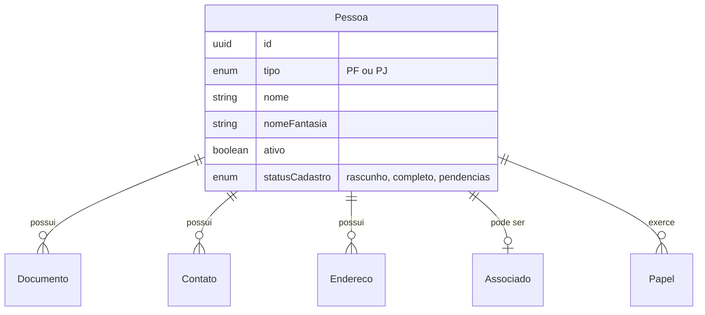
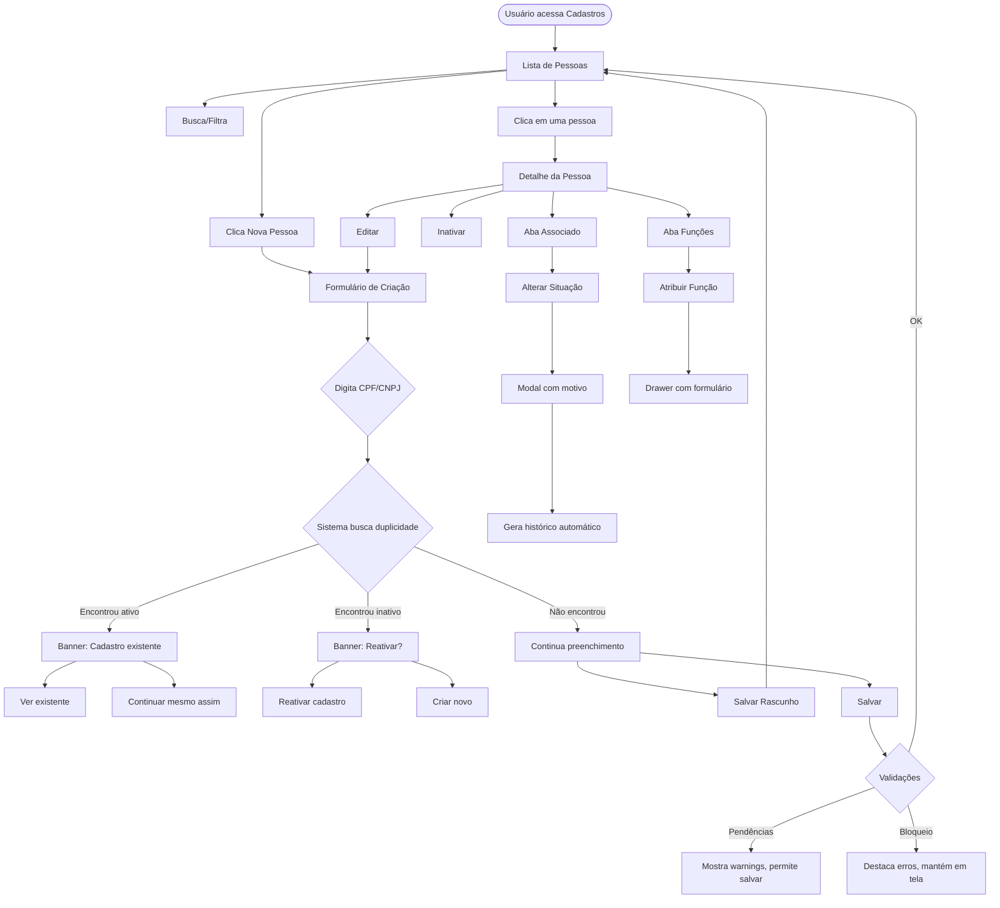

# UX Spec v2 - Módulo A: Cadastro de Pessoas e Membros

---

## 1) Resumo Executivo

### Objetivo do Módulo
Gerenciar o cadastro unificado de todas as pessoas que se relacionam com a instituição religiosa (membros, doadores, fornecedores, funcionários, voluntários), permitindo ao contador(a) manter dados atualizados, emitir recibos de doação, controlar contribuições e cumprir obrigações legais.

### Principais Melhorias v2 (Top 10)

1. **Salvar sempre**: Autosave a cada 30s + botão "Salvar rascunho" + indicador visual de status
2. **Validação não-bloqueante**: Erros soft (warnings) permitem salvar; bloqueios apenas em operações críticas (emitir recibo, consolidar duplicidade)
3. **Detecção precoce de duplicidade**: Ao digitar CPF/CNPJ ou nome, sistema busca cadastros existentes e sugere ações
4. **Progressive disclosure**: Seção Associado colapsada por padrão, expandida sob demanda
5. **Reativação inteligente**: Ao encontrar pessoa inativa, oferece "Reativar" com um clique
6. **Indicador de pendências**: Badge visual mostrando "3 itens pendentes para cadastro completo"
7. **Proteção contra perda**: Modal ao sair sem salvar + histórico de versões simples
8. **Microcopy humanizado**: Mensagens orientativas em PT-BR, tom profissional e acessível
9. **Ações contextuais**: Botões e links que aparecem no momento certo (ex: "Emitir recibo" só com CPF válido)
10. **Histórico automático**: Toda alteração de status de Associado gera log visível

### O que NÃO Será Feito (Anti-escopo)

- Consentimento LGPD (previsto, não implementado - tratado como roadmap)
- Novos campos obrigatórios além dos especificados
- Exclusão definitiva de cadastros (apenas soft-delete)
- Integração com sistemas externos (Receita Federal, SEFAZ)
- Workflow de aprovação multi-nível

---

## 2) Arquitetura de Informação

### Navegação

```
Cadastros > Pessoas
├── Lista de Pessoas (padrão)
├── [+ Nova Pessoa] → Criar Pessoa
├── [Filtro: Rascunhos] → Lista filtrada
├── [Clique na linha] → Detalhe de Pessoa
│   ├── Aba: Dados Gerais
│   ├── Aba: Associado (condicional)
│   └── Aba: Funções/Papéis
└── [Ações na linha] → Editar / Inativar / Reativar
```

### Padrão de Telas

| Tela | Padrão | Descrição |
|------|--------|-----------|
| Lista de Pessoas | Master-list | Busca, filtros, ações em lote |
| Criar Pessoa | Form wizard single-page | Seções colapsáveis, save contínuo |
| Editar Pessoa | Same as Criar | Pré-populado, mesmo comportamento |
| Detalhe de Pessoa | Read-only + actions | Visão consolidada, ações contextuais |
| Inativar Pessoa | Modal | Confirmação + motivo opcional |
| Gestão de Associado | Drawer lateral | Abre sobre Detalhe/Edição |
| Gestão de Papéis | Drawer lateral | Abre sobre Detalhe/Edição |

### Modelo Mental



---

## 3) Fluxos (Wireflow Textual)

### Fluxo 1: Criar Pessoa (com rascunho e retomada)

**Gatilho**: Usuário clica em "+ Nova Pessoa"

**Passos**:
1. Sistema abre tela de criação com seções colapsáveis
2. Usuário seleciona Tipo de Pessoa (PF/PJ) - seção Dados Básicos expandida
3. Ao digitar CPF/CNPJ:
   - Sistema valida formato em tempo real (soft)
   - Sistema busca duplicidade assíncrona (background)
   - Se encontrar: exibe banner "Cadastro existente encontrado" com ações
4. Usuário preenche campos progressivamente
5. A cada 30s ou ao sair de seção: autosave silencioso
6. Usuário pode clicar "Salvar rascunho" a qualquer momento
7. Ao clicar "Salvar":
   - Sistema valida campos obrigatórios (nome, tipo)
   - Se houver pendências não-críticas: salva com status "pendências"
   - Se houver bloqueios: destaca campos e mantém na tela
8. Cadastro salvo aparece na lista com badge de status

**Validações**:
| Campo | Momento | Severidade | Ação |
|-------|---------|------------|------|
| Tipo | Ao salvar | Bloqueio | Obrigatório |
| Nome | Ao salvar | Bloqueio | Mínimo 3 caracteres |
| CPF/CNPJ | Ao digitar | Info | Formato |
| CPF/CNPJ | Ao sair do campo | Warning | Duplicidade |
| Contato principal | Ao salvar | Warning | Sugere marcar |

**Estados de Salvamento**:
- `rascunho`: salvo parcialmente, pode não ter campos obrigatórios
- `pendencias`: salvo, mas faltam dados para operações específicas
- `completo`: todos os dados necessários preenchidos

---

### Fluxo 2: Editar Pessoa

**Gatilho**: Usuário clica em "Editar" na lista ou detalhe

**Passos**:
1. Sistema abre tela de edição pré-populada
2. Campos editáveis com valores atuais
3. Ao alterar Tipo PF↔PJ:
   - Sistema exibe warning sobre documentos incompatíveis
   - Não bloqueia, mas sinaliza inconsistência
4. Validações soft em tempo real
5. Autosave a cada alteração significativa
6. Ao salvar: mesmas regras de criação

**Validações Adicionais**:
- Se já tem títulos/lançamentos vinculados: warning ao tentar alterar CPF/CNPJ
- Se tem função ativa: warning ao tentar inativar

---

### Fluxo 3: Evitar Duplicidade (CPF/CNPJ e Nome)

**Gatilho**: Usuário digita CPF/CNPJ ou nome

**Passos**:
1. Sistema busca em background (debounce 500ms)
2. Se encontrar cadastro ATIVO:
   - Banner: "Encontramos Maria da Silva (CPF: ***.456.***-00) já cadastrada."
   - Ações: [Ver cadastro] [Usar este cadastro] [Continuar mesmo assim]
3. Se encontrar cadastro INATIVO:
   - Banner: "Encontramos cadastro inativo para este CPF."
   - Ações: [Reativar cadastro] [Continuar como novo]
4. Se continuar como novo:
   - Sistema permite, mas registra no log
   - Warning permanece visível

**Busca por nome** (quando sem documento):
- Busca fonética/aproximada
- Exibe lista de possíveis duplicidades
- Usuário confirma "Não é a mesma pessoa" para prosseguir

---

### Fluxo 4: Reativar Pessoa Inativa

**Gatilho**: Usuário encontra pessoa inativa (via busca ou detecção de duplicidade)

**Passos**:
1. Sistema exibe cadastro com badge "Inativo"
2. Ação disponível: "Reativar cadastro"
3. Modal de confirmação:
   - "Deseja reativar o cadastro de [Nome]?"
   - Campo opcional: Motivo da reativação
4. Ao confirmar:
   - Status volta para ativo
   - Se era Associado, exibe opção de reativar também
   - Gera entrada no histórico

---

### Fluxo 5: Tornar Pessoa um Associado

**Gatilho**: Usuário clica em "Tornar Associado" no detalhe/edição

**Passos**:
1. Drawer lateral abre com formulário de Associado
2. Campos obrigatórios: Data de Admissão, Status, Categoria
3. Campos opcionais: Valor, Periodicidade, Dia Vencimento, Isenção
4. Se marcar "Isento":
   - Campo "Motivo da Isenção" se torna obrigatório
   - Warning visual até preencher
5. Ao salvar: pessoa passa a ter aba Associado visível

**Validações**:
| Campo | Severidade | Mensagem |
|-------|------------|----------|
| Data Admissão | Bloqueio | "Informe quando a pessoa se tornou membro" |
| Status | Bloqueio | "Selecione a situação do associado" |
| Categoria | Bloqueio | "Selecione a categoria" |
| Motivo Isenção | Bloqueio (se isento) | "Explique o motivo da isenção" |

---

### Fluxo 6: Alterar Situação do Associado

**Gatilho**: Usuário clica em "Alterar Situação" na aba Associado

**Passos**:
1. Modal com campos:
   - Nova Situação (select)
   - Motivo da Alteração (textarea, mín. 10 caracteres)
   - Data de Efetivação (opcional, default hoje)
2. Se nova situação = "Desligado":
   - Data de Desligamento se torna obrigatória
3. Ao confirmar:
   - Sistema gera entrada automática no histórico
   - Atualiza status imediatamente
   - Se Desligado: para de gerar novos títulos

**Validações**:
| Campo | Severidade | Mensagem |
|-------|------------|----------|
| Motivo | Bloqueio | "Descreva o motivo (mínimo 10 caracteres)" |
| Data Desligamento | Bloqueio (se Desligado) | "Informe a data de desligamento" |

---

### Fluxo 7: Atribuir Papéis/Funções

**Gatilho**: Usuário clica em "Atribuir Função" na aba Papéis

**Passos**:
1. Drawer lateral com formulário
2. Seleciona tipo de função (captador, administrador, etc.)
3. Campos base: Data Início (obrig.), Data Término, Observações
4. Campos específicos aparecem conforme função:
   - Captador: Região de Atuação, Meta Anual
   - Administrador: Responsabilidades, Alçada, Permissões
5. Ao salvar: função aparece na lista com período

---

### Fluxo 8: Cadastrar Doador para Emitir Recibo

**Gatilho**: Usuário precisa emitir recibo para pessoa não cadastrada

**Passos**:
1. Cria pessoa normalmente
2. Se CPF não preenchido: sistema permite salvar
3. Ao tentar emitir recibo (em outro módulo):
   - Sistema verifica CPF
   - Se ausente: modal "Para emitir recibo, é necessário CPF válido"
   - Link direto para editar cadastro
4. Usuário adiciona CPF
5. Retorna e emite recibo

**Filosofia**: Não bloquear cadastro por falta de CPF. Bloquear apenas a operação que depende dele.

---

## 4) Design da Tela (Screen-by-screen)

### 4.1 Lista/Busca de Pessoas

**Layout**:
```
┌────────────────────────────────────────────────────────────┐
│ [Breadcrumb: Cadastros > Pessoas]                          │
│                                                            │
│ Pessoas                              [+ Nova Pessoa]       │
│                                                            │
│ ┌─────────────────────────────────────────────────────────┐│
│ │ 🔍 Buscar por nome, CPF, CNPJ...          [Filtros ▼]  ││
│ └─────────────────────────────────────────────────────────┘│
│                                                            │
│ Filtros ativos: [Tipo: PF ✕] [Status: Ativos ✕]           │
│                                                            │
│ ┌─────────────────────────────────────────────────────────┐│
│ │ □ │ Nome              │ Documento    │ Tipo │ Status   ││
│ ├───┼───────────────────┼──────────────┼──────┼──────────┤│
│ │ □ │ Maria da Silva    │ ***456***00  │ PF   │ ● Ativo  ││
│ │ □ │ João Pedro        │ -            │ PF   │ ⚠ Pend.  ││
│ │ □ │ Mercado ABC Ltda  │ 12.345.678/… │ PJ   │ ● Ativo  ││
│ └─────────────────────────────────────────────────────────┘│
│                                                            │
│ Mostrando 1-20 de 347 pessoas           [< 1 2 3 ... >]   │
└────────────────────────────────────────────────────────────┘
```

**Componentes**:
- **Busca**: Input com ícone, busca em nome, nome fantasia, CPF/CNPJ
- **Filtros (dropdown)**:
  - Tipo: Todos / Pessoa Física / Pessoa Jurídica
  - Status: Ativos / Inativos / Todos
  - Cadastro: Completos / Com pendências / Rascunhos
  - Papel: Associado / Doador / Fornecedor / etc.
- **Tabela**: Seleção múltipla, ordenação por coluna, ações hover
- **Ações na linha** (hover/menu ⋮): Ver detalhes, Editar, Inativar/Reativar

**Estados**:
- **Vazio**: "Nenhuma pessoa cadastrada ainda. Clique em '+ Nova Pessoa' para começar."
- **Sem resultados**: "Nenhum resultado para '[termo]'. Tente outros termos ou [limpe os filtros]."
- **Carregando**: Skeleton da tabela
- **Erro**: Banner vermelho "Não foi possível carregar os cadastros. [Tentar novamente]"

**Acessibilidade**:
- Navegação por teclado na tabela
- Labels visíveis em todos os campos
- Contraste mínimo 4.5:1
- Foco visível em todos os elementos interativos

---

### 4.2 Criar Pessoa

**Layout** (seções colapsáveis):
```
┌────────────────────────────────────────────────────────────┐
│ [← Voltar] Novo Cadastro de Pessoa         [Salvar] [▼]   │
│                                      └─ Salvar rascunho   │
│ ┌─ Status: Rascunho ─────────────────────────────────────┐│
│ │ ⚠ 3 itens pendentes para cadastro completo [ver]      ││
│ └────────────────────────────────────────────────────────┘│
│                                                            │
│ ▼ Dados Básicos ───────────────────────────────────────── │
│   Tipo de Pessoa*     (●) Pessoa Física  ( ) Pessoa Juríd.│
│   Nome Completo*      [____________________________] ℹ️   │
│   Apelido             [____________________________] ℹ️   │
│   Observações         [____________________________]      │
│                                                            │
│ ▼ Documentos ──────────────────────────────────────────── │
│   ┌──────────────────────────────────────────────────────┐│
│   │ CPF: [___.___.___-__]  ✓ Válido                      ││
│   │                                         [+ Adicionar]││
│   └──────────────────────────────────────────────────────┘│
│   ⚠ Para emitir recibos de doação, o CPF é necessário.    │
│                                                            │
│ ▼ Contatos ────────────────────────────────────────────── │
│   ┌──────────────────────────────────────────────────────┐│
│   │ (vazio)                              [+ Adicionar]   ││
│   │ Nenhum contato cadastrado ainda.                     ││
│   └──────────────────────────────────────────────────────┘│
│                                                            │
│ ▼ Endereços ───────────────────────────────────────────── │
│   ┌──────────────────────────────────────────────────────┐│
│   │ (vazio)                              [+ Adicionar]   ││
│   │ Nenhum endereço cadastrado ainda.                    ││
│   └──────────────────────────────────────────────────────┘│
│                                                            │
│ ▷ Dados de Associado (opcional) ─────────────────────────│
│   Clique para expandir se esta pessoa for membro formal   │
│                                                            │
│ ───────────────────────────────────────────────────────── │
│ [Cancelar]                    [Salvar rascunho] [Salvar]  │
└────────────────────────────────────────────────────────────┘
```

**Componentes**:
- **Radio Tipo**: Alterna comportamento de campos
- **Inputs com tooltip (ℹ️)**: Hover mostra ajuda contextual
- **Máscaras**: CPF (###.###.###-##), CNPJ (##.###.###/####-##), Tel, CEP
- **Lista inline**: Documentos, Contatos, Endereços como cards adicionáveis
- **Seção colapsável**: Associado começa fechada
- **Banner de pendências**: Amarelo, lista itens faltantes

**Ações**:
- **Salvar**: Valida obrigatórios, salva, redireciona para lista
- **Salvar rascunho**: Salva sem validar obrigatórios
- **Cancelar**: Se houver alterações, modal de confirmação
- **Dropdown do Salvar**: Salvar e continuar, Salvar e criar outro

---

### 4.3 Editar Pessoa

Mesmo layout de Criar, com:
- Dados pré-populados
- Badge de status atual (Ativo/Inativo)
- Ação "Inativar" disponível no header
- Histórico de alterações acessível (link)

---

### 4.4 Inativar Pessoa (Modal)

```
┌────────────────────────────────────────────────────────────┐
│ Inativar Cadastro                                     [✕] │
│ ───────────────────────────────────────────────────────── │
│                                                            │
│ Você está prestes a inativar o cadastro de:               │
│                                                            │
│   Maria da Silva Santos                                    │
│   CPF: 123.456.789-00                                      │
│                                                            │
│ ⚠ O cadastro não será excluído. Todo o histórico de       │
│   lançamentos e títulos será preservado. Você poderá      │
│   reativar este cadastro a qualquer momento.              │
│                                                            │
│ Motivo da inativação (opcional)                            │
│ [________________________________________]                 │
│                                                            │
│ ───────────────────────────────────────────────────────── │
│                          [Cancelar] [Inativar cadastro]    │
└────────────────────────────────────────────────────────────┘
```

---

### 4.5 Detalhe de Pessoa (Visão Consolidada)

```
┌────────────────────────────────────────────────────────────┐
│ [← Voltar para lista]                                      │
│                                                            │
│ Maria da Silva Santos                    [Editar] [⋮]     │
│ Dona Maria • CPF: 123.456.789-00         └─ Inativar      │
│ ● Ativo                                                    │
│                                                            │
│ ┌──────────────────────────────────────────────────────── │
│ │ [Dados Gerais] [Associado ●] [Funções]                  ││
│ └──────────────────────────────────────────────────────── │
│                                                            │
│ ─── Dados Gerais ──────────────────────────────────────── │
│                                                            │
│ Documentos                                                 │
│ ┌─────────────────────────────────────────────────────────┐│
│ │ CPF        123.456.789-00        ✓ Válido              ││
│ │ RG         12.345.678-9                                ││
│ └─────────────────────────────────────────────────────────┘│
│                                                            │
│ Contatos                                                   │
│ ┌─────────────────────────────────────────────────────────┐│
│ │ ★ Celular      (11) 98765-4321                          ││
│ │   E-mail       maria@email.com                          ││
│ └─────────────────────────────────────────────────────────┘│
│                                                            │
│ Endereços                                                  │
│ ┌─────────────────────────────────────────────────────────┐│
│ │ ★ Residencial                                           ││
│ │   Rua das Flores, 123, Apto 45                          ││
│ │   Centro - São Paulo/SP - 01234-567                     ││
│ └─────────────────────────────────────────────────────────┘│
│                                                            │
│ Observações                                                │
│ Membro antigo, muito ativa na comunidade.                  │
│                                                            │
└────────────────────────────────────────────────────────────┘
```

---

### 4.6 Seção/Aba Associado

```
┌────────────────────────────────────────────────────────────┐
│ ─── Associado ─────────────────────────────────────────── │
│                                                            │
│ Status: ● Ativo                    [Alterar situação]     │
│                                                            │
│ ┌─────────────────────────────────────────────────────────┐│
│ │ Data de Admissão     15/03/2020                         ││
│ │ Categoria            Trabalhador                        ││
│ │ Nº Registro          2020-0042                          ││
│ └─────────────────────────────────────────────────────────┘│
│                                                            │
│ Contribuição                                               │
│ ┌─────────────────────────────────────────────────────────┐│
│ │ Periodicidade        Mensal                             ││
│ │ Valor Sugerido       R$ 50,00                           ││
│ │ Dia de Vencimento    10                                 ││
│ │ Isento               Não                                ││
│ └─────────────────────────────────────────────────────────┘│
│                                                            │
│ Histórico de Situações                         [Ver todos] │
│ ┌─────────────────────────────────────────────────────────┐│
│ │ 15/03/2020  Admitido como Ativo                         ││
│ │             "Novo membro aprovado em assembleia"        ││
│ └─────────────────────────────────────────────────────────┘│
│                                                            │
└────────────────────────────────────────────────────────────┘
```

---

### 4.7 Seção/Aba Funções/Papéis

```
┌────────────────────────────────────────────────────────────┐
│ ─── Funções ──────────────────────────────────────────── │
│                                        [+ Atribuir função] │
│                                                            │
│ ┌─────────────────────────────────────────────────────────┐│
│ │ Captador de Doações                           [Editar]  ││
│ │ Desde 01/01/2023 • Ativo                      [Encerrar]││
│ │ Região: Centro de São Paulo                             ││
│ │ Meta anual: R$ 10.000,00                                ││
│ └─────────────────────────────────────────────────────────┘│
│                                                            │
│ ┌─────────────────────────────────────────────────────────┐│
│ │ Voluntário                                    [Editar]  ││
│ │ 15/06/2020 a 31/12/2022 • Encerrado                     ││
│ │ Coordenação de eventos                                  ││
│ └─────────────────────────────────────────────────────────┘│
│                                                            │
└────────────────────────────────────────────────────────────┘
```

---

## 5) Regras de UX para Validação

### Matriz de Validações

| Campo/Regra | Momento | Severidade | Mensagem | Ação |
|-------------|---------|------------|----------|------|
| **Tipo de Pessoa** | Ao salvar | Bloqueio | "Selecione se é Pessoa Física ou Jurídica" | Foco no campo |
| **Nome** (vazio) | Ao salvar | Bloqueio | "Informe o nome completo" | Foco no campo |
| **Nome** (< 3 chars) | Ao salvar | Bloqueio | "Nome muito curto. Informe o nome completo." | Foco no campo |
| **CPF** (formato) | Ao digitar | Info | Máscara visual apenas | Auto-formatação |
| **CPF** (dígitos inválidos) | Ao sair do campo | Warning | "CPF inválido. Verifique os números." | Destacar campo |
| **CPF** (duplicado ativo) | Ao sair do campo | Warning | "Este CPF já está cadastrado. [Ver cadastro]" | Link para existente |
| **CPF** (duplicado inativo) | Ao sair do campo | Info | "Encontramos cadastro inativo. [Reativar]" | Link para reativar |
| **CPF** (ausente) | Ao emitir recibo | Bloqueio | "Para emitir recibo, o CPF é obrigatório." | Link para editar |
| **CNPJ** (formato) | Ao digitar | Info | Máscara visual apenas | Auto-formatação |
| **CNPJ** (dígitos inválidos) | Ao sair do campo | Warning | "CNPJ inválido. Verifique os números." | Destacar campo |
| **CNPJ** (duplicado) | Ao sair do campo | Warning | "Este CNPJ já está cadastrado. [Ver cadastro]" | Link para existente |
| **PF sem CPF** | Ao salvar | Warning | "Pessoa Física sem CPF. Isso limitará emissão de recibos." | Permitir salvar |
| **PJ sem CNPJ** | Ao salvar | Warning | "Pessoa Jurídica sem CNPJ. Isso limitará operações fiscais." | Permitir salvar |
| **Contato principal** | Ao salvar | Warning | "Nenhum contato marcado como principal. [Marcar]" | Link para marcar |
| **Endereço principal** | Ao salvar | Info | "Considere marcar um endereço como principal." | Sugestão apenas |
| **Isento sem motivo** | Ao salvar Associado | Bloqueio | "Informe o motivo da isenção" | Foco no campo |
| **Desligado sem data** | Ao alterar status | Bloqueio | "Informe a data de desligamento" | Foco no campo |
| **Motivo alteração** (< 10) | Ao alterar status | Bloqueio | "Descreva o motivo com mais detalhes (mínimo 10 caracteres)" | Foco no campo |

---

## 6) Estratégia de Rascunho/Retomada

### Salvamento Parcial

1. **Autosave silencioso**: A cada 30 segundos, se houver alterações
   - Indicador sutil: "Salvando..." → "Salvo às 14:32"
   - Não interrompe o usuário

2. **Salvar rascunho manual**: Botão sempre disponível
   - Salva mesmo sem campos obrigatórios
   - Feedback: Toast "Rascunho salvo"

3. **Salvar (validado)**: Botão principal
   - Valida campos obrigatórios
   - Se passar: salva e redireciona
   - Se falhar: mantém na tela com erros destacados

### Sinalização de Pendências

```
┌─────────────────────────────────────────────────────────────┐
│ ⚠ 3 itens pendentes para cadastro completo                  │
│   • CPF não informado (necessário para recibos)             │
│   • Nenhum contato principal definido                       │
│   • Endereço incompleto                                     │
│                                         [Resolver agora]    │
└─────────────────────────────────────────────────────────────┘
```

### Retomada

- **Filtro "Rascunhos"** na lista principal
- Badge visual na linha: "Rascunho" (cinza) ou "Pendências" (amarelo)
- Ordenação padrão: rascunhos e pendências primeiro

### Proteção Contra Perda

**Modal ao sair sem salvar**:
```
┌────────────────────────────────────────────────────────────┐
│ Alterações não salvas                                 [✕] │
│ ───────────────────────────────────────────────────────── │
│                                                            │
│ Você tem alterações que ainda não foram salvas.           │
│ O que deseja fazer?                                        │
│                                                            │
│ ───────────────────────────────────────────────────────── │
│ [Sair sem salvar]  [Salvar rascunho e sair]  [Continuar]  │
└────────────────────────────────────────────────────────────┘
```

### Alternativa Técnica (se "rascunho" exigir mudança de schema)

Se a implementação de status de rascunho for complexa:
- **Alternativa 1**: Salvar como registro ativo normal, mas exibir badge "Incompleto" baseado em validação client-side
- **Alternativa 2**: Armazenar rascunhos em localStorage do navegador, com opção de "restaurar" ao reabrir tela de criação
- **Alternativa 3**: Campo `status_cadastro` enum (completo/pendencias) sem estado "rascunho" - tudo é salvo no banco

---

## 7) Microcopy (PT-BR)

### Tooltips Principais

| Campo | Tooltip |
|-------|---------|
| Tipo de Pessoa | "Pessoa Física: indivíduo identificado por CPF. Pessoa Jurídica: empresa ou entidade com CNPJ." |
| Nome Completo | "Para pessoa física, informe o nome conforme documento. Para jurídica, a razão social." |
| Nome Fantasia | "Como a pessoa é conhecida na comunidade ou nome fantasia da empresa." |
| CPF | "Digite apenas números. O sistema formatará automaticamente." |
| Contato Principal | "O contato principal será usado para comunicações importantes." |
| Data de Admissão | "Quando a pessoa se tornou membro oficial da entidade." |
| Valor Sugerido | "Valor de referência para a contribuição mensal. Pode ser ajustado a cada lançamento." |
| Isento | "Marque se o associado não paga contribuição. Será necessário informar o motivo." |

### Mensagens de Validação

**Info (azul)**:
- "Este cadastro ainda está incompleto. Você pode continuar depois."
- "Dica: adicione um CPF para poder emitir recibos de doação."

**Warning (amarelo)**:
- "CPF inválido. Verifique se digitou corretamente."
- "Este CPF já está cadastrado para outra pessoa. [Ver cadastro existente]"
- "Pessoa Física sem CPF. Isso limitará a emissão de recibos para Imposto de Renda."
- "Nenhum contato foi marcado como principal. [Marcar o primeiro como principal]"

**Bloqueio (vermelho)**:
- "Informe o nome completo da pessoa."
- "Selecione se é Pessoa Física ou Pessoa Jurídica."
- "Para emitir este recibo, é necessário um CPF válido. [Editar cadastro]"
- "Descreva o motivo da alteração (mínimo 10 caracteres)."
- "Associado isento precisa ter motivo informado."

### Banners de Pendências

```
ℹ️ Cadastro incompleto
   Faltam alguns dados para completar o cadastro. Você pode
   salvar agora e completar depois.
   [Continuar editando] [Salvar mesmo assim]
```

```
⚠️ Encontramos um cadastro parecido
   Maria da Silva Santos (CPF: ***456***00) já está cadastrada.
   [Ver cadastro existente] [É outra pessoa, continuar]
```

### Modal de Saída

```
Alterações não salvas

Você fez alterações que ainda não foram salvas.
Se sair agora, essas informações serão perdidas.

[Sair sem salvar]  [Salvar rascunho]  [Voltar]
```

### Confirmação de Inativação

```
Inativar cadastro de Maria da Silva Santos?

O cadastro ficará oculto nas buscas, mas todo o histórico
de lançamentos e títulos será mantido. Você poderá
reativar este cadastro quando quiser.

[Cancelar] [Inativar]
```

### Duplicidade Encontrada

```
Cadastro existente encontrado

Encontramos Maria da Silva Santos já cadastrada com
este CPF. O que você gostaria de fazer?

[Ver cadastro existente]  →  Abre o cadastro para edição
[Reativar cadastro]       →  Se estiver inativo
[É outra pessoa]          →  Continua a criação (registra no log)
```

### Empty States

**Lista vazia**:
"Nenhuma pessoa cadastrada ainda.
Comece adicionando membros, doadores ou fornecedores.
[+ Nova Pessoa]"

**Sem resultados de busca**:
"Nenhum resultado encontrado para '[termo]'.
Tente outros termos ou [limpar filtros]."

**Sem contatos**:
"Nenhum contato adicionado.
Adicione telefone ou e-mail para facilitar a comunicação.
[+ Adicionar contato]"

**Sem endereços**:
"Nenhum endereço cadastrado.
O endereço é necessário para emissão de documentos oficiais.
[+ Adicionar endereço]"

**Sem funções**:
"Nenhuma função atribuída.
Registre se esta pessoa exerce algum papel na entidade.
[+ Atribuir função]"

---

## 8) Critérios de Aceite (QA/Produto)

### Rascunho/Autosave/Retomada

- [ ] Ao clicar "Salvar rascunho", sistema salva sem validar obrigatórios
- [ ] Autosave dispara a cada 30s se houver alterações
- [ ] Indicador visual mostra "Salvo às HH:MM" após autosave
- [ ] Cadastro salvo como rascunho aparece na lista com badge "Rascunho"
- [ ] Ao reabrir rascunho, todos os campos preenchidos são restaurados
- [ ] Modal de confirmação aparece ao tentar sair com alterações não salvas

### Duplicidade CPF/CNPJ

- [ ] Ao digitar CPF, sistema busca duplicidade após 500ms de inatividade
- [ ] Se encontrar ativo, exibe banner com link para cadastro existente
- [ ] Se encontrar inativo, exibe opção de reativar
- [ ] Usuário pode escolher "continuar mesmo assim" (registra no log)
- [ ] Busca considera tanto ativos quanto inativos
- [ ] CNPJ segue mesma lógica

### Alternância PF/PJ

- [ ] Ao mudar de PF para PJ, sistema exibe warning se houver CPF cadastrado
- [ ] Ao mudar de PJ para PF, sistema exibe warning se houver CNPJ cadastrado
- [ ] Mudança não bloqueia, apenas alerta
- [ ] Documentos incompatíveis ficam destacados com warning

### Associados

- [ ] Seção Associado começa colapsada em novo cadastro
- [ ] Ao expandir e preencher, botão "Tornar Associado" fica disponível
- [ ] Status inicial obrigatório (Ativo, Suspenso, etc.)
- [ ] Ao marcar "Isento", campo "Motivo" se torna obrigatório
- [ ] Alteração de status exige motivo com mínimo 10 caracteres
- [ ] Status "Desligado" exige data de desligamento
- [ ] Toda alteração de status gera entrada automática no histórico
- [ ] Histórico exibe data, status anterior, novo status e motivo

### Papéis/Funções

- [ ] Ao atribuir função, Data Início é obrigatória
- [ ] Data Término é opcional
- [ ] Campos específicos aparecem conforme tipo de função selecionado
- [ ] Função ativa exibe badge "Ativo"
- [ ] Função encerrada exibe período (início a término)

### Preservação de Dados

- [ ] Navegar entre abas não perde dados preenchidos
- [ ] Clicar em "Voltar" com dados não salvos exibe modal
- [ ] Recarregar página exibe warning do navegador se houver alterações
- [ ] Erro de rede durante save exibe mensagem e mantém dados em tela

---

## 9) Backlog (Opcional - Conforme Documento)

Os itens abaixo estão mencionados no documento de referência como **não implementados**:

| Item | Status no Doc | Prioridade Sugerida |
|------|---------------|---------------------|
| Consentimento LGPD | ❌ Não implementado | Média |
| Inativar/Excluir pessoa | ❌ Em desenvolvimento | Alta |
| Melhorias na edição | ⚠️ Parcial | Alta |

### Consentimento LGPD (Roadmap)

Quando implementado, incluir:
- Seção/aba "Consentimentos" no detalhe de pessoa
- Registro de: tipo de tratamento, base legal, data, evidência
- Opção de revogar consentimento (preserva histórico)
- Relatório de consentimentos para auditoria

---

## Diagrama de Fluxo Principal




